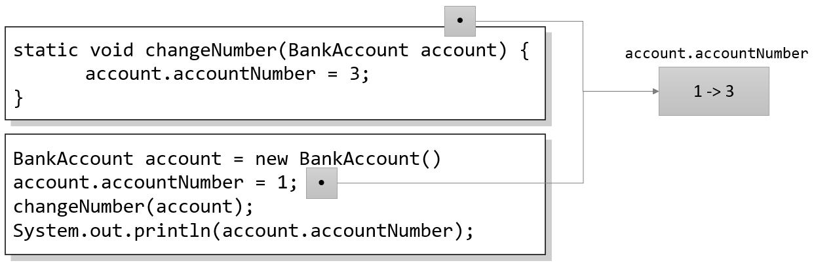

= 메소드 파라미터에 참조 타입 사용

* 참조 타입 역시 메소드 파라미터에 사용됨
** 메소드 내부에서의 변경은 원본 소스에 영향을 미침

---

참조 타입 변수를 메소드의 입력 파라미터 또는 출력 파라미터로 지정할 수 있습니다.

참조 타입 변수를 메소드의 입력 파라미터로 사용하면, 메소드는 참조 변수의 복사본을 받습니다. 이는 메소드가 실행되는 동안 두 참조 타입 변수가 존재하며, 두 참조 타입은 같은 객체를 참조함을 의미합니다. 다음 코드는 3을 표시합니다.

[source, java]
----
static void changeNumber(BankAccount account) {
    account.accountNumber = 3;
}

BankAccount account = new BankAccount();
account.accountNumber = 1;
changeNumber(account);
System.out.println(account.accountNumber);
----

만약 `changeNumber` 메소드에서 파라미터로 전달받은 `account` 인자에 다른 객체를 할당하면, 메소드 밖의 참조 타입 변수는 영향을 받지 않습니다.

[source, java]
----
static void changeNumber(BankAccount account) {
account = new BankAccount();	// 같은 객체를 참조하지 않음
    account.accountNumber = 3;
}
----

마찬가지로, 참조 타입 변수를 return 할 수도 있습니다.

[source, java]
----
static BankAccount createNewAccount(int number, String name) {
    BankAccount account = new BankAccount();
    account.accountNumber = number;
    account.ownerName = name;

    return account;
}

BankAccount newAccount = createNewAccount(1, "Jack");
----

아래 코드에서 `newAccount`, `account`, `changedAccount` 세 참조 타입 변수는 모두 같은 객체를 참조합니다.

[source, java]
----
static BankAccount changeName(BankAccount account) {
    account.ownerName = "Tom";
    return account;
}

BankAccount newAccount = new BankAccount();
newAccount.ownerName = "James";
BankAccount changedAccount = changeName(newAccount);
----

link:./07_same_ref.adoc[이전: 같은 객체에 대한 여러 변수의 참조] +
link:./09_enum.adoc[다음: enum 타입]