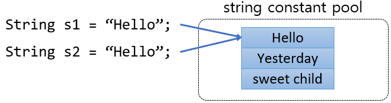
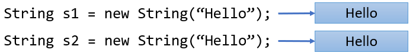
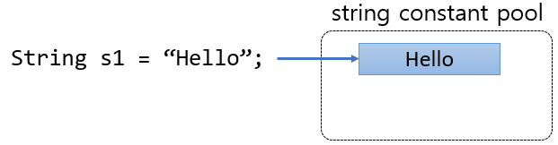

= String 비교 연산자

* ==와 != 연산자는 값을 직접 비교하지 않음
* String 변수는 리터럴을 이용할 때와 new 연산자를 이용할 때 다른 영역에 할당됨
** 리터럴을 사용하는 경우 string constant pool 영역에 할당
** new 연산자를 사용하는 경우 heap 영역에 할당
* 리터럴로 문자열을 할당하면 string constant pool 영역을 검색하여 같은 문자열 값이 있는 곳의 위치를 반환

[source, java]
----
String s1 = “Hello”;
String s2 = “Hello”;
if (s1 == s2)	// true

String s1 = new String(“Hello”);
String s2 = new String(“Hello”);
if (s1 == s2)	// false
----

---

`String` 타입 객체를 생성할 때는 두 가지 방법을 사용할 수 있습니다.

1.	리터럴을 이용하는 방식
2.	new 연산자를 이용하는 방식

== 리터럴을 이용하는 방식

리터럴을 사용하여 `String` 객체를 생성하면 string constant pool이라는 영역에 객체를 할당합니다. 이 경우 내부적으로 `intern()` 메소드를 호출하고 이 메소드는 주어진 문자열 값과 일치하는 객체가 string constant pool에 존재하는지 여부를 검사합니다. 값과 일치하는 객체가 존재하면 그 객체의 위치(주소값)을 반환하고 존재하지 않으면 새 객체를 생성합니다.

 
`new` 연산자를 사용하여 String 객체를 생성하면 객체는 다른 객체와 마찬가지로 Heap 영역에 객체를 할당합니다.

 
따라서, 리터럴로 `String` 객체를 생성한 위 코드에서 `String` 객체 `s1` 이 생성될 때 string constant pool을 검색하고, Hello라는 문자열 값을 가진 객체가 존재하지 않으면 새로 생성합니다.

두 번째 `String` 객체 `s2 `를 "Hello" 리터럴로 생성할 때, string constant pool을 검색하여 Hello라는 값을 가진 객체가 있으면 그 객체의 주소 값을 반환합니다.
 
따라서, `s1` 과 `s2` 두 `String` 변수는 같은 객체를 참조합니다 (같은 객체 주소값을 값으로 가집니다). 따라서 연산자 == 으로 비교하면 true를 반환합니다.

== new 연산자를 이용하는 방식

new 연산자를 이용해서 String 객체를 생성하면 다른 객체의 경우와 동일하게 Heap 영역에 할당됩니다. 이 경우는 두 String 타입 변수는 각자의 객체 위치(주소 값)을 가지게 됩니다. 따라서 연산자 ==로 비교하면 false를 반환합니다.

link:./18_string_compariaion.adoc[이전: String 값 비교] +
link:./20_object_hier.adoc[다음: 객체 계층 구조]