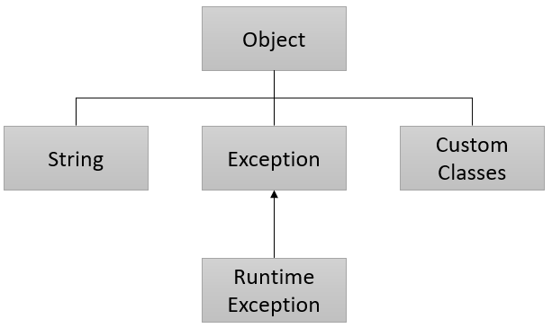

= Object 타입

* java.lang.Object
* 모든 클래스의 슈퍼 클래스

---

Object 타입은 Java 프로그래밍에서 직접 만들거나 대부분의 Java가 제공하는 클래스의 슈퍼 클래스가 되는 기본 타입입니다.

== Object 클래스

`Object` 는 `java.lang` 패키지에 포함된 클래스로, 프로그래밍시에 사용되는 모든 클래스의 기본이 되는 슈퍼클래스입니다. 따라서, Java의 모든 클래스는 `Object` 로 암시적 타입 변환이 가능합니다.

[source, java]
----
String title = "Top Gun";
Object o = title;
System.out.println(o.getClass().getName());
----

== 슈퍼 클래스

모든 클래스는 직접적 또는 간접적으로 `Object` 클래스에서 상속됩니다. 여기에는 프로그래머가 직접 작성하는 클래스와 Java가 제공하는 클래스의 대부분이 포함됩니다. 클래스를 선언할 때 명시적으로 상속을 명시하지 않으면 `Object` 를 상속하는 클래스가 됩니다.

link:./20_object_hier.adoc[이전: 객체 계층 구조] +
link:./22_common_method.adoc[다음: 공통 메소드]