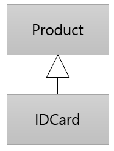

= 클래스 확장

* 한 클래스에서 파생되는 클래스를 생성

[source, java]
----
class Product {
    ...
}

class IDCard extends Product {
    ...
}
----

* 파생되는 서브 클래스는 슈퍼 클래스의 대부분의 요소를 상속함
* 파생되는 서브 클래스는 슈퍼 클래스보다 낮은 가시성을 가질 수 없음

---

슈퍼 클래스에서 서브 클래스를 파생시키는 것은 슈퍼 클래스를 확장하는 것이라고도 알려져 있습니다. Java의 클래스는 하나 이상의 클래스로 확장될 수 있습니다.

== 클래스 확장 구문

한 클래스에서 다른 클래스를 파생시켜 서브 클래스를 만들려면, extents 키워드를 사용합니다.

[source, java]
----
class Subclass extends SuperClass {
    ...
}
----

서브 클래스를 선언할 때 슈퍼 클래스는 `extends` 키워드 뒤에 지정됩니다. 

== 서브 클래스의 상속

서브 클래스는 슈퍼 클래스의 생성자와 소멸자를 제외하고 모든 것을 슈퍼 클래스에서 상속합니다. 슈퍼 클래스의 `public` 멤버는 암시적으로 서브 클래스의 `public` 클래스의 멤버가 됩니다. 슈퍼 클래스의 `private` 멤버는 상속되지만, 슈퍼 클래스의 멤버만 액세스 할 수 있습니다.

link:./02_write_subclass.adoc[이전: 서브 클래스 작성] +
link:./04_access_to_supermembers.adoc[다음: 슈퍼 클래스 멤버에 액세스]