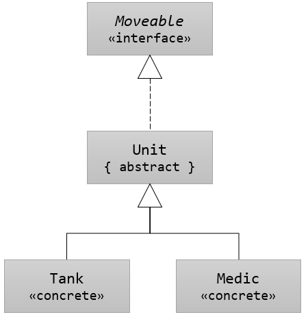

= 클래스 계층 구조에서 추상 클래스 사용

[source, java]
----
interface Moveable {
    void move(int x, int y);
}

abstract class Unit implements Moveable {
    …

    public void move(int x, int y) {
        …
    }
}

class Tank extends Unit { … }
class Medic extends Unit { … } 
----

---

인터페이스, 추상 클래스 및 클래스로 구성된 고전적인 3계층 구조에서 추상 클래스의 역할은 인터페이스의 구현을 제공하는 것입니다.

== 인터페이스를 구현하는 추상 클래스

예제에서 Unit 추상 클래스는 Moveable 인터페이스를 구현합니다. 추상 클래스 Unit 클래스에서 구현한 move 메소드는 가상 메소드이므로 Tank 클래스에서 오버라이드 할 수 있습니다.

[source, java]
----
interface Moveable {
    void move(int x, int y);
}

public abstract class Unit implements Moveable {
    protected String name;
    protected int x;
    protected int y;

    public String getName() {
        return this.name;
    }

    public void move(int x, int y) {
        this.x = x;
        this.y = y;
    }
}

class Tank extends Unit {
    public void move(int x, int y) {
        System.out.println("Now Moving");
    }
}
----

link:./18_declare_abstract_class.adoc[이전: 추상 클래스 선언] +
link:./20_abstract_in_hier2.adoc[다음: 클래스 계층 구조에서 추상 클래스 사용(2)]