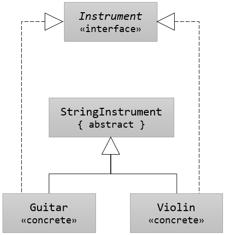

== 클래스 계층 구조에서 추상 클래스 사용 (2)

[source, java]
----
interface Instrument {
    void play();
    …
}

public abstract class StringInstrument {
    String name;
    int numberOfString;
}

public class Guitar extends StringInstrument 
    implements Instrument {
    ...
}
public class Violin extends StringInstrument 
    implements Instrument {
    ...
}
----

인터페이스, 추상 클래스 및 클래스로 구성된 고전적인 3계층 구조에서 추상 클래스의 역할에 대한 다른 예가 있습니다.

== 인터페이스를 구현하지 않는 추상 클래스

이 예제에서 추상 클래스는 인터페이스를 구현하지 않습니다. 추상 StringInstrument는 파생되는 클래스들이 가져야 하는 공통 데이터인 name, numberOfString등만을 가집니다. 이때 인터페이스 Instrument가 가지는 메소드를 구현해야 하는 책임은 인터페이스를 구현하는 Guitar, Violin 클래스가 가집니다. 

[source, java]
----
interface Instrument {
    void play();
    void tune();
}

public abstract class StringInstrument {
    String name;
    int numberOfString;
}

public class Guitar extends StringInstrument implements Instrument {

    public void play() {}
    public void tune() {}
}
----

* `Guitar` 와 `Violin` 클래스는 `name` 과 `numberOfString` 필드를 `StringInstrument` 클래스에서 상속합니다.
* `Guitar` 와 `Violin` 클래스는 `Instrument` 인터페이스의 `play`, `tune` 두 메소드를 구현해야 합니다.

link:./19_abstract_in_hier2.adoc[이전: 클래스 계층구조에서 추상 클래스 사용]
link:./21_abstract_interface.adoc[다음: 추상 클래스와 인터페이스]