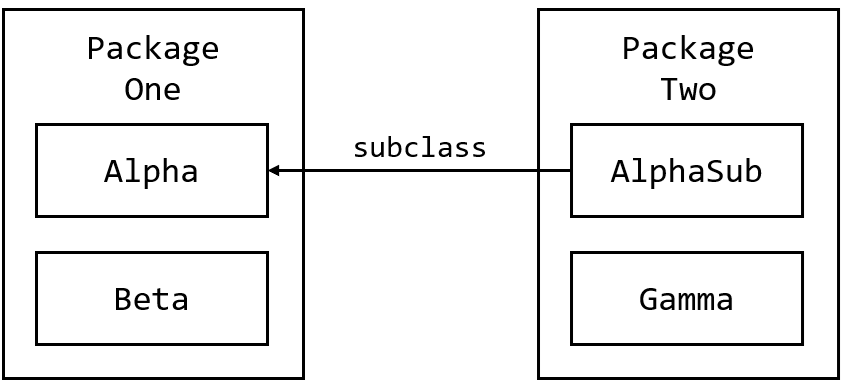

== Java에서의 접근 제어

* 접근 제한자(Access level modifier) 사용
* 다른 클래스가 특정 필드를 사용하거나 특정 메소드를 호출할 수 있는지 여부 결정
* Java에서는 두 가지 수준을 사용
** 최 상위 수준(top level) - `public` 또는 package-private(명시적으로 표시하지 않을 경우)
** 멤버 수준(member level) - public , private , protected 또는 package-private (명시적으로 표시하지 않을 경우)

---

클래스는 `public` 접근 제한자를 사용하여 선언할 수 있습니다. 이 경우 해당 클래스는 모든 위치의 모든 클래스에서 볼 수 있습니다. 클래스에 접근 제한자를 명시하지 않은 경우 기본 값(package-private이라고도 부릅니다)이 주어지며 해당 클래스는 자체 패키지 내에서만 볼 수 있습니다.

멤버 수준에서는 클래스와 마찬가지로 `public` 접근 제한자 또는 접근 제한자를 사용하지 않을 수 있으며(이 경우 기본 값인 package-private이 적용됨), `protected` 와 `private` 두 가지의 접근 제한자를 추가로 사용할 수 있습니다. `private` 접근 제한자는 같은 클래스 내에서만 접근 할 수 있다는 것을 의미하며, `protected` 접근 제한자는 package-private과 같이 같은 패키지내에서만 액세스 할 수 있습니다. 추가적으로, `protected` 접근 제한자의 경우 다른 패키지에 있는 클래스지만 해당 클래스의 서브 클래스인 경우 접근이 허락됩니다.

아래 표는 각 접근 제한자의 멤버에 대한 접근 허가를 보여줍니다.

[cols="1,1,1,1,1" options="header"]
|===
|Modifier|Class|Package|Subclass|World
|public|Y|Y|Y|Y
|protected|Y|Y|Y|N
|제한자 없음|Y|Y|N|N
|private|Y|N|N|N
|===

첫 번째 열은 클래스 자체가 액세스 레벨에 정의된 멤버에 액세스할 수 있는지 여부를 나타냅니다. 보시다시피 클래스는 항상 자체 멤버에 액세스할 수 있습니다. 두 번째 열은 클래스와 같은 패키지의 클래스(상속 관계에 관계없이)가 멤버에 액세스할 수 있는지 여부를 나타냅니다. 세 번째 열은 이 패키지 외부에서 선언된 클래스의 하위 클래스가 멤버에 액세스할 수 있는지 여부를 나타냅니다. 네 번째 열은 모든 클래스가 멤버에 액세스할 수 있는지 여부를 나타냅니다.

액세스 레벨은 두 가지 방식으로 영향을 미칩니다. 첫째, Java 플랫폼의 클래스와 같이 다른 소스에서 온 클래스를 사용할 때 액세스 레벨은 해당 클래스의 어떤 멤버를 자신의 클래스에서 사용할 수 있는지 결정합니다. 둘째, 클래스를 작성할 때 클래스의 모든 멤버 변수와 모든 메서드가 어떤 액세스 레벨을 가져야 하는지 결정해야 합니다.

다음 그림은 이 에에서 네 클래스와 그 관계를 보여줍니다.

아래 표는 각 접근 제한자에 대해 Alpha 클래스 멤버의 표시 여부를 보여줍니다.

[cols="1,1,1,1,1" options="header"]
|===
|Modifier|Alpha|Beta|Alphasub|Gamma
|public|Y|Y|Y|Y
|protected|Y|Y|Y|N
|제한자 없음|Y|Y|N|N
|private|Y|N|N|N
|===

link:./02_write_subclass.adoc[이전: 서브 클래스 작성] +
link:./04_class_extension.adoc[다음: 클래스 확장]