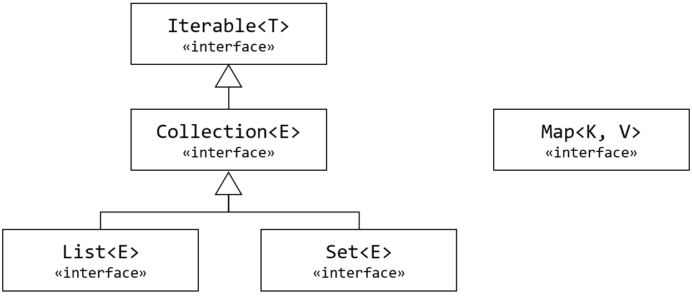
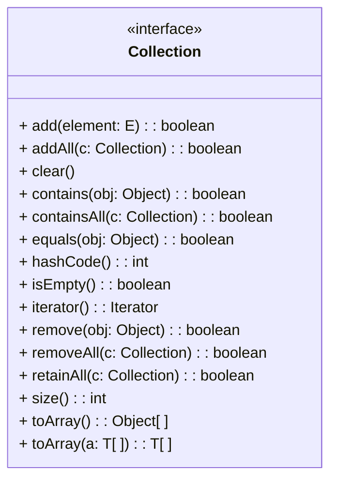

# Module 11 Collections Framework
Java에는 다수의 데이터 또는 데이터 집합을 쉽고 효과적으로 처리할 수 있는 표준화 된 프로그래밍 방식을 제공하는 Collections Framework가 포함되어 있습니다.

인터페이스를 사용해서 구현되어 제공되는 풍부한 클래스를 통해서 개발 시간을 단축할 수 있으며, 재사용성 높은 코드를 작성할 수 있습니다.

이 장을 마치면, 다음과 같은 것들을 할 수 있게 됩니다:
* 데이터 구조와 알고리즘을 제공하여 프로그래밍 노력을 줄임으로써 높은 수준의 로직을 작성하는데 집중하여, 다른 컬렉션 개발에 집중할 수 있습니다.
* 컬렉션 및 알고리즘을 조작하는데 사용할 표준 인터페이스를 제공하여 소프트웨어 재사용성을 높일 수 있습니다.

### Table of Contents
1. Collection
2. Iterator, Comparable, Comparator
3. List
4. Set
5. Map
6. Collections (Util Class)

<br />
<br />
<br />
<br />
<br />

## Collection Framework
Java는 JDK 1.2 부터 Collection 클래스와 인터페이스를 포함하는 Collection Framework 개념을 정의하여 포함합니다. 이 장에서는 List와 Set의 상위 개념인 Collection 인터페이스에 대해 알아 봅니다.

#### Table of Contents
1. Collection 프레임워크
2. Collection 인터페이스
3. 주요 메소드

<br />

### Collection 개요
* * *
* Collection은 요소로 구성된 개체를 말함
    * 요소는 기본 유형이거나 개체에 대한 참조일 수 있음
* 배열은 요소를 메모리상에 연속적으로 저장함
    * 개별 요소에 액세스 하지 않고도 즉시 배열의 요소에 빠르게 액세스 할 수 있음
    * 상대적 위치가 주어졌을 때 빠르게 액세스 할 수 있는 저장구조
    * 배열의 크기가 고정되고, 배열에 데이터를 추가하는 모든 동작에 대한 코드를 직접 작성해야 함
* Collection은 요소의 저장 방식을 추상화 함
    * 요소의 추가, 삭제 등 요소에 액세스 하는 모든 추상화된 동작을 제공
* * *

***Collection***은 요소(Element)로 구성된 개체를 말합니다. 요소는 기본 데이터 타입(int 와 같은)이거나 참조 타입 객체일 수 있습니다. 익숙한 예로, array는 같은 타입의 메모리상에 연속하여 저장된 요소의 Collection입니다. 아래와 같이 5개의 String 요소(String 개체에 대한 참조) 배열을 만들 수 있습니다.
```java
String[] names = new String[5];
```
여기에서 **new** 연산자는 5개의 문자열 참조의 배열에 대한 공간을 할당하고 할당된 공간의 시작 부분에 대한 참조를 반환합니다. 이 참조는 name 변수에 저장됩니다. 

배열이 연속적으로 지정된다는 것은 중요한 의미를 가집니다. 다른 개별 요소에 먼저 액세스 하지 않고도 즉시 배열의 요소에 액세스 할 수 있습니다. 배열의 임의 액세스 속성은 코드에서 상대적인 위치가 주어졌을 때 요소에 빠르게 액세스 할 수 있는 저장 구조가 필요할 때 유용하게 사용됩니다.

하지만 배열에는 몇 가지 단점이 있습니다. 요소가 배열에 저장되기 전에 전체 배열에 대한 공간이 할당되어야 합니다. 크기가 너무 작으면 더 큰 배열을 할당하고 더 작은 배열의 내용을 더 큰 배열로 할당해야 합니다. 또 배열에서의 동작을 위한 모든 코드를 작성해야 한다는 문제가 있습니다.

Collection은 요소의 저장 방식을 추상화합니다. Collection에 요소를 추가하고 삭제하는 등 내부의 모든 요소에 적용되는 방식을 미리 제공합니다.

<br />

### Java Collection Framework
* * *
* Java Collection Framework는 java.util 패키지에 포함된 관련 인터페이스와 클래스의 모음
* 광범위하게 적용할 수 있는 여러 Collection 프레임워크를 제공함
* 타입 파라미터를 사용한 Generics 클래스 구현
* Framework의 클래스들은 Collection의 동작을 위한 공통적인 메소드를 가지고 있음
* * *

소프트웨어 프레임워크는 복잡한 문제를 해결하거나 서술하는데 사용되는 기본 개념 구조입니다. 프레임워크는 버즈워드로서 명확한 합의와 정의가 없는 용어로 불리지만, “Design Patterns: Elements of Reusable Object-Oriented Software”의 저자 중 한명인 랄프 존슨은 “소프트웨어의 구체적인 부분이 해당하는 설계와 구현을 재사용이 가능하게끔 협업화된 형태로 클래스들을 제공하는 것”이라고 정의했습니다.

Java Collections Framework는 java.util 패키지에 포함된 Collection 관련 인터페이스와 클래스의 모임입니다. Collections Framework는 광범위하게 사용될 수 있는 Collection 클래스들을 포함합니다. 

모든 Collections 프레임워크의 클래스들은 공통의 메소드를 가지고 있습니다. 
```Java
/**
 * Determines if this collection has no elements.
 *
 * @return true – if this collection has no elements
 *
 * /
public boolean isEmpty()
```
만약 myList라는 ArrayList 클래스의 인스턴스가 생성되고 myList에 요소가 포함되지 않았다면, 다음 코드는 true를 반환합니다.

```java
ArrayList<Integer> myList = new ArrayList<>();
System.out.println(myList.isEmpty());
```
아래와 같이 myList에 add 메소드를 통해 요소를 추가했다면, isEmpty 메소드는 false를 반환합니다.

```java
myList.add(1);
System.out.println(myList.isEmpty());
```

<br />

### Collection 클래스의 저장 구조
* * *
* Collection 클래스의 인스턴스는 일반적으로 컬렉션의 요소수에 비례하여 메모리를 사용
    * 컬렉션이 메모리에 저장되는 방식은 공간 효율성에 상당한 영향을 미칠 수 있음
    * 연속 컬렉션 클래스(Contiguous-Collection class)
        * 컬렉션의 각 요소에 대한 참조를 배열에 저장
        * 배열의 임의 접근 기능을 사용할 수 있음
    * 연결된 자료구조(Linked-Entry)
        * 객체간 연결된 형태로 요소를 저장
    * Collection 클래스의 저장 구조와 액세스 방식은 추상화되어 필드에 의존하지 않음
* * *

Collections클래스의 인스턴스는 일반적으로 Collection의 요소수에 비례하여 메모리를 사용합니다. 따라서 메모리에 저장되는 방식은 프로그램의 공간 효율성에 영향을 미칠 수 있습니다. Collection 인스턴스를 메모리에 저장하는 간단한 방법 중 하나는 Collection의 각 요소에 대한 참조를 배열에 저장하는 것입니다. 배열은 컬렉션 클래스의 일부가 될 수 있습니다.

이런 클래스를 연속 컬렉션 클래스(Contiguous-Collection class)라고 합니다. ArrayList 클래스에는 배열 필드가 있고 ArrayList 인스턴스의 각 요소는 해당 인스턴스의 배열에 저장됩니다. 배열의 크기는 고정되어 있고, 프로그래머는 배열의 요소를 조작하기 위한 모든 코드를 작성해야 합니다. 연속 컬렉션 형태의 클래스는 사용자보다 개발자에게서 이런 문제가 발생합니다. 해당 컬렉션 클래스의 사용자는 개발자가 작성한 메소드를 호출하기만 하면 Collection 클래스를 사용할 수 있습니다.

연속 컬렉션 클래스 대신 연결된 자료구조(Linked-Entry)를 사용할 수 있습니다. 기본적으로 각 요소는 항목(Entry, Node라고도 많이 불림)이라는 특수 개체에 보관됩니다. 각 항목 개체 내에는 다른 항목 개체에 대한 링크가 하나 이상 있습니다. 연결된 Collection 클래스에서 각 인스턴스의 요소는 항목에 저장됩니다.

Collection 프레임워크의 개체들은 저장 구조와 저장 구조에 따른 메소드의 동작등 구체적인 방식은 캡슐화합니다. Collection 클래스의 저장 구조와 액세스 방식은 추상화되어 필드에 의존하지 않습니다. 사용자는 저장 구조를 알고 응용 프로그램에 알맞은 구조를 가지는 클래스를 사용할 수 있습니다.

<br />

### Java Collections Framework 구성
* * *
* Java Collections Framework는 철저히 테스트된 다양한 인터페이스와 클래스로 구성
    * 클래스는 널리 사용되는 데이터 구조 및 알고리즘을 나타냄
        * Collection이 필요한 대부분의 응용 프로그램에 대해 프레임워크는 적절한 클래스를 제공
    * 추상 클래스
        * AbstractCollection, AbstractList, AbstractSet등의 추상 클래스 제공
        * 정의가 하위 클래스의 필드에 의존하는 모든 메소드를 추상으로 제공하고 해당 필드에 의지하지 않는 메소드를 정의
    * 타입 파라미터
        * 타입 파라미터를 사용하는 지네릭스 타입으로 선언됨
* * *
Java Collections Framework는 철저히 테스트된 다양한 인터페이스와 클래스로 구성됩니다. 클래스는 널리 사용되는 데이터 구조 및 알고리즘을 나타냅니다. Collection이 필요한 거의 모든 응용 프로그램 대해 적절한 클래스를 제공합니다. Java Collections Framework를 사용하면 “바퀴를 새로 발명할 필요 없이” 만들어진 클래스들을 사용할 수 있게 하여 생산성을 향상시킵니다.

Java Collections Framework는 AbstractCollection, AbstractList, AbstractSet 등 몇 개의 추상 클래스를 제공합니다. 이들 추상 클래스는 정의하 하위 클래스에 의존하는 모든 메소드를 추상으로 제공하고 해당 필드에 의존하지 않는 메소드를 정의합니다. 아래 그림은 ArrayList 클래스의 계층 구조를 보여줍니다.


또한 Java Collections Framework의 대부분의 클래스들은 타입 파라미터를 가지는 지네릭스 타입으로 되어 있습니다. Java Collections Framework에 포함된 ArrayList 클래스의 클래스 정의는 아래와 같습니다.

```java
public class ArrayList<E> extends AbstractList<E>
        implements List<E>, RandomAccess, Cloneable, java.io.Serializable
{
```
ArrayList 클래스의 인스턴스는 아래와 같은 방법으로 생성할 수 있습니다.

```java
AbstractList<String> list = new ArrayList<>();
```

<br />

### Collection 인터페이스

* * *
* Java Collections Framework는 기본적으로 계층구조로 구성됨
    * 인터페이스와 추상 클래스로 계층 구조를 구성
    * 최 하위 수준에 인터페이스와 추상 클래스를 구현한 클래스가 존재
* Collection 인터페이스와 Map 인터페이스가 최 상위 계층구조에 존재
* Collection 인터페이스는 Iterable 인터페이스를 확장하여 요소의 순회 방법을 정의함
* * *

Java Collections Framework는 기본적으로 계층 구조로 구성됩니다. 최 하위를 제외한 모든 수준에는 인터페이스와 추상 클래스가 있으며 최 하위 수준에는 인터페이스의 구현과 추상 클래스의 확장 클래스가 있습니다. 계층 구조의 최 상위에는 Collection과 Map이라는 두 개의 인터페이스가 있습니다.



Collection 인터페이스는 Java에서 Collection이 구현해야 할 공통적인 메소드를 가지고 있습니다. Collection 인터페이스를 UML 표기법으로 나타내면 아래와 같이 됩니다. 


Collection 인터페이스는 타입 파라미터로 E를 가집니다. E는 선언에서 Integer나 String과 같은 실제 클래스로 대체됩니다. Collection 인터페이스를 구현하는 클래스 중의 하나인 ArrayList는 아래와 같이 선언될 수 있습니다.

```java
Collection<String> list = new ArrayList<>();
```

Collection 인터페이스를 구현하는 클래스는 Collection 인터페이스가 가진 메소드를 클래스의 요소 저장 방식과 구현 방식으로 캡슐화하여 구현합니다. ArrayList 클래스의 인스턴스인 Collection 타입 객체 list는 아래와 같이 add 메소드를 통해 객체에 원소를 추가할 수 있습니다. 

```java
list.add(“Hello”);
```

또한 아래와 같이 remove 메소드를 통해 원소를 삭제할 수 있습니다.

```java
list.remove(“Hello”);
```

<br />

### Collection 인터페이스의 주요 메소드
* * *
* Collection 인터페이스는 List, Set등 Java의 Collection 구현제들이 공통적으로 가지는 메소드를 정의
* Collection 인터페이스는 Iterable 인터페이스를 확장
    * Iterable 인터페이스는 반복을 위한 공통된 메소드를 가진 Iterator 인터페이스를 반환
    * 메소드를 통해 동일한 방식으로 Collection을 사용할 수 있음
* * *
Collection 인터페이스는 List, Set등 Java의 Collection 구현체들이 공통적으로 가지는 메소드를 정의합니다. Collection 인터페이스는 Iterable 인터페이스의 서브타입이며, Iterable 인터페이스를 Iterator() 메소드를 통해 반복을 위한 공통된 동작을 가진 Iterator 인터페이스를 반환합니다.

Java에서 Collection 구현체들은 이런 메소드를 통해 동일한 방법으로 사용될 수 있습니다. Collection 인터페이스는 아래의 메소드 구현을 강제하고, Collection의 서브 타입은 List, Set등의 구현체는 아래의 메소드들을 동일한 방법으로 사용할 수 있습니다.

|Method|설명|
|------|----|
|boolean add(E e) <br />boolean addAll(Collection<? extends E> c)|지정된 객체  e  또는 Collection(c) 객체들을 collection에 추가합니다. 작업을 성공하면 true반환 합니다.|
|void clear();|Collection의 모든 객체를 삭제합니다.|
|boolean contains(Object o)<br/>boolean containsAll(Collection<?> c)|Collection에 o 또는 Collection(c) 객체들이 Collection에 포함되었는지 체크 합니다. 존재하면 true , 존재하지 않는다면 |false를 반환합니다.|
|boolean equals(Object o)|동일한 객체(Collection) 인지 비교합니다. 같으면 true를 반환 합니다.|
|int hashCode()|Collection의 hash코드를 반환 합니다.|
|boolean isEmpty()|Collection이 비어있는지 확인합니다. 비어있다면 true를 반환 합니다.|
|Iterator<E> iterator()|Collection객체에서 Iterator를 반환 합니다.|
|boolean remove(Object o);<br />boolean removeAll(Collection<?> c)|객체를 삭제하거나  지정된 Collection에 포함된 객체를 삭제합니다. 삭제되면 true를 반환 합니다.|
|boolean retainAll(Collection<?> c)|remove 반대, 지정된 Collection에 포함된 객체가 있다면 해당 객체를 제외한 나머지 객체를 삭제 합니다. 삭제후 Collection의 변화가 있다면 true를 반환 합니다.|
|int size()|Collection의 저장된 객체의 Size를 반환 합니다.|
|Object[] toArray();|Collection에 저장된 객체를 Object[] 형태의 배열로 반환 합니다|
|<T> T[] toArray(T[] a)|지정된 배열에 T[] a 형태의 Collection의 객체를 저장해서 반환합니다.|
|default<br /> boolean removeIf(Predicate<? super E> filter)|Collection에서 Predicate<? super E> filter 조건에 해당하는 객체를 삭제합니다. java 1.8에 추가되었습니다.|

<br />
<br />
<br />
<br />
<br />

## Iterator, Comparable, Comparator
Iterator는 사전적 의미로는 반복자를 의미하며, 데이터가 집합된 자료 구조에서 데이터를 추출하는데 이용됩니다. Comparable은 같은 타입의 인스턴스를 비교하고 반환 값을 기준으로 정렬합니다. 이 장에서는 Collection의 탐색, 비교 및 정렬에 대해서 학습합니다.

#### Table of Contents
1. Iterable과 Iterator
2. Comparable
3. Comparator

<br />

### Iterable과 Iterator
* * *
* Iterable 인터페이스는 for-each 반복의 대상이 될 수 있는 타입의 추상적 동작을 정의
    * Iterator() 메소드를 통해 Iterator 타입 객체를 반환
    * forEach 메소드와 Spliterator Defailt 메소드 제공
* Iterator 인터페이스는 Collection에 저장되어 있는 요소들을 읽는 방법을 표준화 함
    * 사전적으로 반복자를 의미
    * 반복적인 데이터가 집합되어 있는 자료구조에서 데이터를 표준적인 방법으로 추출
        * 더 읽을 요소가 남아 있는지 확인 – hasNext()
        * 남아있는 요소를 읽음 – next()
* * *
Iterable 인터페이스는 for-each 반복의 대상이 될 수 있는 타입의 추상적 동작을 정의합니다. Iterable 인터페이스는 Iterator() 추상 메소드와 forEach, Spliterator 두 Default 메소드를 가지고 있습니다.

|Method|설명|
|-|-|
|Iterator<T> iterator()|T 타입을 요소로 가지는 Iterator 객체를 반환합니다.|
|default void forEach(Consumber<? super T> action)|Iterable의 모든 요소가 처리되거나 작업이 예외를 throw 할 때 까지의 각 요소에 대해 지정된 작업을 처리합니다.|
|default Spliterator<T> spliterator()|Spliterator를 반환합니다.|

아래 클래스는 Iterable의 서브 타입으로, for-each 반복의 대상이 될 수 있도록 Lecture 클래스를 정의합니다.

```java
import java.util.Iterator;

public class Lecture<E> implements Iterable<E> {
    E[] elements;
    int index;
    
    public Lecture(int size) {
        this.elements = (E[])new Object[size];
        this.index = 0;
    }

    public void add(E e) {
        if (this.index >= elements.length) {
            System.out.println("Class is full!");
            return;
        }
        else {
            this.elements[this.index++] = e;
        }
    }

    public Iterator<E> iterator() {
        return new LectureIterator<E>(this);
    }
}
```

Iterator 인터페이스는 반복적인 데이터가 집합되어 있는 자료구조에서 표준적인 방법으로 데이터를 추출할 수 있도록 추상화합니다.
|Method|설명|
|-|-|
|boolean hasNext()|읽어 올 다음 요소가 있는지 확인하는 메소드입니다. 있으면 true 없으면 false를 반환합니다.|
|E next();|읽어 올 요소가 남아있는지 확인하는 메소드입니다. 있으면 해당 객체를 반환합니다.|
|default void remove();|next()로 읽어온 요소를 삭제합니다.|

아래 클래스는 Iterator의 서브 타입으로, 반복하는 방법을 정의합니다.

```java
import java.util.Iterator;

public class LectureIterator<E> implements Iterator<E> {
    Lecture<E> lecture;
    int index = 0;

    public LectureIterator(Lecture<E> lecture) {
        this.lecture = lecture;
    }
    
    public boolean hasNext() {
        if (this.index >= lecture.elements.length) {
            return false;
        }
        else {
            return true;
        }
    }

    public E next() {
        return lecture.elements[this.index++];
    }
}
```

Collections 인터페이스를 확장한 List와 Set 인터페이스에서도 Iterator() 메소드를 사용할 수 있습니다. List, Map, Set등의 자료구조는 데이터를 가지고 있는 방법이 달라 각각 다른 방법으로 데이터를 읽어야 하지만, Iterator는 표준적인 읽는 방법을 가지고 있으므로 공통적인 문법을 사용하여 데이터를 읽을 수 있습니다.

**List 읽기**
```java
List list = new ArrayList<>();

for(int i = 65; i < 70; i++) {
    list.add(String.valueOf((char)i));
}

Iterator<String> iterator = list.iterator();
while (iterator.hasNext()) {
    String str = iterator.next();
    System.out.println(str);
}
```
**HashSet 읽기**
```java
Set list = new HashSet<>();

for(int i = 65; i < 70; i++) {
    list.add(String.valueOf((char)i));
}

Iterator<String> iterator = list.iterator();
while (iterator.hasNext()) {
    String str = iterator.next();
    System.out.println(str);
}
```

<br />

### Comparable
***
* 값을 비교하는데 사용되는 compareTo() 메소드를 정의
    * 같은 타입의 인스턴스를 비교해야 하는 클래스는 모두 Comparable 인터페이스를 구현
* Boolean을 제외한 모든 Wrapper 클래스는 모두 정렬이 가능
* Collections Framework에서 Collection에 저장되어 있는 요소들을 읽는 방법을 표준화

```java
public <T extends Comparable<T>> void bubbleSort(T[] items) {
    for(int i = items.length - 1; i > 0; i--) {
        for(int j = 0 ; j < i ; j++) {
            if (items[j].compareTo(items[j+1]) > 0) {
                T item = items[j];
                items[j] = items[j+1];
                items[j+1] = item;
            }
        }
    }
}
```
***

Comparable 인터페이스를 구현하는 클래스는 값을 비교하는 compareTo() 메소드를 구현합니다. 

|Method|설명|
|-|-|
|Int compareTo(T o)|이 개체를 지정된 개체와 비교하여 순서를 지정합니다.|

T의 타입을 Comparable로 제한하는 bubbleSort 메소드는 Comparable 인터페이스를 구현하는 요소로 구성된 모든 인터페이스를 정렬할 수 있습니다.

```java
public <T extends Comparable<T>> void bubbleSort(T[] items) {
    for(int i = items.length - 1; i > 0; i--) {
        for(int j = 0 ; j < i ; j++) {
            if (items[j].compareTo(items[j+1]) > 0) {
                T item = items[j];
                items[j] = items[j+1];
                items[j+1] = item;
            }
        }
    }
}
```

<br />

### Comparator
***
* Comparable 인터페이스를 구현한 클래스의 기본 정렬 기준과 다르게 정렬할 때 사용
* 기본적인 정렬 기준(오름차순)을 기본 정렬 기준과 다르게 정렬하고 싶을 때 사용

```java
class DescendingOrder implements Comparator<User> {
    public int compare(User o1, User o2) {
        if(o1.getUserAge() > o2.getUserAge()){
            return -1;
        } else if(o1.getUserAge() < o2.getUserAge()){
            return 1;
        } else {
            return 0;
        }
    }
}
```
***
Comparator 인터페이스를 구현하는 클래스는 compare 메소드를 가지고 있고, 이 메소드는 기본적으로 제공되는 정렬 기준과 다른 정렬 기준을 사용하고 싶을 때 구현합니다.

|Method|설명|
|-|-|
|Int compare(T o1, T o2)|전달된 객체의 순서를 반환합니다.|

DecencingOrder 클래스는 Comparator 인터페이스를 구현합니다. DesendingOrder 클래스의 compare 메소드는 User의 나이를 기준으로 나이가 많으면 1을 반환합니다. 따라서 오름차순 정렬합니다.

<br />

```java
class DescendingOrder implements Comparator<User> {
    public int compare(User o1, User o2) {
        if(o1.getUserAge() > o2.getUserAge()){
            return -1;
        } else if(o1.getUserAge() < o2.getUserAge()){
            return 1;
        } else {
            return 0;
        }
    }
}
```
## Lab 12-1 Collection 인터페이스를 구현하는 클래스 구현

[실습 파일](./Lab12-1.md) 참조