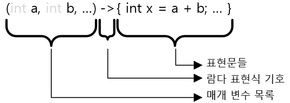
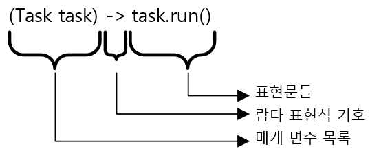
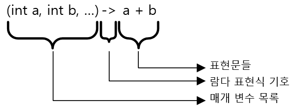

= Lambda Expression 형식

* 파라미터 목록과 표현 식의 블록으로 선언

[source, java]
----
(int i, int j, ...) -> (int x = i + j; ...)
----

* 파라미터 타입은 생략 가능

[source, java]
----
(a, b, …) -> { int x = a + b; … }
----

* 파라미터가 하나인 경우, 괄호 생략 가능

[source, java]
----
a -> { int x = a + b; … }
----

* 수행문이 하나이고, 지역 변수 선언 또는 return이 없는 경우 { } 생략 가능

[source, java]
----
(Task task) -> task.run()
----

* 괄호가 생략된 수행문에 return 키워드가 포함되어 있을 경우 return 생략 가능

[source, java]
----
(a, b) -> a + b
----

* 가장 단순한 형태

[source, java]
----
x -> x
----

---

Lambda Expression은 파라미터 목록과 짧은 코드 블록으로 구성됩니다. Lambda Expression의 기본 블록은 아래와 같습니다.

image:./images/image01.png[]

[source, java]
----
(int a) -> { return a + a; }
(int a, int b) -> { int temp = a * b; System.out.println(temp); }
() -> { System.out.println(“Hello World!”); return 0; }
----

**파라미터 데이터 타입 생략 가능** +
Lambda Expression에서는 파라미터 타입을 생략할 수 있습니다.

[source, java]
----
(a, b) -> { return a + b; }
(x) -> { return x * x * x; }
----

**파라미터가 하나인 경우 괄호 생략 가능** +
파라미터가 하나인 경우 파라미터 목록에 괄호를 생략할 수 있습니다.

image:./images/image03.png[]

**단일 수행문 적용시 블록 제거 가능** + 
Lambda Expression 수행문 블록 내에 수행문이 하나일 경우, 제한적으로 블록 구성을 위한 괄호 제거가 가능합니다. 제안 요건은 다음과 같습니다.

* 지역 변수 선언이 없음
* return 키워드가 없음

[source, java]
----
x -> return x * x * x:    	// 사용 불가 
x -> { return x * x * x: } 	// 사용 가능
----

**결과를 반환하는 단일문은 괄호와 return 생략 가능** + 
단일 수행문이면서 결과를 반환해야 할 경우, 괄호와 return문을 생략할 수 있습니다.

[source, java]
----
x -> x * x * x () -> Math.random()
----

return만 생략할 경우, return 값이 없는 수행문으로 처리됩니다.

[source, java]
----
x -> { x * x * x;}
----

가장 단순한 형태로 아래와 같이 쓸 수 있습니다.

image:./images/image06.png[]

link:./06_introduct_lambda.adoc[이전: Lambda Expression] +
link:./08_method_reference.adoc[다음: 메소드 참조]