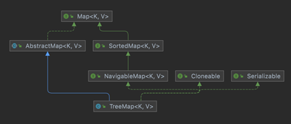

= TreeMap

* 이진 검색 트리(Binary Search Tree) 형태로, 검색과 정렬에 특화된 자료구조
* TreeSet과 같이 레드-블랙 트리(Red-Black Tree) 구조를 사용
** 정렬된 순서로 데이터를 저장
** 추가와 삭제에는 불리하지만 검색과 정렬에는 유리
* Key를 기준으로 데이터 정렬

[source, java]
----
Map<String, String> map = new TreeMap<>();
map.put("red", "Anne of Green Gables");
map.put("white","White Rabbit");

map.containsKey("red");
map.containsValue("White Rabbit");

treeMap.firstKey();
treeMap.firstEntry();

map.get("white");

map.remove("red");
----

---

TreeMap은 이진 검색 트리(Binary Search Tree)를 기반으로 한 Map 구현체입니다. TreeSet과의 차이점은 TreeSet은 값만을 저장하는 반면 TreeMap은 Key와 Value가 저장된 Map.Entry를 저장한다는 점입니다.

 
TreeMap은 TreeSet과 같이 이진 검색 트리 중 레드-블랙 트리(Red-Black Tree)를 사용하여 데이터를 저장하면 정렬됩니다. Key는 저장과 동시에 자동 오름차순 정렬되고, 숫자 타입일 경우 값으로, String 타입일 경우 유니코드로 정렬됩니다.

TreeMap은 데이터를 저장하면서 정렬되기나 추가와 삭제에는 불리합니다. 하지만 정렬된 상태로 Map을 유지해야 하거나 정렬된 데이터를 조회하는 범위 탐색(Range Scan)에는 유리합니다.

*주요 메소드*

[cols="2a, 3" options="header"]
|===
|Method|설명
|Map.Entry ceilingEntry(Object key)|	지정된 key와 일치하거나 큰 것 중 제일 작은 요소를 키와 값의 쌍 형태로 반환합니다. 없으면 null을 반환합니다.
|Object ceilingKey(Object Key)|지정된 key와 일치하거나 큰 것중 제일 작은 요소의 키를 반환합니다. 없으면 null을 반환합니다.
|boolean containsKey(Object key)|지정된 value가 포함되어 있는지 여부를 반환합니다.
|boolean containsValue(Object value)|	지정된 value가 포함되어 있는지 여부를 반환합니다.
|NavigableMap<K, V> descndingMap()|해당 Map에 포함된 모든 매핑을 역순으로 반환합니다.
|Set<Map.Entry<K,V>> entrySet()|지정된 키와 값을 Entry(key/value)의 형태로 Set에 저장하여 반환합니다.
|Map.Entry firstEntry()|TreeMap의 첫 번째 키와 값의 쌍을 반환합니다.
|Object firstKey()|TreeMap의 첫 번째 키를 반환합니다.
|Map.Entry floorEntry(Object key)|지정된 key와 일치하거나 큰 것 중 제일 작은 요소를 키와 값의 쌍 형태로 반환합니다. 없으면 null을 반환합니다.
|Object floorKey(Object key)|지정된 key와 일치하거나 큰 것중 제일 작은 요소의 키를 반환합니다. 없으면 null을 반환합니다.
|NavigableMap headMap(Object toKey, boolean inclusive)|첫 번째 요소부터 지정된 범위까지의 모든 요소를 SortedMap으로 반환합니다. inclusive의 값이 true이면 toKey를 포함합니다.
|Map.Entry higherKey(Object key)|지정된 key보다 큰 키 중에서 제일 작은 키의 키-값 쌍을 반환합니다.
|Object higherKey(Object key)|지정된 key보다 큰 키중에서
|Set<K> keySet()|지정된 모든 key를 Set에 저장하여 반환합니다.
|Map.Entry lowerEntry(Object key)|지정된 key보다 작은 키 중에서 제일 큰 키의 키-값 쌍을 반환합니다.
|Object lowerKey(Object key)|지정된 key보다 작은 키 중에서 제일 큰 키를 반환합니다.
|Map.Entry lastEntry()|TreeMap의 마지막 키와 값의 쌍을 반환합니다.
|Object lastKey()|TreeMap의 마지막 키를 반환합니다.
|void clear()|지정된 모든 객체를 제거합니다.
|remove(Object key, Object value)|key에 해당하는 value를 제거합니다.
|V getOrDefault(Object key, V defaultValue)|key에 해당되는 값을 반환합니다. 값이 존재하지 않는다면 defaultValue값을 반환합니다.
|void putAll(Map<? extends K)|Map 저장된 모든요소를 HashMap에 저장합니다.
|V replace(K key, V value)|당 key값을 value로 변경합니다.
|boolean replace(K key, V oldValue, V newValue)|key, value 모두 일치한다면 newValue값으로 변경합니다.
|===

*생성 및 데이터 삽입*

[source, java]
----
TreeMap<String, String> treeMap = new TreeMap<>();
treeMap.put("red", "Anne of Green Gables");
treeMap.put("white","White Rabbit");
----

*키와 값 존재 여부 확인*

[source, java]
----
treeMap.containsKey("red");
treeMap.containsValue("White Rabbit");
----

*첫 번째와 마지막 키와 값 확인*

[source, java]
----
treeMap.firstKey();
treeMap.firstEntry();
treeMap.lastKey();
treeMap.lastEntry();
----

*데이터 조회*

[source, java]
----
treeMap.get("white")
----

*데이터 삭제*

[source, java]
----
treeMap.remove("red");
----

*크기 확인*

[source, java]
----
treeMap.size();
----

*Collection으로 값 반환*

[source, java]
----
treeMap.values();
----

*데이터 순회*

[source, java]
----
Set<Map.Entry> entrySet = treeMap.entrySet();
entrySet.forEach(o -> {
    System.out.println(o.getKey() + " : " + o.getValue());
});

for(Map.Entry entry: entrySet) {
    System.out.println(entry.getKey() + ": " + entry.getValue());
}

Iterator iterator = entrySet.iterator();
while(iterator.hasNext()) {
    Map.Entry entry = (Map.Entry) iterator.next();  
    System.out.println(entry.getKey() + ": " + entry.getValue());
}
----

link:./27_hashtable.adoc[이전: Hashtable] +
link:./29_collections_class.adoc[다음: Collections 클래스]