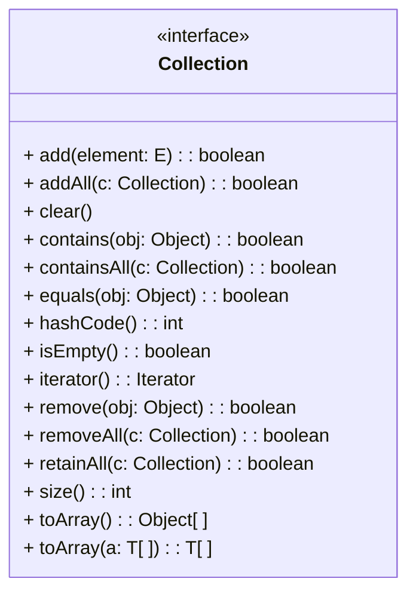

### Java Collections Framework
***
* Java Collection Framework는 java.util 패키지에 포함된 관련 인터페이스와 클래스의 모음
* 광범위하게 적용할 수 있는 여러 Collection 프레임워크를 제공함
* 타입 파라미터를 사용한 Generics 클래스 구현
* Framework의 클래스들은 Collection의 동작을 위한 공통적인 메소드를 가지고 있음
***

소프트웨어 프레임워크는 복잡한 문제를 해결하거나 서술하는데 사용되는 기본 개념 구조입니다. 프레임워크는 버즈워드로서 명확한 합의와 정의가 없는 용어로 불리지만, “Design Patterns: Elements of Reusable Object-Oriented Software”의 저자 중 한명인 랄프 존슨은 “소프트웨어의 구체적인 부분이 해당하는 설계와 구현을 재사용이 가능하게끔 협업화된 형태로 클래스들을 제공하는 것”이라고 정의했습니다.

Java Collections Framework는 java.util 패키지에 포함된 Collection 관련 인터페이스와 클래스의 모임입니다. Collections Framework는 광범위하게 사용될 수 있는 Collection 클래스들을 포함합니다. 

모든 Collections 프레임워크의 클래스들은 공통의 메소드를 가지고 있습니다. 
```Java
/**
 * Determines if this collection has no elements.
 *
 * @return true – if this collection has no elements
 *
 * /
public boolean isEmpty()
```
만약 myList라는 ArrayList 클래스의 인스턴스가 생성되고 myList에 요소가 포함되지 않았다면, 다음 코드는 true를 반환합니다.

```java
ArrayList<Integer> myList = new ArrayList<>();
System.out.println(myList.isEmpty());
```

아래와 같이 myList에 add 메소드를 통해 요소를 추가했다면, isEmpty 메소드는 false를 반환합니다.

```java
myList.add(1);
System.out.println(myList.isEmpty());
```

<br />

### Collection 클래스의 저장 구조
* * *
* Collection 클래스의 인스턴스는 일반적으로 컬렉션의 요소수에 비례하여 메모리를 사용
    * 컬렉션이 메모리에 저장되는 방식은 공간 효율성에 상당한 영향을 미칠 수 있음
    * 연속 컬렉션 클래스(Contiguous-Collection class)
        * 컬렉션의 각 요소에 대한 참조를 배열에 저장
        * 배열의 임의 접근 기능을 사용할 수 있음
    * 연결된 자료구조(Linked-Entry)
        * 객체간 연결된 형태로 요소를 저장
    * Collection 클래스의 저장 구조와 액세스 방식은 추상화되어 필드에 의존하지 않음
* * *

Collections클래스의 인스턴스는 일반적으로 Collection의 요소수에 비례하여 메모리를 사용합니다. 따라서 메모리에 저장되는 방식은 프로그램의 공간 효율성에 영향을 미칠 수 있습니다. Collection 인스턴스를 메모리에 저장하는 간단한 방법 중 하나는 Collection의 각 요소에 대한 참조를 배열에 저장하는 것입니다. 배열은 컬렉션 클래스의 일부가 될 수 있습니다.

이런 클래스를 연속 컬렉션 클래스(Contiguous-Collection class)라고 합니다. ArrayList 클래스에는 배열 필드가 있고 ArrayList 인스턴스의 각 요소는 해당 인스턴스의 배열에 저장됩니다. 배열의 크기는 고정되어 있고, 프로그래머는 배열의 요소를 조작하기 위한 모든 코드를 작성해야 합니다. 연속 컬렉션 형태의 클래스는 사용자보다 개발자에게서 이런 문제가 발생합니다. 해당 컬렉션 클래스의 사용자는 개발자가 작성한 메소드를 호출하기만 하면 Collection 클래스를 사용할 수 있습니다.

연속 컬렉션 클래스 대신 연결된 자료구조(Linked-Entry)를 사용할 수 있습니다. 기본적으로 각 요소는 항목(Entry, Node라고도 많이 불림)이라는 특수 개체에 보관됩니다. 각 항목 개체 내에는 다른 항목 개체에 대한 링크가 하나 이상 있습니다. 연결된 Collection 클래스에서 각 인스턴스의 요소는 항목에 저장됩니다.

Collection 프레임워크의 개체들은 저장 구조와 저장 구조에 따른 메소드의 동작등 구체적인 방식은 캡슐화합니다. Collection 클래스의 저장 구조와 액세스 방식은 추상화되어 필드에 의존하지 않습니다. 사용자는 저장 구조를 알고 응용 프로그램에 알맞은 구조를 가지는 클래스를 사용할 수 있습니다.

<br />

### Java Collections Framework 구성
* * *
* Java Collections Framework는 철저히 테스트된 다양한 인터페이스와 클래스로 구성
    * 클래스는 널리 사용되는 데이터 구조 및 알고리즘을 나타냄
        * Collection이 필요한 대부분의 응용 프로그램에 대해 프레임워크는 적절한 클래스를 제공
    * 추상 클래스
        * AbstractCollection, AbstractList, AbstractSet등의 추상 클래스 제공
        * 정의가 하위 클래스의 필드에 의존하는 모든 메소드를 추상으로 제공하고 해당 필드에 의지하지 않는 메소드를 정의
    * 타입 파라미터
        * 타입 파라미터를 사용하는 지네릭스 타입으로 선언됨
* * *
Java Collections Framework는 철저히 테스트된 다양한 인터페이스와 클래스로 구성됩니다. 클래스는 널리 사용되는 데이터 구조 및 알고리즘을 나타냅니다. Collection이 필요한 거의 모든 응용 프로그램 대해 적절한 클래스를 제공합니다. Java Collections Framework를 사용하면 “바퀴를 새로 발명할 필요 없이” 만들어진 클래스들을 사용할 수 있게 하여 생산성을 향상시킵니다.

Java Collections Framework는 AbstractCollection, AbstractList, AbstractSet 등 몇 개의 추상 클래스를 제공합니다. 이들 추상 클래스는 정의하 하위 클래스에 의존하는 모든 메소드를 추상으로 제공하고 해당 필드에 의존하지 않는 메소드를 정의합니다. 아래 그림은 ArrayList 클래스의 계층 구조를 보여줍니다.


또한 Java Collections Framework의 대부분의 클래스들은 타입 파라미터를 가지는 지네릭스 타입으로 되어 있습니다. Java Collections Framework에 포함된 ArrayList 클래스의 클래스 정의는 아래와 같습니다.

```java
public class ArrayList<E> extends AbstractList<E>
        implements List<E>, RandomAccess, Cloneable, java.io.Serializable
{
```
ArrayList 클래스의 인스턴스는 아래와 같은 방법으로 생성할 수 있습니다.

```java
AbstractList<String> list = new ArrayList<>();
```

<br />

### Collection 인터페이스

* * *
* Java Collections Framework는 기본적으로 계층구조로 구성됨
    * 인터페이스와 추상 클래스로 계층 구조를 구성
    * 최 하위 수준에 인터페이스와 추상 클래스를 구현한 클래스가 존재
* Collection 인터페이스와 Map 인터페이스가 최 상위 계층구조에 존재
* Collection 인터페이스는 Iterable 인터페이스를 확장하여 요소의 순회 방법을 정의함
* * *

Java Collections Framework는 기본적으로 계층 구조로 구성됩니다. 최 하위를 제외한 모든 수준에는 인터페이스와 추상 클래스가 있으며 최 하위 수준에는 인터페이스의 구현과 추상 클래스의 확장 클래스가 있습니다. 계층 구조의 최 상위에는 Collection과 Map이라는 두 개의 인터페이스가 있습니다.


Collection 인터페이스는 Java에서 Collection이 구현해야 할 공통적인 메소드를 가지고 있습니다. Collection 인터페이스를 UML 표기법으로 나타내면 아래와 같이 됩니다. 


Collection 인터페이스는 타입 파라미터로 E를 가집니다. E는 선언에서 Integer나 String과 같은 실제 클래스로 대체됩니다. Collection 인터페이스를 구현하는 클래스 중의 하나인 ArrayList는 아래와 같이 선언될 수 있습니다.

```java
Collection<String> list = new ArrayList<>();
```

Collection 인터페이스를 구현하는 클래스는 Collection 인터페이스가 가진 메소드를 클래스의 요소 저장 방식과 구현 방식으로 캡슐화하여 구현합니다. ArrayList 클래스의 인스턴스인 Collection 타입 객체 list는 아래와 같이 add 메소드를 통해 객체에 원소를 추가할 수 있습니다. 

```java
list.add(“Hello”);
```

또한 아래와 같이 remove 메소드를 통해 원소를 삭제할 수 있습니다.

```java
list.remove(“Hello”);
```

<br />

### Collection 인터페이스의 주요 메소드
* * *
* Collection 인터페이스는 List, Set등 Java의 Collection 구현제들이 공통적으로 가지는 메소드를 정의
* Collection 인터페이스는 Iterable 인터페이스를 확장
    * Iterable 인터페이스는 반복을 위한 공통된 메소드를 가진 Iterator 인터페이스를 반환
    * 메소드를 통해 동일한 방식으로 Collection을 사용할 수 있음
* * *
Collection 인터페이스는 List, Set등 Java의 Collection 구현체들이 공통적으로 가지는 메소드를 정의합니다. Collection 인터페이스는 Iterable 인터페이스의 서브타입이며, Iterable 인터페이스를 Iterator() 메소드를 통해 반복을 위한 공통된 동작을 가진 Iterator 인터페이스를 반환합니다.

Java에서 Collection 구현체들은 이런 메소드를 통해 동일한 방법으로 사용될 수 있습니다. Collection 인터페이스는 아래의 메소드 구현을 강제하고, Collection의 서브 타입은 List, Set등의 구현체는 아래의 메소드들을 동일한 방법으로 사용할 수 있습니다.

|Method|설명|
|------|----|
|boolean add(E e) <br />boolean addAll(Collection<? extends E> c)|지정된 객체  e  또는 Collection(c) 객체들을 collection에 추가합니다. 작업을 성공하면 true반환 합니다.|
|void clear();|Collection의 모든 객체를 삭제합니다.|
|boolean contains(Object o)<br/>boolean containsAll(Collection<?> c)|Collection에 o 또는 Collection(c) 객체들이 Collection에 포함되었는지 체크 합니다. 존재하면 true , 존재하지 않는다면 |false를 반환합니다.|
|boolean equals(Object o)|동일한 객체(Collection) 인지 비교합니다. 같으면 true를 반환 합니다.|
|int hashCode()|Collection의 hash코드를 반환 합니다.|
|boolean isEmpty()|Collection이 비어있는지 확인합니다. 비어있다면 true를 반환 합니다.|
|Iterator<E> iterator()|Collection객체에서 Iterator를 반환 합니다.|
|boolean remove(Object o);<br />boolean removeAll(Collection<?> c)|객체를 삭제하거나  지정된 Collection에 포함된 객체를 삭제합니다. 삭제되면 true를 반환 합니다.|
|boolean retainAll(Collection<?> c)|remove 반대, 지정된 Collection에 포함된 객체가 있다면 해당 객체를 제외한 나머지 객체를 삭제 합니다. 삭제후 Collection의 변화가 있다면 true를 반환 합니다.|
|int size()|Collection의 저장된 객체의 Size를 반환 합니다.|
|Object[] toArray();|Collection에 저장된 객체를 Object[] 형태의 배열로 반환 합니다|
|<T> T[] toArray(T[] a)|지정된 배열에 T[] a 형태의 Collection의 객체를 저장해서 반환합니다.|
|default<br /> boolean removeIf(Predicate<? super E> filter)|Collection에서 Predicate<? super E> filter 조건에 해당하는 객체를 삭제합니다. java 1.8에 추가되었습니다.|

<br />
<br />
<br />
<br />
<br />

## Iterator, Comparable, Comparator
Iterator는 사전적 의미로는 반복자를 의미하며, 데이터가 집합된 자료 구조에서 데이터를 추출하는데 이용됩니다. Comparable은 같은 타입의 인스턴스를 비교하고 반환 값을 기준으로 정렬합니다. 이 장에서는 Collection의 탐색, 비교 및 정렬에 대해서 학습합니다.

#### Table of Contents
1. Iterable과 Iterator
2. Comparable
3. Comparator

<br />

### Iterable과 Iterator
* * *
* Iterable 인터페이스는 for-each 반복의 대상이 될 수 있는 타입의 추상적 동작을 정의
    * Iterator() 메소드를 통해 Iterator 타입 객체를 반환
    * forEach 메소드와 Spliterator Defailt 메소드 제공
* Iterator 인터페이스는 Collection에 저장되어 있는 요소들을 읽는 방법을 표준화 함
    * 사전적으로 반복자를 의미
    * 반복적인 데이터가 집합되어 있는 자료구조에서 데이터를 표준적인 방법으로 추출
        * 더 읽을 요소가 남아 있는지 확인 – hasNext()
        * 남아있는 요소를 읽음 – next()
* * *
Iterable 인터페이스는 for-each 반복의 대상이 될 수 있는 타입의 추상적 동작을 정의합니다. Iterable 인터페이스는 Iterator() 추상 메소드와 forEach, Spliterator 두 Default 메소드를 가지고 있습니다.

|Method|설명|
|-|-|
|Iterator<T> iterator()|T 타입을 요소로 가지는 Iterator 객체를 반환합니다.|
|default void forEach(Consumber<? super T> action)|Iterable의 모든 요소가 처리되거나 작업이 예외를 throw 할 때 까지의 각 요소에 대해 지정된 작업을 처리합니다.|
|default Spliterator<T> spliterator()|Spliterator를 반환합니다.|

아래 클래스는 Iterable의 서브 타입으로, for-each 반복의 대상이 될 수 있도록 Lecture 클래스를 정의합니다.

```java
import java.util.Iterator;

public class Lecture<E> implements Iterable<E> {
    E[] elements;
    int index;
    
    public Lecture(int size) {
        this.elements = (E[])new Object[size];
        this.index = 0;
    }

    public void add(E e) {
        if (this.index >= elements.length) {
            System.out.println("Class is full!");
            return;
        }
        else {
            this.elements[this.index++] = e;
        }
    }

    public Iterator<E> iterator() {
        return new LectureIterator<E>(this);
    }
}
```

Iterator 인터페이스는 반복적인 데이터가 집합되어 있는 자료구조에서 표준적인 방법으로 데이터를 추출할 수 있도록 추상화합니다.
|Method|설명|
|-|-|
|boolean hasNext()|읽어 올 다음 요소가 있는지 확인하는 메소드입니다. 있으면 true 없으면 false를 반환합니다.|
|E next();|읽어 올 요소가 남아있는지 확인하는 메소드입니다. 있으면 해당 객체를 반환합니다.|
|default void remove();|next()로 읽어온 요소를 삭제합니다.|

아래 클래스는 Iterator의 서브 타입으로, 반복하는 방법을 정의합니다.

```java
import java.util.Iterator;

public class LectureIterator<E> implements Iterator<E> {
    Lecture<E> lecture;
    int index = 0;

    public LectureIterator(Lecture<E> lecture) {
        this.lecture = lecture;
    }
    
    public boolean hasNext() {
        if (this.index >= lecture.elements.length) {
            return false;
        }
        else {
            return true;
        }
    }

    public E next() {
        return lecture.elements[this.index++];
    }
}
```

Collections 인터페이스를 확장한 List와 Set 인터페이스에서도 Iterator() 메소드를 사용할 수 있습니다. List, Map, Set등의 자료구조는 데이터를 가지고 있는 방법이 달라 각각 다른 방법으로 데이터를 읽어야 하지만, Iterator는 표준적인 읽는 방법을 가지고 있으므로 공통적인 문법을 사용하여 데이터를 읽을 수 있습니다.

**List 읽기**
```java
List list = new ArrayList<>();

for(int i = 65; i < 70; i++) {
    list.add(String.valueOf((char)i));
}

Iterator<String> iterator = list.iterator();
while (iterator.hasNext()) {
    String str = iterator.next();
    System.out.println(str);
}
```
**HashSet 읽기**
```java
Set list = new HashSet<>();

for(int i = 65; i < 70; i++) {
    list.add(String.valueOf((char)i));
}

Iterator<String> iterator = list.iterator();
while (iterator.hasNext()) {
    String str = iterator.next();
    System.out.println(str);
}
```

<br />

### Comparable
***
* 값을 비교하는데 사용되는 compareTo() 메소드를 정의
    * 같은 타입의 인스턴스를 비교해야 하는 클래스는 모두 Comparable 인터페이스를 구현
* Boolean을 제외한 모든 Wrapper 클래스는 모두 정렬이 가능
* Collections Framework에서 Collection에 저장되어 있는 요소들을 읽는 방법을 표준화

```java
public <T extends Comparable<T>> void bubbleSort(T[] items) {
    for(int i = items.length - 1; i > 0; i--) {
        for(int j = 0 ; j < i ; j++) {
            if (items[j].compareTo(items[j+1]) > 0) {
                T item = items[j];
                items[j] = items[j+1];
                items[j+1] = item;
            }
        }
    }
}
```
***

Comparable 인터페이스를 구현하는 클래스는 값을 비교하는 compareTo() 메소드를 구현합니다. 

|Method|설명|
|-|-|
|Int compareTo(T o)|이 개체를 지정된 개체와 비교하여 순서를 지정합니다.|

T의 타입을 Comparable로 제한하는 bubbleSort 메소드는 Comparable 인터페이스를 구현하는 요소로 구성된 모든 인터페이스를 정렬할 수 있습니다.

```java
public <T extends Comparable<T>> void bubbleSort(T[] items) {
    for(int i = items.length - 1; i > 0; i--) {
        for(int j = 0 ; j < i ; j++) {
            if (items[j].compareTo(items[j+1]) > 0) {
                T item = items[j];
                items[j] = items[j+1];
                items[j+1] = item;
            }
        }
    }
}
```

<br />

### Comparator
***
* Comparable 인터페이스를 구현한 클래스의 기본 정렬 기준과 다르게 정렬할 때 사용
* 기본적인 정렬 기준(오름차순)을 기본 정렬 기준과 다르게 정렬하고 싶을 때 사용

```java
class DescendingOrder implements Comparator<User> {
    public int compare(User o1, User o2) {
        if(o1.getUserAge() > o2.getUserAge()){
            return -1;
        } else if(o1.getUserAge() < o2.getUserAge()){
            return 1;
        } else {
            return 0;
        }
    }
}
```
***
Comparator 인터페이스를 구현하는 클래스는 compare 메소드를 가지고 있고, 이 메소드는 기본적으로 제공되는 정렬 기준과 다른 정렬 기준을 사용하고 싶을 때 구현합니다.

|Method|설명|
|-|-|
|Int compare(T o1, T o2)|전달된 객체의 순서를 반환합니다.|

DecencingOrder 클래스는 Comparator 인터페이스를 구현합니다. DesendingOrder 클래스의 compare 메소드는 User의 나이를 기준으로 나이가 많으면 1을 반환합니다. 따라서 오름차순 정렬합니다.

<br />

```java
class DescendingOrder implements Comparator<User> {
    public int compare(User o1, User o2) {
        if(o1.getUserAge() > o2.getUserAge()){
            return -1;
        } else if(o1.getUserAge() < o2.getUserAge()){
            return 1;
        } else {
            return 0;
        }
    }
}
```
## Lab 12-1 Collection 인터페이스를 구현하는 클래스 구현

<a href="Lab_14-1.md">실습 파일</a> 참조

<br />
<br />
<br />
<br />
<br />

## List
List는 요소(Element)간의 순서가 있고, 크기가 가변적인 자료구조입니다. 이 장에서는 List의 구현체인 Vector, LinkedList, ArrayList, Stack에 대해 학습합니다.

#### Table of Contents
1. List 인터페이스
2. ArrayList
3. LinktedList
4. Queue
5. Vector
6. Stack

<br />

### List 인터페이스
***
* List는 중복을 허용하면서 저장 순서가 유지되는 자료구조
* 길이가 가변적이고 데이터 사이의 빈 공간을 허용하지 않음
* 배열의 인덱스와 같은 유일 식별자가 없음
* Collection 인터페이스의 서브 타입
* Vector, LinkedList, ArrayList등이 List 인터페이스의 서브 타입


***
List 인터페이스는 저장되는 데이터의 중복을 허용하면서 저장 순서가 유지되는 자료 구조입니다. List 인터페이스를 구현하는 Collection 개체들은 길이가 고정되어 있지 않고, 데이터 사이의 빈 공간을 허용하지 않습니다.

List 인터페이스는 아래와 같은 장점들을 가집니다.

* 데이터의 크기에 따른 동적 할당
* 빈 공간을 허용하지 않음
* 데이터의 삽입 삭제가 용이함

**주요 메소드**

|Method|설명|
|-|-|
|void add(int index, E element)|해당 index 위치에 요소를 추가 합니다.|
|boolean add(E e)|해당 요소를 추가 합니다.|
|E get(int index)|해당 위치의 요소를 반환 합니다.|
|int indexOf(Object o)|순방향 0번 위치부터 object 의 위치를 반환 합니다.|
|int lastIndexOf(Object o)|object의 위치를 반환 합니다.(역방향 마지막 위치부터 역으로 찾습니다.)|
|ListIterator<E> listIterator()<br />ListIterator<E> listIterator(int index)|Interator를 확장한 ListIterator를 반환합니다.|
|boolean remove(Object o)|object를 삭제 합니다. 성공하면 true를 반환 합니다.|
|E remove(int index)|index 위치의 객체를 삭제 후 삭제된 객체를 반환 합니다.|
|E set(int index, E element)|지정된 index 위치에 객체를 저장합니다.|
|sort(Comparator<? super E> c)|비교자(Comparator)에 의해서 List를 정렬합니다.|
|List<E> subList(int fromIndex, int toIndex)|지정된 범위 ( formIndex, toIndex)에 있는 객체를 반환 합니다.|
|static <E> List<E> of()|수정이 불가능한 emptyList 를 반환 합니다. java 9 추가 되었습니다.|
|static <E> List<E> of(E e1)|e1 <-- list 를  수정 불가능한  list ( ImmutableCollections) 반환 합니다. java 9에서 추가되었습니다.|

<br />

### ArrayList
***
* Java에서 가장 많이 사용되는 Collection 클래스
* 배열과 동일하게 연속된 메모리 공간을 사용
    * index를 사용하여 액세스 가능
    * 기본 크기 10개로 할당된 후 가변적으로 크기가 변함
    * 생성된 크기 이상이 저장되면 메모리에 추가로 할당됨
```java
ArrayList<String> list = new ArrayList<>();

for (int i = 0; i < list.size(); i++) {
    System.out.print(list.get(i) + " ");
}

for (String s: list) {
    System.out.print(s + " ");
}
```
***
ArrayList는 Java 프로그래밍에서 가장 많이 사용되는 Collection 클래스입니다. RandomAccess 인터페이스를 구현하여 index를 이용해서 비 순서로 액세스할 수 있으며, Cloneable 인터페이스를 구현하여 복제본을 만들어 낼 수 있습니다.


**ArrayList 생성**
*  기본 생성: 기본 크기가 10으로 설정됨
```java
ArrayList list = new ArrayList();
```
* 기본 크기를 20으로 생성
```java
ArrayList list = new ArrayList(20);
```
* 기본 크기가 20이면서 10씩 증가하는 ArrayList 생성
```java
ArrayList list = new ArrayList(20, 10);
```
**생성 및 데이터 삽입**
```java
List<String> list  = new ArrayList();
list.add("red");
list.add("green");
list.add("blue");
```
**처음 위치에 데이터 삽입**
```java
list.set(0,"white");
```
**데이터 삭제**
```java
list.remove("white");
```
**데이터 존재 확인**
```java
list.contains("green")
```

<br />

### LinkedList
***
* 노드라고 불리는 요소가 포인터와 주소를 사용하여 연결되는 자료구조
    * 각 노드가 데이터와 포인터를 가지고 한 줄로 연결되는 방식
    * 해당 노드의 포인터가 이전 노드, 다음 노드의 연결을 할 수 있도록 저장
* 삽입 삭제가 쉽고 동적
    * 배열과 달리 데이터가 연속적으로 존재하지 않음
    * 모든 요소가 데이터를 연결(Link)한 형태의 자료 구조
* 직접적으로 노드에 접근할 수 없으며, 순회 방식의 접근

```java
LinkedList<String> list = new LinkedList<>();
list.add("red");list.addLast("pink");list.addFirst("yellow");
list.removeFirst(); list.removeLast();
for(String color : list){
    System.out.println("color:" + color);
}
```
***
LinkedList는 배열과 같이 데이터가 연속적으로 존재하지 않고 노드라 불리는 각 요소가 데이터와 포인터를 가지고 한 줄로 연결되는 방식의 자료구조입니다. 삽입 삭제가 쉽고 동적이기 때문에 선형으로 저장되고 중간 노드의 삽입 삭제가 없는 방식에 유리합니다.

LinkedList는 노드에 인덱스를 사용하는 방식으로 직접 접근할 수 없으며 Head 노드에서 시작하여 링크를 따라서 접근하는 순회 방식으로 데이터를 탐색합니다.

Serializable 인터페이스를 구현하여 쓰레드에 안전하며, Cloneable 인터페이스를 구현하여 복제 가능하고, Deque 인터페이스를 구현하여 처음과 끝 양쪽에서 데이터의 삽입과 삭제를 수행할 수 있습니다.


LinkedList는 배열과 같이 데이터가 연속적으로 존재하지 않고 노드라 불리는 각 요소가 데이터와 포인터를 가지고 한 줄로 연결되는 방식의 자료구조입니다. 삽입 삭제가 쉽고 동적이기 때문에 선형으로 저장되고 중간 노드의 삽입 삭제가 없는 방식에 유리합니다.

LinkedList는 노드에 인덱스를 사용하는 방식으로 직접 접근할 수 없으며 Head 노드에서 시작하여 링크를 따라서 접근하는 순회 방식으로 데이터를 탐색합니다.

Serializable 인터페이스를 구현하여 쓰레드에 안전하며, Cloneable 인터페이스를 구현하여 복제 가능하고, Deque 인터페이스를 구현하여 처음과 끝 양쪽에서 데이터의 삽입과 삭제를 수행할 수 있습니다.

**주요 메소드**
|Method|설명|
|-|-|
|public void addFirst(E e)|첫번째 요소로 추가 합니다.|
|public void addLast(E e)|마지막 요소로 추가 합니다.|
|public E removeFirst()|첫번째 요소를 제거 합니다.|
|public E removeLast()|마지막 요소를 제거 합니다.|
|public E getFirst()|첫번째 요소를 반환 합니다.|
|public E getLast()<br />ListIterator<E> listIterator(int index)|마지막 요소를 반환 합니다.|

**생성 및 데이터 삽입**
```java
LinkedList<String> list = new LinkedList<>();
list.add("red");
list.add("green");
list.add("white");
```
**처음과 끝 위치에 데이터 삽입**
```java
list.addLast("pink");
list.addFirst("yellow");
```
**데이터 삭제**
```java
list.removeFirst();
list.removeLast();
```
**데이터 접근**
```java
for(String color : list){
    System.out.println("color:" + color);
}

Iterator<String> iterator = list.iterator();
while(iterator.hasNext()){
    System.out.println("color:" + iterator.next());
```

<br />

### Queue 인터페이스
***
* Stack과 반대로 FIFO(First In First Out) 형태를 가지는 자료구조
* 데이터가 입력되는 순서대로 처리되어야 하는 상황에서 사용
* LinkedList는 Queue의 구현체

```java
Queue queue = new LinkedList();
queue.add("white");
queue.offer("green");
queue.element();
queue.peek()
queue.remove();
queue.poll();
queue.forEach(item->{
    System.out.println(item);
});
```
***

Queue는 Stack과 반대로 FIFO(First In First Out) 형태를 가지는 자료구조이며, 데이터가 입력되는 순서대로 처리되어야 하는 상황에서 사용됩니다. 

Java Collection Framework의 Queue는 인터페이스이며, LinkedList는 Queue 인터페이스의 구현체입니다.


**주요 메소드**
|Method|설명|
|-|-|
|public boolean add(E e)|element를 Queue에 추가합니다. 성공하면 true를 반환 합니다.저장공간이 부족하다면 IllegalStateException 발생합니다.|
|public boolean remove(Object o)|Queue에서 Object를 제거합니다.|
|public E element()|삭제없이 요소를 반환합니다. peek과는 달리 Queue가 비어있다면 NoSuchElementException 발생합니다.|
|public boolean offer(E e)|Queue에 객체를 저장 합니다. 성공하면 true, 실패하면 false를 반환합니다.|
|public E poll()|Queue에 객체를 꺼내서 반환합니다. 비어있다면 null을 반환합니다.|
|public E peek()|Queue에서 객체를 꺼내서 반환 합니다. 비어있으면 null을 반환합니다.|

**생성 및 데이터 삽입**
```java
Queue queue = new LinkedList();
queue.add("white");
queue.offer("green");
```
**데이터 조회 (꺼냄)**
```java
queue.peek();
queue.poll();
```
**데이터 조회 (삭제 없음)**
```java
queue.element()
```
**데이터 삭제**
```java
queue.remove();
queue.remove(“White”);
```
**데이터 순회**
```java
for(String color : list){
    System.out.println("color:" + color);
}

Iterator<String> iterator = list.iterator();
while(iterator.hasNext()){
    System.out.println("color:" + iterator.next());
}
```

<br />

### Vector
***
* Collection Framework가 추가되기 전에 추가된 레거시 클래스
* ArrayList와 유사하며, 지네릭스를 사용할 수 있도록 재 설계됨
    * List 인터페이스를 구현하여 크기가 가변적으로 변경됨
    * Vector를 개선하여 작성된 ArrayList보다 성능이 떨어짐
* 스레드에 안전하나, 동기화 비용이 발생하여 ArrayList 보다 성능이 떨어짐
***

Vector는 레거시 클래스로, 기능이 개선된 ArrayList가 추가되어 더 이상 사용할 필요가 없으나 코드 호환성을 위해 남아있는 List 구현체입니다. List 인터페이스를 구현하므로 ArrayList와 동일하게 동작합니다. 레거시 코드와의 호환 문제가 아니라면 Vector보다 ArrayList를 사용하는 것이 좋습니다.


**Vector와 ArrayList**

|  |Vector|ArrayList|
|-|-|-|
|동기화|한번에 하나의 쓰레드에 접근 가능|동시에 여러 쓰레드가 작업할 수 있음|
|스레드 안전|Thread Safe|명시적인 Thread Safe |
|성능|느림|빠름(동기화가 되어 있지 않음)|
|크기증가|Vector Size의 100% 증가|ArrayList Size의 50% 증가|

<br />

### Stack
***
* FILO (First In Last Out) 구조를 가진 전통적인 자료구조
* Java에서 Stack은 Vector에서 파생됨
```java
Stack<String> stack = new Stack<>();

stack.push("white");
stack.push("red");
stack.pop();
stack.peek().
for(String s: stack) {
    System.out.print(s + " ");
}
```
***

Stack은 FILO(First In Last Out) 구조를 가진 전통적인 자료 구조이며, Java의 Collection Framework에서는 Vector에서 파행된 형태로 구현되었습니다.


**주요 메소드**
|Method|설명|
|-|-|
|public E push(E item) |Stack의 아래에서부터 데이터를 저장합니다.|
|public synchronized E pop() |Stack의 맨 위의 값을 삭제합니다.|
|public synchronized E peek()|Stack의 맨 위의 값을 가져옴니다.|
|public synchronized int search(Object o) |Stack에서 해당 객체가 몇 번째에 있는지 반환합니다.|
|public boolean empty() |Stack이 비어있는지 확인합니다. 비어있다면 true를 반환합니다.|

**생성 및 데이터 삽입**
```java
Stack stack = new Stack();
stack.push("white");
stack.push("red");
```
**데이터 조회 (꺼냄)**
```java
stack.pop();
```
**최 상위 데이터 조회 (삭제 없음)**
```java
stack.peek();
```
**데이터 순회**
```java
for(String s: stack) {
    System.out.print(s + " ");
}

Iterator iterator = stack.iterator();
while(iterator.hasNext()) {
    System.out.print(iterator.next() + " ");
}
```

<br />
<br />
<br />
<br />
<br />

## Set
Set은 수학에서 말하는 집합과 유사한 자료구조를 표현합니다. Set 인터페이스는 집합과 유사하게 데이터의 중복을 허용하지 않으며 저장 순서가 유지되지 않습니다. 이 장에서는 Set 인터페이스의 구현체인 SortedSet, HashSet, TreeSet에 대해 학습합니다.

#### Table of Contents
1. Set 인터페이스
2. HashSet
3. TreeSet

<br />

### Set 인터페이스
***
* 집합과 유사한 자료구조 표현
* 중복된 요소를 허용하지 않음
* 저장 순서를 유지하지 않음
* HashSet, LinkedHashSet, TreeSet등으로 구현됨


***

Set은 수학에서의 집합과 유사한 동작을 수행하는 자료구조이며, Java에서는 Set 인터페이스를 통해 구현합니다. Set은 중복되는 요소를 허용하지 않으며, 저장 순서를 유지하지 않습니다. (LinkedHashSet 예외)

List와 가장 다른 점은, 중복되는 요소를 허용하지 않는다는 것입니다. 

**주요 메소드**
|Method|설명|
|-|-|
|public boolean add(E item) |지정된 요소가 없을 경우 Set에 요소를 추가합니다. <br />지정된 요소가 존재하는 경우 false를 반환합니다.|
|public boolean remove(Object o)|지정된 객체가 존재하는 경우 해당 요소를 제거합니다. <br />요소가 없는 경우 false를 반환합니다.|
|public boolean contains(Object o)|지정된 요소가 집합에 있는지 확인합니다.|
|public boolean equals(Object o)|지정된 객체와 현재 집합이 같은지 비교합니다.|
|public boolean isEmpty()|집합이 비어있을 경우 true를, 아닌 경우 false를 반환합니다.|
|public int size()|집합에 포함된 요소의 수를 반환합니다.|
|public void clear()|집합의 모든 요소를 제거합니다.|

<br />

### HashSet
***
* Set 인터페이스를 구현한 가장 대표적인 컬렉션
* 입력의 순서가 없고 입력된 요소의 순서가 유지되지 않음
* 중복된 요소를 저장하지 않음
* Hash 알고리즘으로 데이터를 매핑
    * Hash에 의해 데이터의 위치를 특정시켜 해당 데이터를 빠르게 색인
    * 삽입, 삭제, 색인이 매우 빠른 컬렉션
```java
Set<String> set  = new HashSet();
System.out.println( "1.add color : " +  set.add("white"));
System.out.println( "2.add color : " +  set.add("white"));
System.out.println( "3.add color : " +  set.add("red"));

for(String s: set) {
    System.out.print(s + " ");
}
```
***

Set은 수학에서의 집합과 유사한 동작을 수행하는 자료구조이며, Java에서는 Set 인터페이스를 통해 구현합니다. Set은 중복되는 요소를 허용하지 않으며, 저장 순서를 유지하지 않습니다. (LinkedHashSet 예외)

HashSet은 데이터의 위치를 Hash에 의해 특정하므로 해당 데이터를 빠르게 검색할 수 있도록 합니다. HashSet은 집합의 전형적인 기능을 가지며, 데이터를 검색하기 위해 Hash 알고리즘을 이용하는 자료 구조입니다.

**Hash**  
Hash는 데이터를 검색할 때 사용할 Key와 실제 데이터의 Value가 한 쌍으로 존재하고, key 값이 배열의 인덱스로 저장되도록 하여 검색과 저장의 시간 복잡도를 O(1)에 수렴하게 되는, 검색과 저장을 빠르게 하는 기법을 의미합니다.


**주요 메소드**
|Method|설명|
|-|-|
|public boolean addAll(Collection c) |주어진 컬렉션에 저장된 모든 개체를 추가합니다. (합집합)|
|public void clear()|Set에 있는 모든 요소를 삭제합니다|
|public boolean containsAll(Collection c)|주어진 컬렉션에 있는 모든 개체를 저장하고 있는지 확인합니다.|
|Public boolean removeAll(Collection e)|주어진 컬렉션에 저장된 모든 개체와 동일한 요소를 삭제합니다. (차집합)|

**생성 및 데이터 삽입**
```java
Set<String> set = new HashSet<>();
set.add("Jason");
set.add("Celine");
set.add("Jason");	// false를 반환하고 데이터가 입력되지 않음
```
**데이터 확인**
```java
set.contains("Jason");
```
**데이터 삭제**
```java
set.remove("Jason");
```
**데이터 순회**
```java
for(String s: set) {
    System.out.print(s);
}

Iterator iterator = set.iterator();
while(iterator.hasNext()) {
    System.out.print(iterator.next());
}
```

### TreeSet
***
* 중복을 허용하지 않고, 저장 순서를 유지하지 않음
* 이진 탐색 트리 구조의 하나인 레드-블랙 트리(Red-Black Tree) 구조
    * 정렬된 순서로 데이터를 저장
    * 추가와 삭제에는 불리하지만 검색과 정렬에는 유리
```java
TreeSet<Integer> treeSet = 
    new TreeSet(Arrays.asList(1,3,2,9,5,6,10,4,8,7));

for(int i: treeSet) {
    System.out.print(i + " ");
}
treeSet.first();
treeSet.last();
treeSet.higher(5);
treeSet.lower(5);
treeSet.headSet(5);
treeSet.tailSet(5);
treeSet.subSet(3,7);
```
***

TreeSet은 중복을 허용하지 않고 저장 순서를 유지하지 않는 Set의 성질을 가지는 구현체입니다. 이진 탐색 트리(Binary Search Tree)로 구성되어 추가와 삭제에는 불리하지만 정렬과 검색에 유리한 자료구조 입니다.


**레드-블랙 트리(Red-Black Tree)**  
TreeSet은 이진 탐색 트리 중에서도 성능이 향상된 레드-블랙 트리로 구현되었습니다. 이진 탐색 트리는 트리의 높이만큼 시간이 걸리며, 데이터의 값이 트리에 잘 분산되어 있지 않으면 검색 효율이 떨어지는 구조입니다. 레드 블랙 트리는 상위 노드와 비교하여 큰 값은 오른쪽으로, 작은 값은 왼쪽으로 저장하는 구조로 데이터의 값이 트리에 잘 분산되어 균형을 맞추어 검색 효율을 높입니다.


**주요 메소드**
|Method|설명|
|-|-|
|public E first()|정렬된 순서에서 첫 번째 객체를 반환합니다.|
|public E last()|정렬된 순서에서 마지막 객체를 반환합니다.|
|public E higher(E e)|지정된 객체보다 큰 값을 가진 객체중 제일 가까운 값의 객체를 반환합니다. 없으면 null을 반환합니다.|
|public E lower(E e)|지정된 객체보다 작은 값을 가진 객체 중 제일 가까운 값의 객체를 반환합니다. 없으면 null을 반환합니다.|
|public SortedSet<E> headSet(E toElement)|지정된 객체보다 작은 값의 객체들을 반환합니다.|
|public SortedSet<E> tailSet(E fromElement)|지정된 객체보다 큰 값의 객체들을 반환합니다.|
|public SortedSet<E> subSet(E fromElement, E toElement)|범위검색 결과를 반환합니다. 끝 범위인 toElement는 범위에 포함되지 않습니다.|

**생성 및 데이터 삽입**
```java
TreeSet<Integer> treeSet = new TreeSet<Integer>();
treeSet.add(1);
treeSet.add(5);
treeSet.add(2);
treeSet.add(6);
```
**데이터 확인**
```java
treeSet.first();	    // 첫 번째 값
treeSet.last();	        // 마지막 값
treeSet.higher(5);	    // 5보다 큰 첫 번째 값
treeSet.lower(5);	    // 5보다 작은 첫 번째 값
treeSet.headSet(5);	    // 5보다 작은 집합
treeSet.tailSet(5);	    // 5보다 큰 집합
treeSet.subSet(3,7);	// 3 <= 7인 집합
```
**데이터 삭제**
```java
set.remove("Jason");
```
**데이터 순회**
```java
for(String s: set) {
    System.out.print(s);
}

Iterator iterator = set.iterator();
while(iterator.hasNext()) {
    System.out.print(iterator.next());
}
```

<br />
<br />
<br />
<br />
<br />

## Map
Map은 key/value로 이루어져 하나의 쌍으로 묶인 데이터를 저장하는 Collection을 의미합니다. 이 장에서는 HashMap, HashTable, TreeMap, Properties등 Map을 구현하는 자료구조에 대해 학습합니다.

#### Table of Contents
1. HashMap
2. HashTable
3. Properties

<br />

### Map 인터페이스
***
* Key-Value 쌍으로 이루어진 데이터를 저장하는 자료구조
    * Key는 중복을 허용하지 않음
    * Value는 중복을 허용함
* 입력된 순서를 유지하지 않으며, 정렬되지 않음
* 삽입, 삭제, 검색에 유리
***

Map 인터페이스는 중복을 허용하지 않는 Key와 중복이 가능한 Value를 하나의 쌍으로 묶어서 저장하는 컬렉션 클래스를 구현하는데 사용되는 인터페이스입니다. Key와 Value의 쌍으로 구성된 데이터를 저장하고, 조회와 삭제는 Key를 이용하여 수행합니다.

Map은 Key는 중복될 수 없으나 Value는 중복되며, 기존에 저장된 Key와 같은 값의 Key로 Value가 저장되면 기존의 값은 없어지고 새 Value가 저장되는 특징을 가지는 자료구조입니다.

|Method|설명|
|-|-|
|void clear()|Map의 모든 개체를 삭제합니다.|
|boolean containsKey(Object key)|지정된 Key와 일치하는 Map의 Key가 있는지 확인합니다.|
|boolean containsValue(Object value)|지정된 value와 일치하는 value가 있는지 확인합니다.|
|Set entrySet()|Map에 저장된 key-value 상을 Map.Entry 객체로 저장한 Set로 반환합니다.|
|Object get(Object Key)|지정한 Key에 대응하는 Value를 반환합니다.|
|boolean isEmpty()|Map 객체가 비어있는지 여부를 반환합니다.|
|Set keyset()|Map에 저장된 모든 Key를 반환합니다.|
|Object put(Object key, Object value)|Key-Value 쌍을 Map에 저장합니다.|
|void putAll(Map t)|파라미터로 전달받은 Map의 모든 Key-Value 쌍을 저장합니다.|
|int size()|Map에 저장된 key-value 쌍을 반환합니다.|
|Collection values()|Map에 저장된 모든 value를 반환합니다.|

### HashMap
***
* Map 인터페이스를 구현한 자료구조
* Key, Value 쌍으로 데이터를 입력
* 해당 Key를 이용해 데이터에 액세스
* 스레드에 안전하지 않으나, 속도 측면에서 유리함
```java
Map map = new HashMap();
map.put("red", "Anne of Green Gables");
map.put("white","White Rabbit");

map.containsKey("red");
map.containsValue("White Rabbit");

map.get("white");

map.remove("red");
```
***

HashMap은 Map 인터페이스의 구현체이며 Key-Value의 쌍으로 데이터를 저장하고 Key를 해싱하여 데이터에 액세스하고 삭제합니다. Key는 컬렉션 내에서 유일한 값을 가집니다.


HashMap에서 Key는 중복될 수 없으며, Value는 중복될 수 있습니다. Collection 또는 Iterable 인터페이스를 구현하지 않아 foreach문 등에서 순회될 수 없습니다. HashMap은 내부에 Key와 Value를 저장하는 자료 구조를 가지고 있습니다. HashMap은 HashSet와 유사한 방법으로 Key와 Value가 저장되는 위치를 결정합니다. 따라서 요소가 삽입되는 순서와 위치는 Hash 알고리즘이 결정합니다.

기존에 저장된 키와 동일한 키로 값을 저장하면 기존 값이 새 값으로 대치되며, Hashing을 사용하므로 많은 양의 데이터를 검색하는데 있어 뛰어난 성능을 보입니다.

|Method|설명|
|-|-|
|boolean containsKey(Object key)|지정된 key가 포함되어 있는지 여부를 반환합니다.|
|boolean containsValue(Object value)|지정된 value가 포함되어 있는지 여부를 반환합니다.|
|Set<Map.Entry<K,V>> entrySet()|지정된 키와 값을 Entry(key/value)의 형태로 Set에 저장하여 반환합니다.|
|Set<K> keySet()|지정된 모든 key를 Set에 저장하여 반환합니다.|
|void clear()|지정된 모든 객체를 제거합니다.|
|remove(Object key, Object value)|key에 해당하는 value를 제거합니다.|
|V getOrDefault(Object key, V defaultValue)|key에 해당되는 값을 반환합니다. 값이 존재하지 않는다면 defaultValue값을 반환합니다.|
|void putAll(Map<? extends K)|Map 저장된 모든요소를 HashMap에 저장합니다.|
|V replace(K key, V value)|당 key값을 value로 변경합니다.|
|boolean replace(K key, V oldValue, V newValue)|key, value 모두 일치한다면 newValue값으로 변경합니다.|

**생성 및 데이터 삽입**
```java
Map map = new HashMap();
map.put("red", "Anne of Green Gables");
map.put("white","White Rabbit");
```
**키와 값 존재 여부 확인**
```java
map.containsKey("red");
map.containsValue("White Rabbit");
```
**데이터 조회**
```java
map.get("white")
```
**데이터 삭제**
```java
map.remove("red");
```
**데이터 순회**
```java
Set<Map.Entry> entrySet = map.entrySet();

for(Map.Entry entry: entrySet) {
    System.out.println(entry.getKey() + ": " + entry.getValue());
}

Iterator iterator = entrySet.iterator();
while(iterator.hasNext()) {
    Map.Entry entry = (Map.Entry) iterator.next();  
    System.out.println(entry.getKey() + ": " + entry.getValue());
```

### Hashtable
***
* Hash를 이용해 Key와 Value 쌍으로 이루어진 데이터를 저장하는 전통적 자료구조
* HashMap과 동일한 방법으로 저장
    * Key, Value 쌍으로 데이터를 입력
    * 해당 Key를 이용해 데이터에 액세스
* 스레드에 안전함
* Collection Framework 이전부터 존재하던 레거시 클래스
```java
Map map = new Hashtable();
map.put("red", "Anne of Green Gables");
map.put("white","White Rabbit");

map.containsKey("red");
map.containsValue("White Rabbit");

map.get("white");

map.remove("red");
```
***
Hashtable은 Collection Framework 이전부터 존재하던 레거시 클래스로, HashMap과 동일하게 동작합니다. Hashtable은 HashMap과 달리 스레드에 안전합니다. 또, null 입력이 가능한 HashMap과 달리 null을 사용할 수 없습니다.


**생성 및 데이터 삽입**
```java
Map map = new Hashtable();
map.put("red", "Anne of Green Gables");
map.put("white","White Rabbit");
```
**키와 값 존재 여부 확인**
```java
map.containsKey("red");
map.containsValue("White Rabbit");
```
**데이터 조회**
```java
map.get("white")
```
**데이터 삭제**
```java
map.remove("red");
```
**데이터 순회**
```java
Set<Map.Entry> entrySet = map.entrySet();

for(Map.Entry entry: entrySet) {
    System.out.println(entry.getKey() + ": " + entry.getValue());
}

Iterator iterator = entrySet.iterator();
while(iterator.hasNext()) {
    Map.Entry entry = (Map.Entry) iterator.next();  
    System.out.println(entry.getKey() + ": " + entry.getValue());
}
```

<br />
<br />
<br />
<br />
<br />

## Collections 클래스
java.util 패키지의 Collection 클래스는 Collection 인터페이스를 구현하는 인스턴스를 반환하는 static 메소드로 구성된 유틸리티 클래스로, collection을 위한 많은 동작들을 포함하고 있습니다. 이 장에서는 Collections 클래스가 제공하는 기능들에 대해 학습합니다.

#### Table of Contents
1. Collections 클래스
2. Collection 동기화
3. Unmodifiable Collection
4. Singleton Collection
5. Checked Collection

<br />

### Collections 클래스
***
* Collection 개체를 위한 여러 메소드를 제공하는 유틸리티 클래스
    * List, Set, Map등 모든 Collection 클래스에 사용
    * Collection 객체에 대한 생성, 정렬, 섞기, 병합, 검색등의 메소드를 제공
* static 메소드로 제공
```java
List numbers = Arrays.asList(1, 3, 10, 5, 8, 9, 7, 2, 6, 4);
Collections.max(numbers);
Collections.min(numbers);

Collections.sort(numbers);
Collections.binarySearch(numbers,3);
Collections.reverse(numbers);
Collections.shuffle(numbers);
```
***

java.util 패키지에 포함된 Collections 클래스는 Collection 객체를 위한 여러 메소드를 제공합니다. Collections 클래스는 List, Set, Map등 대부분의 Collection 클래스에 사용할 수 있으며 Collection 객체에 대한 정렬, 섞기, 병합, 검색 등의 기능을 static 메소드로 제공합니다.

**주요 메소드**
|Method|설명|
|-|-|
|static T min(Collection<? extends T> coll)|지정된 Collection의 가장 작은 요소를 반환합니다.|
|Static T max(Collection<? extends T> coll)|지정된 Collection의 가장 큰 요소를 반환합니다.|
|void sort(Comparator<? super E> c)|지정된 Collection을 오름차순으로 정렬합니다.|
|static void shuffle(List<?> list)|지정된 Collection을 랜덤으로 썩어줌니다.|
|binarySearch(List<? extends Comparable<? super T>> list, T key)|지정된 Collection에서 값을 찾아서 index를 반환합니다. |
|static boolean disjoint(Collection<?> c1, Collection<?> c2)|Collection c1, c2를 비교해서 일치하는 값이 하나도 없으면 true, 하나라도 있으면 false를 반환 합니다.|
|static <T> void copy(List<? super T> dest, List<? extends T> src)|지정된 collection의 모든 요소를 새로운 Collection으로 복사해서 반환 합니다.|
|static void reverse(List<?> list)|지정된 Collection을 역순으로 정렬합니다.|

**생성 (복사)**
```java
List<Integer> list = Arrays.asList(1, 3, 10, 5, 8, 9, 7, 2, 6, 4);
List<Integer> numbers = Arrays.asList(1, 2, 3, 4, 5, 6, 7, 8, 9, 10, 11, 12);
Collections.copy(numbers, list);
```
**최대값과 최소값**
```java
Collections.max(numbers);
Collections.min(numbers);
```
**정렬**
```java
Collection.sort(numbers);
```
**검색**
```java
Collections.binarySearch(numbers, 3);
```
**반전**
```java
Collections.reverse(numbers);
```
**섞기**
```java
Collections.shuffle(numbers);
```

<br />

### Collections 동시성 처리
***
* 멀티스레드 환경에서는 동시성 처리가 필요함
    * 하나의 Collection 객체에 여러 스레드가 접근할 때
    * 데이터 일관성을 위한 Synchronize 처리가 필요
* Vector와 Hashtable은 동시성을 처리하도록 설계됨
    * 동시성 처리는 느리므로, 비 멀티스레드 환경을 위해 ArrayList, HashMap등을 사용
* ArrayList, HashMap등에 동시성 제어가 필요할 때 Collections 클래스를 사용

```java
List<String> list  = Collections.synchronizedList(new ArrayList());
```
***
Collection Framework의 Vector와 Hashtable 객체에는 멀티스레드 환경에서 데이터 일관성을 위한 처리가 되어있지만, Synchronize 처리를 위한 비용을 줄이기 위해 비 멀티스레드 환경에서는 ArrayList, HashMap등 Synchronize가 없는 객체를 사용합니다.

ArrayList, HashMap등 동시성 처리가 되어 있지 않은 객체에 동시성 처리가 필요할 때, Collections 클래스의 synchronizeList, SynchronizedSet, SynchronizedMap등의 동시성 지원 메소드를 사용할 수 있습니다.

<br />

### 읽기 전용 Collection
***
* Collection에 저장된 데이터를 읽기전용으로 만듦
* 외부에서 변경할 수 없으므로 데이터의 무결성이 보장됨
* 읽기전용으로 설정된 Collection의 요소에 변경을 시도하면 UnsupportedOperationException 발생
```java
List<String> list = new ArrayList();
list = Collections.unmodifiableList(list);
```
***

Collection 객체는 자유롭게 데이터를 추가하고, 읽고, 수정하고, 지울 수 있습니다. Collection이 한번 생성된 후 데이터의 무결성을 위해 수정이 불가능해야 하는 경우, Collections 클래스의 unmodifiableList, unmodifiableSet, unmodifiableMap 메소드를 사용해 읽기 전용으로 설정할 수 있습니다.
```java
List<String> list = new ArrayList(){{
    add("red");
    add("green");
    add("blue");
}};

list = Collections.unmodifiableList(list);

try {
    list.add("pink");
} 
catch (UnsupportedOperationException e){
   e.printStackTrace();
}
```

<br />

### Checked Collection
***
* Collection에 단일 타입의 객체를 저장하고자 할 때 사용
* 지정된 타입 외 다른 타입이 저장될 때 ClassCast Exception 사용
    * checkedList, checkedSet, checkedMap 메소드 지원
```java
List colors = Collections.checkedList(new ArrayList(),String.class);
```
***

일반적으로 Collection 클래스에는 다양한 타입의 객체를 저장할 수 있습니다. 한 가지 타입의 객체를 저장하고자 한다면 checked 형태의 collection을 사용할 수 있습니다.

Collections 클래스에서 제공하는 checklist, checkedSet, checkedMap 메소드를 사용하여 단일 타입만 저장 가능한 Collection을 생성할 수 있습니다. 
```java
List colors = Collections.checkedList(new ArrayList(),String.class) ;
colors.add("white");
colors.add("black");
colors.add("green");
colors.add("pink");

try {
    colors.add(123);
}
catch (ClassCastException e){
    System.out.println(e.getMessage());
}

colors.forEach(color->{
    System.out.println(color);
});
```

<br />
<br />
<br />
<br />
<br />

## 검토
***
* Collection 개요
* Iterator, Comparable, Comparator
* List
* Set
* Map
* Collections 클래스
***
**Quiz**
1. Collection Framework를 구성하는 인터페이스와 클래스에 대해 설명하고 클래스 다이어그램을 작성하세요
2. List, Set, Map 컬렉션의 차이에 대해 설명하세요.
3. Iterable 인터페이스와 Iterator 인터페이스의 메소드를 기술하세요.
4. ArrayList와 Vector의 차이점에 대해 설명하세요