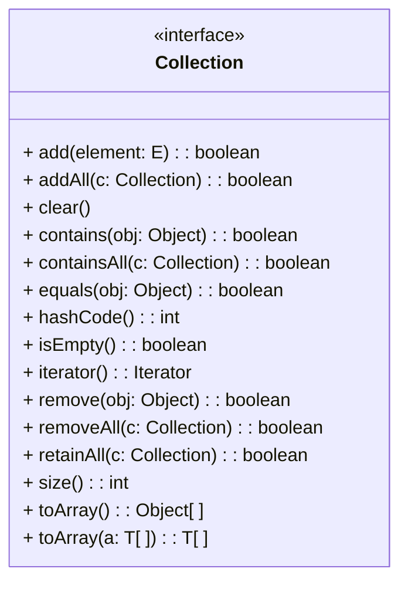

### Collection 인터페이스

* * *
* Java Collections Framework는 기본적으로 계층구조로 구성됨
    * 인터페이스와 추상 클래스로 계층 구조를 구성
    * 최 하위 수준에 인터페이스와 추상 클래스를 구현한 클래스가 존재
* Collection 인터페이스와 Map 인터페이스가 최 상위 계층구조에 존재
* Collection 인터페이스는 Iterable 인터페이스를 확장하여 요소의 순회 방법을 정의함
* * *

Java Collections Framework는 기본적으로 계층 구조로 구성됩니다. 최 하위를 제외한 모든 수준에는 인터페이스와 추상 클래스가 있으며 최 하위 수준에는 인터페이스의 구현과 추상 클래스의 확장 클래스가 있습니다. 계층 구조의 최 상위에는 Collection과 Map이라는 두 개의 인터페이스가 있습니다.


Collection 인터페이스는 Java에서 Collection이 구현해야 할 공통적인 메소드를 가지고 있습니다. Collection 인터페이스를 UML 표기법으로 나타내면 아래와 같이 됩니다. 


Collection 인터페이스는 타입 파라미터로 E를 가집니다. E는 선언에서 Integer나 String과 같은 실제 클래스로 대체됩니다. Collection 인터페이스를 구현하는 클래스 중의 하나인 ArrayList는 아래와 같이 선언될 수 있습니다.

```java
Collection<String> list = new ArrayList<>();
```

Collection 인터페이스를 구현하는 클래스는 Collection 인터페이스가 가진 메소드를 클래스의 요소 저장 방식과 구현 방식으로 캡슐화하여 구현합니다. ArrayList 클래스의 인스턴스인 Collection 타입 객체 list는 아래와 같이 add 메소드를 통해 객체에 원소를 추가할 수 있습니다. 

```java
list.add(“Hello”);
```

또한 아래와 같이 remove 메소드를 통해 원소를 삭제할 수 있습니다.

```java
list.remove(“Hello”);
```

<a href="./07_Collection_인터페이스의_주요_메소드.md">다음 장</a>