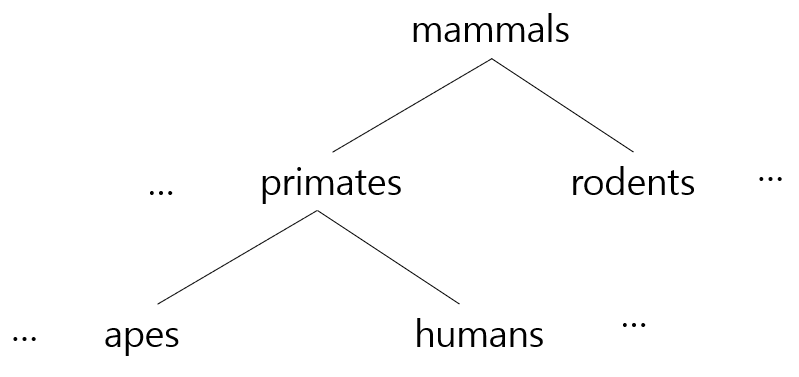

= 추상화 소개

* 관련성이 있는 속성과 그렇지 않은 속성의 분리
* 프로그램 설계 프로세스의 전형
** 문제를 더 간단한 문제로 변환하기 위해 중요한 것을 골라내고 무시할 것을 버림
** 어떤 것이 중요한지에 초점을 맞추고 판단
* 결과적으로 복잡한 자료, 모듈, 시스템 등으로부터 핵심적인 개념 또는 기능을 간추려 냄
* Abstraction 수준을 정의하여 복잡한 구현을 계층화 함

---

Abstration은 관련성이 있는 속성과 그렇지 않은 속성을 분리하여 분석을 단순화하는 일련의 프로세스입니다. 이 작업에서 컨텍스트에 중요한 것들을 골라내고, 컨텍스트와 관련이 없는 무시할 수 있는 것을 버리는 작업을 수행합니다.

개념이 포유류(Mammul)인 구조를 살펴봅시다. 모든 포유류는 암컷이 우유를 생산한다는 사실과 같은 특정 특성을 포함합니다. 이 주상화 수준에서는 이러한 공통 특성에 초점을 맞추고 다양한 유형의 포유동물 간의 차이점을 무시합니다.

Abstration 수준을 한 단계 내리면, 포유류의 특정 특징들에 대해 모델링할 수 있습니다. 그러나 이 수준에서도 개인이나 종을 고려하지 않고 관련 종을 그룹화하여 Abstration할 수 있습니다. 이 수준에서는 영장류나 설치류와 같은 그룹을 갖게 됩니다. 이 수준에서는 인간과 유인원의 차이점 보다는 공통된 특징에 집중합니다. 이러한 차이점은 낮은 수준의 Abstration 단계로 내려갈수록 세분화됩니다.

많은 프로그램에서 유용한 컴퓨터에서의 예는 파일의 개념입니다. 파일은 원시 스토리지에서 Abstraction되고 명명된 사용할 수 있는 스토리지를 제공합니다. 운영체제는 파일 인식이 다릅니다. 파일 이름의 구조는 운영체제 마다 다릅니다.

프로그래밍 언어는 고급 언어이라 하더라도 일반적인 데이터 구조의 고정된 집합과 이를 조작하는데 사용할 수 있는 강력한 집합을 모두 제공하지는 못합니다. 설령 제공하는 언어가 있다고 하더라도 너무 많은 기본 제공 Abstraction를 포함하는 언어는 사용하기 어려울 정도로 어려울 수 있습니다.

이에 대한 대안은 프로그래머가 필요에 따라 자신의 Abstraction을 구성할 수 있도록 하는 메커니즘을 제공하는 것입니다. 프로시저의 정의와 호출을 분리함으로써 프로그래밍 언어는 파라미터화에 의한 Abstraction과 명세에 의한 Abstraction, 두 가지 중요한 Abstraction 방법을 가능하게 합니다.

link:./02_decomposition_abstraction.adoc[이전: 분해와 추상화] +
link:./04_abstraction_by_parameterization.adoc[다음: 파라미터화에 의한 추상화]