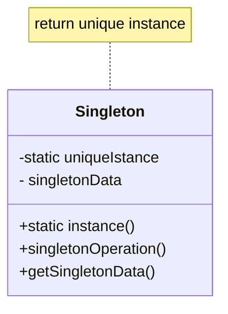

### 싱글턴(Singleton) 패턴
***
* 이름
    * 싱글턴(Singleton) 패턴
* 문제
    * 어떤 클래스의 경우 정확히 하나의 인스턴스만을 가지게 하는 것이 중요하다 (예: 프린터 스풀)
    * 클래스의 인스턴스를 하나만 만들고, 이 인스턴스에 쉽게 접근할 수 있도록 만들 수 있어야 한다.
* 해법
    * 클래스 자체가 자신의 유일한 인스턴스로의 접근을 자체적으로 관리하도록 설계한다. 이 클래스는 자신 말고는 다른 인스턴스가 생성될 수 없음을 보증할 수 있고, 클래스 자체가 인스턴스에 대한 접근 방식을 제공하도록 할 수 있다.
* 활용
    * 클래스의 인스턴스가 오직 하나임을 보장하며, 정의된 접근 방식에 의해서만 접근해야 할 때
    * 유일하게 존재하는 인스턴스가 상속에 의해 확장되어야 할 때
* 구조

* 결과
    * 유일하게 존재하는 인스턴스로의 접근을 통제할 수 있음
    * 변수 영역을 줄임
    * 오퍼레이션의 정제를 가능하게 함
    * 인스턴스의 개수 변경이 자유로움
    * 클래스 오퍼레이션을 사용하는 것 보다 유연한 방법
***

싱글턴 패턴은 클래스에서 만들 수 있는 인스턴스가 오직 하나일 경우에 이에 대한 접근은 단일 통로만 제공하는데 의도가 있습니다. 어떤 클래스의 경우에는 하나의 인스턴스만을 갖도록 하는 것이 중요할 때도 있습니다. 모든 객체가 공유해야 하는 데이터를 가진 객체의 경우 전체 응용 프로그램에서 단일 인스턴스임이 보장되어야 하고, 특정 동작을 위한 객체를 생성하서 반환하는 객체, 예를 들면 미로 찾기 게임에서 미로를 생성하는 객체 같은 경우에도 단일 객체인 것이 좋습니다.

이 경우, 객체가 응용 프로그램에서 유일한 객체임을 보장하여야 하고, 이 인스턴스에 쉽게 접근하도록 할 수 있도록 프로그래밍해야 합니다. 전역 변수를 이용해서 이 객체로 접근하도록 하면 인스턴스를 여러 개 만들 필요가 없게 되지만, 유일한 인터페이스임을 보장할 수 없고, 캡슐화 관점에서 문제가 생길 수도 있습니다.

합당한 방법은, 클래스 자체가 자신의 유일한 인스턴스로의 접근 방법을 자체적으로 관리하게 하는 것입니다. 이 클래스는 자신 말고는 다른 인스턴스가 생성되지 않음을 보증할 수 있고, 클래스 자체가 인스턴스에 대한 유일한 접근 방법을 제공하도록 할 수 있습니다.

**싱글턴 패턴을 사용해야 하는 경우**
* 클래스의 인스턴스가 오직 하나임을 보장해야 할 때. 접근 방식에 의해 모든 클라이언트가 접근할 수 있도록 해야 하는 경우
* 유일하게 존재해야하는 인스턴스가 상속에 의해 확장되어야 할 때.

**싱글턴 패턴에 참여하는 객체**
* Singleton  
인스턴스를 생성하는 오퍼레이션을 정의하여, 유일한 인스턴스로의 접근이 가능하게 합니다. 이 오퍼레이션은 클래스 오퍼레이션으로 정의되어야 합니다. (클래스 오퍼레이션은 Java에서 static으로 선언되어 클래스를 이름 공간으로 사용하고 응용 프로그램에서 만들어지는 모든 객체에 걸쳐 공유되는 메소드를 말합니다)

**객체간 협력 방법**  
클라이언트는 싱글턴 클래스에 정의된 생성 오퍼레이션을 통해 유일하게 생성되는 싱글턴 인스턴스애 접근할 수 있습니다.

**결과와 장단점**  
1. 유일 인스턴스로의 접근을 통제할 수 있습니다. 싱글턴 클래스가 해당 인스턴스를 캡슐화하고 있으므로 클라이언트의 인스턴스에 대한 접근을 제어할 수 있습니다.
2. 유일한 객체 생성을 클래스로 분리함으로써, 변수를 정의해서 사용함으로 발생하는 복잡도, 코드 읽기의 어려움, 단일 책임원칙 위반을 줄일 수 있습니다.
3. 유일함을 보장하는 객체의 생성을 캡슐화하므로, 객체를 생성하는 동작을 정제할 수 있습니다.
4. 싱글턴 클래스의 인스턴스가 하나 이상이어야 하는 경우도 있습니다. 이 경우 개수를 자유롭게 늘이고 줄일 수 있습니다.
5. 클래스 내에 정적 객체를 정의하고 사용하는 것 보다 유연한 방법을 제공합니다.

**구현**
Java에서 싱글턴 패턴의 구현은, 유일해야 하는 객체를 클래스 내에서 static으로 선언하여 응용 프로그램내의 모든 객체가 사용할 수 있는 공용으로 선언하고, 싱글턴 객체의 생성자를 private으로 클라이언트에서 객체의 생성자를 호출하여 다른 객체를 생성하지 못하게 하는 방법으로 구현할 수 있습니다.
```java
public class Singleton {
    private static Singleton singleton;
private Singleton() {}
}
```
싱글턴 클래스의 생성자를 private으로 선언하면 클라이언트에서 클래스의 인스턴스를 생성할 수 없게 됩니다. 이 경우 Java에서는 싱글턴 객체에서 파생되는 서브 클래스를 만들 수 없게 되므로 오퍼레이션 정제에서 상속을 이용할 수 있는 장점을 잃게 됩니다.

그리고 싱글턴 객체에 액세스할 수 있는 유일한 메소드를 만들어 노출합니다. 싱글턴 객체에 액세스하는 유일한 방법은 이 메소드를 호출하는 방법이 되도록 합니다.
```java
public class Singleton {
    private static Singleton singleton;
    private Singleton() {}

    public static Singleton getSingleton() {
        if (singleton == null)
            singleton = new Singleton();
        return singleton;
    }
}
```
**관련 패턴**  
추상 팩토리 패턴, 빌더 패턴, 퍼사드 패턴, 프로토 타입 패턴 등에서 객체를 생성하는 생성 대리자 역할을 하는 클래스는 싱글턴으로 선언됩니다.

<a href="./11_Lab17-1_Bank_응용_프로그램_리팩토링.md">연습</a>