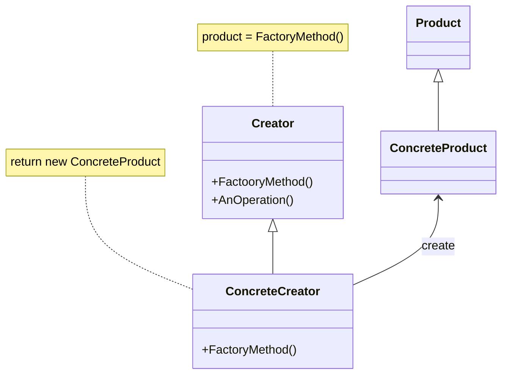

## 팩토리 메소드(Factory Method) 패턴
***
* 이름
    * 팩토리 메소드(Factory Method) 패턴, 다른 이름으로 가상 생성자(Virtual Constructor) 패턴
* 문제
    * 생성해야 하는 인스턴스의 종류가 많고, 각 인스턴스는 다른 타입의 서브 클래스이다.
    * 인스턴스를 생성하는 클래스(Creator)는 어떤 타입의 클래스가 만들어질 지 알 수 없다.
* 해법
    * 제품(Product)의 서브 클래스 중 어느 것을 생성해야 하는지를 프레임워크와 분리하여 정의.
* 활용
    * 생성할 객체 타입을 예측할 수 없을 때
    * 생성할 객체를 기술하는 책임을 서브 클래스에 정의하고자 하는 경우
    * 객체 생성의 책임을 서브 클래스에게 위임하고 서브 클래스의 정보를 위임하려는 경우
* 구조



* 결과
    * 애플리케이션에 국한된 클래스가 코드에 종속되지 않아도 됨
        * Product 인터페이스 하고만 동작하도록 코드를 작성
        * 이후 사용자가 정의한 ConcreteProduct 클래스와 동작하도록 작성
* 단점
    * Creator 클래스를 반드시 상속하여 구체적 제품을 생성해야 함
***

팩토리 메소드 패턴은 객체를 생성하기 위해 인터페이스를 정의하지만, 어떤 클래스의 인스턴스를 생성할 지에 대한 결정은 서브 클래스에게 넘기는데 의미가 있습니다.

프레임워크 – 복잡한 문제를 해결하거나 서술하는데 사용되는 기본 개념 구조 – 는 추상 클래스를 사용하여 객체 사이의 관련성을 정의하고 유지할 수 있습니다. 프레임워크는 일반적으로 추상 클래스간의 상호 작용을 정의해서 전체 시스템의 기본 동작 방식을 정의합니다. 그리고 추상 클래스에서 파생된 서브클래스들이 구체적인 행위를 정의하여 프로그램을 동작하도록 만듭니다.

다르게 동작하는 여러 유닛을 가진 게임이 있다고 생각해 봅시다. 이 게임을 구동하는 프레임워크는 유닛과 게임이 상호작용하게 하는 관련성을 지정해 놓았을 수 있습니다. 프레임워크에서 다양한 유닛을 정의하고, 다양한 유닛을 상황에 맞게 생성하기 위한 생성 클래스를 정의했다고 생각합시다. 이 두 클래스는 모두 추상 클래스이거나 인터페이스이고, 클라이언트는 특정 응용 프로그램에 종속적인 구현을 위해 서브 클래스를 정의할 수 있습니다.

게임이 진행되면서 어떤 인스턴스가 생성될지 알 수 없기 때문에, 생성 클래스는 어떤 유닛의 인스턴스를 생성해야 하는지 알 수 없습니다. 단지 문서의 유닛을 언제 생성해야 하는 지만 알 수 있습니다. 이 경우, 프레임워크는 클래스를 인스턴스화 해야 하지만, 추상 클래스 또는 인터페이스는 인스턴스를 가질 수 없습니다.

팩토리 메소드 패턴은 이런 문제에 대한 해법을 제시합니다. 즉, 유닛의 서브 클래스 중 어느 것을 생성해야 하는지를 프레임워크와 분리하여 정의합니다.

**팩토리 메소드 패턴을 사용해야 하는 경우**
* 생성할 인스턴스 타입을 예측할 수 없을 때
* 객체의 생성을 서브 클래스에 위임하려 하는 때
* 서브 클래스에 대한 정보를 위임하고자 하는 경우

**팩토리 메소드 패턴에 참여하는 객체**
* Product  
팩토리 메소드가 생성하는 객체의 인터페이스를 정의합니다.
* ConcreteProduct  
Product 클래스에 정의된 인터페이스를 실제로 구현합니다.
* Creator  
Product 타입을 반환하는 팩토리 메소드를 구현합니다. 구체적인 생성은 ConcreateCreator에게 위임합니다. 
* ConcreateCreator  
ConcreteProduct 인스턴스를 생성하여 return 하기 위해 팩토리 메소드를 재정의합니다.

**객체간 협력 방법**

Creator는 서브 클래스에 실제 필요한 팩토리 메소드를 구현하여 적당한 ConcreteProduct의 인스턴스를 반환합니다.

**결과와 장단점**

응용 프로그램에 국한된 클래스가 코드에 종속될 필요를 없애 줍니다. 응용 프로그램은 Product 클래스에 정의된 인터페이스와 동작하도록 코드를 작성하고, 이후 사용자가 정의한 ConcreteProduct 클래스와 동작할 수 있도록 합니다.

1. 팩토리 메소드로 클래스 내부에서 객체를 생성하도록 하는 것이 객체를 직접 생성하게 하는 것 보다 훨씬 응용성이 높아집니다. 
2. Creator 클래스만이 팩토리 메소드를 호출하도록 하여, 병렬적 클래스 계층도를 연결하는 역할을 담당합니다.

**구현**
프레임워크는 복잡한 문제를 해결하거나 서술하는데 사용되는 기본 개념 구조를 제공합니다. 프레임워크는 높은 수준에서의 객체 간의 상호 작용 방법을 정의합니다. 프레임워크에서 팩토리 메소드 패턴은, 추상화 된 높은 수준에서의 생성될 클래스(Product)와 객체를 생성할 클래스(Factory)간의 상호 관계를 정의합니다.

```java
public interface Product {
    int getModelNumber();
    String getProductName();
    String getCategoryName();
    void setCategory(String category);
}
```

프레임워크는 Product와 Product를 생성하는 팩토리의 관계를 정의합니다. 팩토리 메소드 패턴에서 Factory는 Product를 생성하는 과정을 상호관계로 정의합니다.

```java
public abstract class Factory {
    public final Product createProduct(int modelNumber, String modelName) {
        Product product = create(modelNumber, modelName);
        return product;
    }

    protected abstract Product create(int modelNumber, String modelName);
    protected abstract void setCategory(Product product);
}
```

프레임워크에서 Product와 Factory의 상호 작용이 정의되었습니다. 따라서 프로그램에서 제품은 인터페이스의 Product 서브 타입이 됩니다. 

```java
public class Cellphone implements Product {
    private int modelNumber;
    private String modelName;
    private String category;

    public Cellphone(int modelNumber, String modelName) {
        this.modelNumber = modelNumber;
        this.modelName = modelName;
    }

    public int getModelNumber() {
        return this.modelNumber;
    }

    public String getProductName() {
        return this.modelName;
    }

    public String getCategoryName() {
        return this.category;
    }

    public void setCategory(String category) {
        this.category = category;
    }
}
```

객체를 생성하는 Factory는 객체의 생성을 서브 클래스에 위임합니다.

```java
public class CellphoneFactory extends Factory {
    public Product create(int modelNumber, String modelName) {
        Cellphone cellphone = new Cellphone(modelNumber, modelName);
        this.setCategory(cellphone);
        return cellphone;
    }

    public void setCategory(Product product) {
        product.setCategory("Mobile Device");
    }
}
```

**관련 패턴**

추상 팩토리 패턴, 템플릿 메소드 패턴에서 객체 생성을 위해 팩토리 메소드 패턴을 사용하는 경우가 많습니다.

<a href="./14_Lab13-2_팩토리_메소드_패턴.md">연습</a>