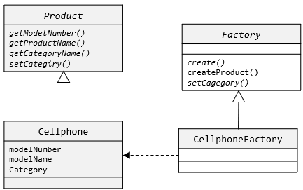
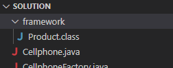
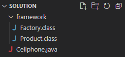
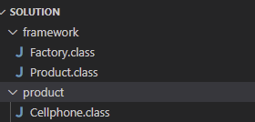
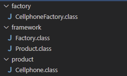
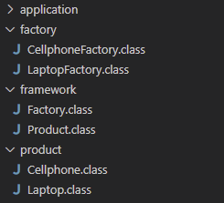

## Lab 13-2 : Factory Method 패턴
이 연습에서는 Factory Method 패턴을 이용하여 프레임워크에서 정의된 인스턴스 생성과 관련된 객체 상호작용이 분리된 프로그램을 작성합니다. 이 프로그램의 클래스 다이어그램은 아래와 같습니다.



1. Visual Studio Code를 엽니다.
2. 파일 메뉴에서 폴더 열기를 클릭하고 c:\Labs\Lab17-2\Starter 폴더를 엽니다.
3. 작성자 신뢰 경고 창에서, 예, 작성자를 신뢰합니다 버튼을 클릭합니다.

**프레임워크 코드 확인**

1. Visual Studio Code 탐색기에서, Product.java 파일을 엽니다.
2. 파일에는 Product 인터페이스가 정의되어 있습니다. 코드는 아래와 같습니다.

```java
package framework;

public interface Product {
    int getModelNumber();
    String getProductName();
    String getCategoryName();
    void setCategory(String category);
}
```
3. 아래 명령을 수행하여 Product.java 파일을 컴파일합니다. 

```bash
$ javac -d . Product.java
```

4. Visual Studio Code 탐색기에서, framework 디렉토리가 생성되고 컴파일된 Product.class 파일이 생성된 것을 확인합니다.

5. Visual Studio Code 탐색기에서, Factory.java 파일을 엽니다.
6. 파일에는 Factory 추상 클래스가 정의되어 있습니다. 코드는 아래와 같습니다.

```java
package framework;

public abstract class Factory {
    public final Product createProduct(int modelNumber, String modelName) {
        Product product = create(modelNumber, modelName);
        setCategory(product);
        return product;
    }

    protected abstract Product create(int modelNumber, String modelName);
    protected abstract void setCategory(Product product);
}
```

7. 아래 명령을 수행하여 Factory.java 파일을 컴파일합니다.
```bash
$ javac -d . Factory.java
```
8. Visual Studio Code 탐색기에서, framework 디렉토리가 생성되고 컴파일된 Factory.class 파일이 생성된 것을 확인합니다.



**Product 클래스 생성**

1. Visual Studio Code 탐색기에서 Cellphone.java 파일을 엽니다.
2. 파일에서 패키지와 import된 패키지를 확인합니다.
3. Cellphone 클래스를 작성합니다.
    1. Cellphone 클래스는 framework 패키지에 선언된 Product 인터페이스의 서브타입입니다.
    2. int형 전역변수 modelNumber, String형 전역변수 modelNamel, String형 전역변수 category를 가집니다.
    3. Celphone 클래스의 생성자는 int 타입 modelNumber, String 타입 modelName을 가지고, 각각 전역변수 modelNumber와 modelName에 할당됩니다.
    4. getModelNumber 메소드는 전역변수 modelNumber의 getter입니다.
    5. getProductName은 전역변수 modelName의 getter입니다.
    6. getCategoryName은 전역변수 category의 getter입니다.
4. 완성된 코드는 아래와 유사할 것입니다.

```java
public class Cellphone implements Product {
    private int modelNumber;
    private String modelName;
    private String category;

    public Cellphone(int modelNumber, String modelName) {
        this.modelNumber = modelNumber;
        this.modelName = modelName;
    }

    public int getModelNumber() {
        return this.modelNumber;
    }

    public String getProductName() {
        return this.modelName;
    }

    public String getCategoryName() {
        return this.category;
    }

    public void setCategory(String category) {
        this.category = category;
    }
}
```

5. 아래 명령을 수행하여 Cellphone.java 파일을 컴파일합니다.

```bash
$ javac -d . Cellphone.java
```

6. Visual Studio Code 탐색기에서, product 디렉토리가 생성되고 컴파일된 Cellphone.class 파일이 생성된 것을 확인합니다.



**Concrete 클래스인 Cellphone을 생성하는 CellphoneFacory 클래스 생성**

1. Visual Studio Code 탐색기에서 CellphoneFactory.java 파일을 엽니다.
2. 파일에서 패키지와 import된 패키지를 확인합니다.
3. CellphoneFactory 클래스를 작성합니다.
    1. CellphoneFactory 클래스는 framework 프레임워크에 선언된 Factory 클래스의 서브 클래스입니다.
    2. create 메소드는 int 타입 modelNumber, String 타입 modelName을 파라미터로, 두 파라미터를 사용해서 Cellphone 클래스의 인스턴스를 반환합니다.
    3. setCategory 메소드는 Product 타입 product를 파라미터로, product 객체의 setCategory 메소드를 호출하여 “Mobile Device” 카테고리로 분류합니다.
4. 완성된 코드는 아래와 유사할 것입니다.

```java
package factory;
import framework.*;
import product.*;

public class CellphoneFactory extends Factory {
    protected Product create(int modelNumber, String modelName) {
        Product product = new Cellphone(modelNumber, modelName);
        return product;
    }

    protected void setCategory(Product product) {
        product.setCategory("Mobile Device");
    }
}
```
5. 아래 명령을 수행하여 CellphoneFactory.java 파일을 컴파일 합니다. 오류가 있으면 수정합니다.
```bash
$ javac -d . CellphoneFactory.java
```
6. Visual Studio Code 탐색기에서 factory 디렉토리가 생성되고 컴파일된 CellphoneFactory.class 파일이 생성된 것을 확인합니다.



**프로그램 테스트**
1. Visual Studio Code 탐색기에서 Test.java 파일을 엽니다.
2. 파일에서 패키지와 import된 패키지를 확인합니다.
3. 아래 명령을 수행하여 Test.java 파일을 컴파일합니다.

```bash
$ javac -d . Test.java
```

4. Visual Studio Code 탐색기에서 Application 디렉토리가 생성되고 컴파일된 Test.class 파일이 생성된 것을 확인합니다.
5. 아래 명령을 수행하여 프로그램을 실행하고 결과를 확인합니다.
```java
> java application.Test
iPhone13, Mobile Device
Galaxy Note 10, Mobile Device
```

**랩탑 Product 추가**
1. Visual Studio Code 탐색기에서, 새 파일 아이콘을 클릭하고 Laptop.java 파일을 생성합니다.
2. product 패키지에 속하도록 선언합니다.

```java
package product;
```
3. framework 패키지의 모든 클래스를 import 합니다.

```
import framework.*;
```
4. Laptop 클래스를 작성합니다.
    1. Laptop 클래스는 framework 패키지에 선언된 Product 인터페이스의 서브타입입니다.
    2. int형 전역변수 modelNumber, String형 전역변수 modelName, String형 전역변수 category를 가집니다.
    3. Laptop 클래스의 생성자는 int 타입 modelNumber, String 타입 modelName을 가지고, 각각 전역변수 modelNumber와 modelName에 할당됩니다.
    4. getModelNumber 메소드는 전역변수 modelNumber의 getter입니다.
    5. getProductName 메소드는 전역변수 modelName의 getter입니다.
    6. getCategoryName 메소드는 전역변수 category의 getter입니다.
5. 완성된 코드는 아래와 유사할 것입니다.

```java
package product;
import framework.*;

public class Laptop implements Product {
    private int modelNumber;
    private String modelName;
    private String category;

    public Laptop(int modelNumber, String modelName) {
        this.modelNumber = modelNumber;
        this.modelName = modelName;
    }

    public int getModelNumber() {
        return this.modelNumber;
    }

    public String getProductName() {
        return this.modelName;
    }

    public String getCategoryName() {
        return this.category;
    }

    public void setCategory(String category) {
        this.category = category;
    }
}
```
6. 아래 명령을 수행하여 Laptop.java 파일을 컴파일 합니다. 오류가 있으면 수정합니다.

```bash
$ javac -d . Laptop.java
```

**Laptop 인스턴스를 생성하는 LaptopFactory 추가**

1. Visual Studio Code 탐색기에서 새 파일 아이콘을 클릭하고 LaptopFactory.java 파일을 추가합니다.
2. factory 패키지에 위치하도록 선언합니다.
```java

```java
package factory;
```

3. framework 패키지와 product 패키지의 모든 클래스를 import 합니다

```java
import framework.*;
import product.*;
```
4. LaptopFactory 클래스를 작성합니다.
    1. LaptopFactory 클래스는 framework 프레임워크에 선언된 Factory 클래스의 서브 클래스입니다.
    2. create 메소드는 int 타입 modelNumber, String 타입 modelName을 파라미터로, 두 파라미터를 사용해서 Laptop 클래스의 인스턴스를 반환합니다.
    3. setCategory 메소드는 Product 타입 product를 파라미터로, product 객체의 setCategory 메소드를 호출하여 “Laptop” 카테고리로 분류합니다.
5. 완성된 코드는 아래와 유사할 것입니다.

```java
package factory;
import framework.*;
import product.*;

public class LaptopFactory extends Factory {
    protected Product create(int modelNumber, String modelName) {
        Product product = new Laptop(modelNumber, modelName);
        return product;
    }

    protected void setCategory(Product product) {
        product.setCategory("Laptop");
    }
}
```

6. 아래 코드를 수행하여 LaptopFactory.java 파일을 컴파일합니다.

```bash
$ javac -d . LaptopFactory.java
```

7. Visual Studio Code 탐색기에서 product와 factory 디렉토리에 생성된 클래스들을 확인합니다.



**프로그램 테스트**
1. Visual Studio Code 탐색기에서 Test.java 파일을 엽니다.
2. main 메소드에서, 기존 코드 아래와 같이 테스트 코드를 작성합니다.

```java
Factory lapTopfactory = new LaptopFactory();
Product product3 = lapTopfactory.createProduct(123, "Macbook Pro M1");
Product product4 = lapTopfactory.createProduct(124, "Galaxy Laptop Pro 10");
System.out.println(product3.getProductName() + ", " + product3.getCategoryName());
System.out.println(product4.getProductName() + ", " + product4.getCategoryName());
```

3. 아래 코드를 수행하여 Test.java 파일을 컴파일합니다. 오류가 있으면 수정합니다.

```bash
$ javac -d . Test.java
```
4. 아래 코드를 수행하여 프로그램을 실행합니다. 

```bash
$ java application.Test
iPhone13, Mobile Device
Galaxy Note 10, Mobile Device
Macbook Pro M1, Laptop
Galaxy Laptop Pro 10, Laptop
```

<a href="./15_연습문제.md">연습문제</a>