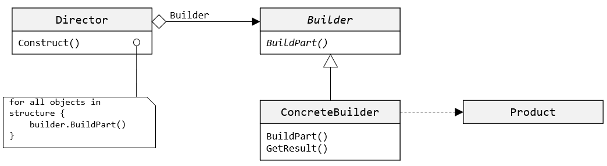

### 빌더(Builder) 패턴
***
* 이름
    * 빌더(Builder) 패턴
* 문제
    * 객체를 생성하는 방법은 동일하나 표현하는 방법이 다르다
    * 서로 표현하는 방법이 다르더라도 생성할 수 있는 동일한 구축 공정을 제공하도록 해야 함
* 해법
    * 객체를 생성하는 클래스와 표현하는 클래스를 분리, 동일한 절차에서도 다른 표현을 생성하는 방법을 제공
* 활용
    * 복합 객체의 생성 알고리즘이 이를 합성하는 요소 객체들의 조립 방법에 독립적일 때
    * 합성할 객체들의 표현이 서로 다르더라도 구축 공정이 이를 지원해야 할 때
* 구조

* 결과
    * 제품에 대한 내부 표현을 다양하게 변화시킬 수 있다.
    * 생성과 표현에 필요한 코드를 분리한다
    * 복합 객체를 생성하는 공정을 좀더 세밀하게 나눌 수 있다
***

빌더 패턴은 객체를 생성하는 방법과 객체가 자신을 표현하는 방법을 정의하는 클래스를 별도로 분리하여 객체가 표현하는데 다른 방법을 사용하는 것과는 관계없이 같은 방법으로 객체를 생성하는 방법을 정의하는 패턴입니다.

Rich Text Format 타입 문서 에디터는 RTF 포맷에서 다른 텍스트 포맷(ASCII 포맷 등)으로 포맷을 바꿀 수 있어야 합니다. 이때, 에디터는 RTF 문서를 변환할 포맷의 종류에 제한이 없어야 하며, 에디터 자체의 변경 없이도 새로운 형태의 변환이 추가될 수 있도록 작성되어야 할 필요가 있습니다.

이를 위해 RFT 읽어들여서 보여주는 Reader 클래스와 다른 형식으로 변경하는 Converter 클래스를 함께 합성하는 방식이 필요합니다. Reader 객체가 RTF 문서를 분석해 읽어 들일 때 Converter 클래스를 통해 필요한 전환을 수행합니다. Converter 객체는 데이터 전환을 수행하거나 어떤 특별한 형태로 토큰을 표현할 책임을 갖습니다.

여기서 Converter 클래스는 서로 다른 변환과 텍스트 포맷을 처리할 수 있도록 상세화됩니다. 아래 다이어그램과 같이, ASCIIConverter 클래스는 일반적인 텍스트의 전환만을 처리하고, TeXConverter는 TeX 방식을 생성하기 위하 필요한 모든 처리를 담당할 오퍼레이션을 구현합니다.

Converter 클래스들은 복잡한 객체를 생성하고 조립하는데 필요한 메커니즘을 Converter 클래스에 정의된 인터페이스 각각의 오퍼레이션에 구현합니다. 이런 Converter를 Reader와 분리시켜서, Reader는 문서를 읽는 책임만 지도록 할 수 있습니다.
Builder 패턴은 이런 문제를 해결하는데 목적이 있습니다. 각 Converter 클래스를 패턴에서 Builder라고 부르며, Reader를 Director라고 부릅니다. Builder 패턴은 객체를 생성하는 객체의 생성과 처리를 분리하는 데 적용됩니다. 

**빌더 패턴에 참여하는 객체**

* Builder  
객체의 일부 요소들을 생성하기 위한 추상 인터페이스를 정의합니다.
* ConcreteBuilder  
클래스에 정의된 인터페이스를 구현하며, 제품의 부품들을 모아 빌더를 합성합니다. 또한, 생성한 요소의 표현을 정의하고 관리합니다.
* Director  
Builder 인터페이스를 사용하는 객체를 합성합니다.
* Product  
구축할 복합 객체를 표현합니다.

**객체간 협력 방법**
1. 클라이언트는 Director 객체를 생성하고 생성한 객체를 원하는 Builder 객체로 합성해 나갑니다.
2. 제품의 일부가 구축될 때 마다 Director는 Builder에게 통보합니다.
3. Builder는 Director의 요청을 처리하여 제품에 부품을 추가합니다.
4. 클라이언트는 Builder로부터 제품을 검색합니다.

**결과**

1. 제품에 대한 내부 표현을 다양하게 변화시킬 수 있습니다.  
Builder 객체는 Director를 제공하고 제품을 합성하기 위해 필요한 추상 인터페이스를 정의합니다. 빌더를 통해서 제품이 어떤 요소로 합성되는지 각 요소들의 표현방법이 무엇인지를 은닉할 수 있게 됩니다. 즉, 빌더 만이 어떤 요소로 전체 제품을 합성하고 그 요소들이 어떤 타입들로 구현되는지를 알고 있을 뿐입니다. 제품을 합성할 때는 빌드에 정의된 추상 인터페이스를 통해 클라이언트가 동작하기 때문에, 새로운 제품의 표현 방법이나 제품의 합성 방법이 바뀔 경우 추상 인터페이스를 정의한 Builder 클래스를 상속하여 새로운 Builder 서브 클래스를 정의할 수 있습니다.
2. 생성과 표현에 필요한 코드를 분리합니다.  
Builder 패턴을 사용하면, 복합 객체를 생성하고 내부 표현 방법을 별도의 모듈로 정의할 수 있습니다. 클라이언트는 제품의 내부 구조를 정의한 클래스는 전혀 모른 채, 빌더와의 상호 작용을 통해서 필요한 복합 객체를 생성하게 됩니다. 
3. 복합 객체를 생성하는 공정을 세밀하게 나눌 수 있습니다.  
한번에 복합 객체를 생성하는 것과 같이 Builder 패턴에서는 Director의 통제하에 하나씩 내부 합성 요소들을 만들어 나갑니다. Director가 Builder로부터 만들어진 전체 복합 객체를 되돌려 받을 때 까지 제품 합성의 과정은 계속 이루어집니다. 따라서 Builder 클래스의 인터페이스에는 이 제품을 생성하는 과정 자체가 반영되어 있습니다. 

<a href="./17_Lab17-2_Builder_패턴.md">연습</a>