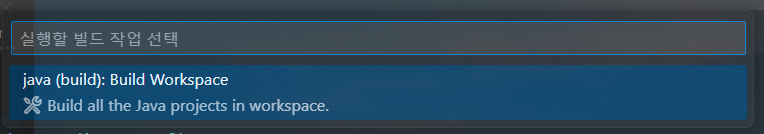
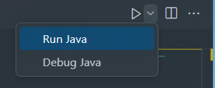

## Lab 13-3 : Builder 패턴
이 연습에서는 Builder 패턴을 이용하여 객체를 생성하고 표현하는 절차는 동일하지만 생성하는 부분과 객체를 표현하는 클래스가 분리된 응용 프로그램알 작성합니다. 작성할 프로그램의 클래스 다이어그램은 아래와 같습니다.

1. Visual Studio Code를 엽니다.
2. 파일 메뉴에서 폴더 열기를 클릭하고 c:\Labs\Lab17-3\Starter 폴더를 엽니다.
3. 작성자 신뢰 경고 창에서, 예, 작성자를 신뢰합니다 버튼을 클릭합니다.

**Directory 코드 확인**
1. Visual Studio Code 탐색기에서, src/director/Album.java 파일을 열고 코드를 확인합니다. 파일은 Guns and Roses의 1987년 앨범 Appetite for Destruction의 수록곡 정보를 포함하고 있습니다. 

Construct() 메소드에서 Builder 타입의 메소드 코드는 아래와 같습니다.

```java
package director;

import builder.Builder;
import java.util.ArrayList;;

public class Album {
    private Builder builder;

    public Album(Builder builder) {
        this.builder = builder;
    }

    public void construct() {
        builder.albumTitle("Appetite for Destruction");
        builder.teamName("Guns N' Roses");
        ArrayList<String> songs = new ArrayList<>();
        songs.add("Welcome to the Jungle");
        songs.add("It's So Easy");
        songs.add("Nightrain");
        songs.add("Out to Get Me");
        songs.add("Mr. Brownstone");
        songs.add("Paradise City");
        songs.add("My Michelle");
        songs.add("Think About You");
        songs.add("Sweet Child o' Mine");
        songs.add("You're Crazy");
        songs.add("Anything Goes");
        songs.add("Rocket Queen");
        builder.makeItems(songs);
        builder.close();    
    }
}
```

**Builder 코드 확인**
1. Visual Studio Code 탐색기에서, src/builder/Builder.java 파일을 열고 코드를 확인합니다. 코드는 아래와 같습니다.
```java
package builder;
import java.util.ArrayList;

public interface Builder {
    void albumTitle(String albumTitle);
    void teamName(String title);
    void makeItems(ArrayList<String> items);
    void close();
    void makeFile();
}
```

**텍스트 형식 파일을 생성하는 ConcreteBuilder 클래스 생성**

1. Visual Studio Code 탐색기에서, src/builder/TextBuilder.java 파일을 열고 코드를 확인합니다. 
2. TextBuilder 클래스에, String 타입 변수 albumTitle과 teamName를 private으로 선언합니다.
3. StringBuffer 타입 buffer 객체를 선언하고 생성합니다. 코드는 아래와 같습니다.

```java
public class HTMLBuilder implements Builder {
    private String albumTitle;
    private String teamName;

    private StringBuilder buffer = new StringBuilder();
    ...
}
```
4. Builder 인터페이스의 albumTitle 메소드를 구현하는 코드를 작성합니다. albumTitle 메소드는 String 타입 파라미터를 가지며, TextBuilder 클래스의 전역 변수 albumTitle에 파라미터 값을 할당한 후 StringBuffer 객체에 Title: 과 파라미터로 전달 받은 값을 추가합니다.
5. Builder 인터페이스의 teamName 메소드를 구현하는 코드를 작성합니다. teamName 메소드는 String 타입 파라미터를 가지며, TextBuilder 클래스의 teamName 변수에 파라미터 값을 할당한 후, StringBuffer 객체에 “---------------------------------“, teamName 변수 값, “---------------------------------“ 을 차례로 추가합니다.
6. 완성된 코드는 아래와 유사할 것입니다.

```java
@Override
public void albumTitle(String albumTitle) {
    this.albumTitle = albumTitle;
    buffer.append("Title: " + albumTitle + "\n");
}

@Override
public void teamName(String teamName) {
    this.teamName = teamName;
    buffer.append("-----------------------------------\n");
    buffer.append(teamName + "\n");
    buffer.append("-----------------------------------\n");
}
```
7. Builder 인터페이스의 makeItems 메소드를 구현하는 코드를 작성합니다. makeItems 메소드는 ArrayList<String> 타입 객체를 파라미터를 가지며, List에 포함된 문자열들을 번호를 붙여 StringBuffer 객체에 추가합니다.
8. Builder 인터페이스의 close 메소드를 구현하는 코드를 작성합니다. close 메소드는 파라미터 없이, StringBuffer 객체에 “---------------------------------“를 추가합니다.
9. 완성된 코드는 아래와 유사할 것입니다.

```java
@Override
public void makeItems(ArrayList<String> items) {
    for(int i = 0; i < items.size(); i++) {
    buffer.append(i + ". ");
    buffer.append(items.get(i) + "\n");
    }
}

@Override
public void close() {
    buffer.append("-----------------------------------\n");
}
```

10. makeFile 메소드를 확인합니다. makeFile 메소드는 파일을 생성하고 내용을 파일에 씁니다. 코드는 아래와 같습니다.
```java
@Override
public void makeFile() {
    try {
        File file = new File(this.albumTitle + " - " + this.teamName + ".txt");
        
        if (!file.exists()) {
            file.createNewFile();
        }

        FileWriter fileWriter = new FileWriter(file);
        BufferedWriter writer = new BufferedWriter(fileWriter);
        writer.write(buffer.toString());
        writer.close();
    }
    catch (IOException e) {}
}
```

**클라이언트 코드 확인 및 실행**
1. Visual Studio Code 탐색기에서, src/App.java 파일을 열고 코드를 확인합니다. 코드는 아래와 같습니다.
```java
import builder.TextBuilder;
import director.Album;

public class App {
    public static void main(String[] args) throws Exception {
        TextBuilder builder = new TextBuilder();
        Album album = new Album(builder);
        album.construct();
        builder.makeFile();
    }
}
```
2. Visual Studio Code의 터미널 메뉴에서 빌드 직업 실행을 클릭합니다.
3. Java (build): Build Workspace를 클릭합니다.  

4. Visual Studio Code 탐색기에서 bin 디렉터리를 확장하고 생성된 클래스 파일을 확인합니다.
5. Visual Studio의 오른쪽 위 화살표를 클릭하고 Run Java를 선택합니다.  

6. 실행이 완료되고, 생성된 Appetite for Destruction - Guns N' Roses.txt 파일을 확인합니다.
