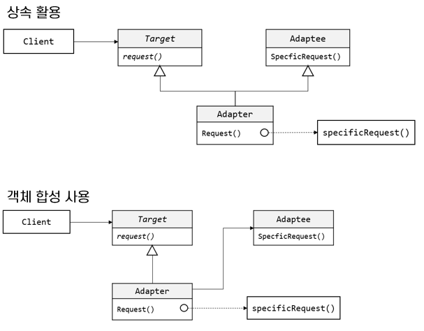

### Adapter 패턴
***
* 이름
    * 어댑터(Adapter) 패턴 – 다른 이름으로 래퍼(Wrapper) 패턴
* 문제
    * 재사용성을 목표로 개발한 툴킷도 실제 재 사용성을 발휘하지 못하는 경우가 많음
    * 응용 프로그램이 요청하는 인터페이스와 툴킷에 정의된 인터페이스가 일치하지 않을 경우
* 해법
    * 이미 개발되어 있는 인터페이스를 수정할 수 없는 경우, 구현을 상속하거나 집합(Aggregation)을 이용하여 어댑터 객체를 구현
* 활용
    * 기존 클래스를 사용해야 하나 인터페이스가 수정되어야 하는 경우
    * 만들어진 것을 재사용하고자 하나, 재 사용 가능한 라이브러리를 수정할 수 없는 경우
    * 서브 클래스들의 상속을 통해 인터페이스를 개조하는 것이 어려운 경우

* 결과
    * 구체적 Adapter 클래스가 Adaptee 클래스에 맞게 인터페이스를 Target 클래스로 변형함
    * Adapter 클래스는 Adaptee 클래스의 행위를 재정의 할 수 있음
***

재사용을 목표로 개발한 툴킷도 실제 재 사용을 발휘하지 못할 때가 발생합니다. 즉, 응용 프로그램이 요청하는 인터페이스와 툴킷에 정의된 인터페이스가 일치하지 않을 때가 있기 때문입니다.

이미 존재하기는 하지만 현재 이를 사용하고자 하는 클래스와는 아무 연관없이 개발될 클래스이거나, 서로 일치하지 않는 인터페이스들을 잘 통합하여 하나의 응용 프로그램을 개발해야 할 때, 이미 만든 클래스들을 통합하여 잘 운영할 수 있는 방법이 필요합니다. 만약 기존 프로그램의 소스코드를 가지고 있다면 가능한 일이지만, 소스코드 없이 라이브러리만 가지고 있다면 불가능합니다.

이미 개발된 클래스의 인터페이스를 수정할 수 없다면, 이미 개발된 인터페이스에 둘 다 맞도록 개발한 클래스를 조정해야 합니다. 이를 위해 할 수 있는 방법은 두 가지입니다.

* 기존 개체의 인터페이스와 구현을 모두 상속받는다.
* 클래스의 인스턴스를 새로 만들 클래스에 포함시키고, 인터페이스를 사용하여 개체를 구현한다.

어댑터 패턴은 다음과 같은 상황에서 활용합니다.
* 기존 클래스를 사용하고 싶은데 인터페이스가 맞지 않을 때
* 아직 예측하지 못한 클래스나 실제 관련되지 않은 클래스들이 기존 클래스를 재사용하고자 하지만, 이미 정의된 재사용 가능한 클래스가 지금 요청하는 인터페이스를 꼭 정의하고 있지 않을 때.
* 이미 존재하는 여러 개의 서브 클래스를 사용해야 하는데, 이 서브 클래스들의 상속을 통해서 이들 인터페이스를 다 개조한다는 것이 현실성이 없을 때
