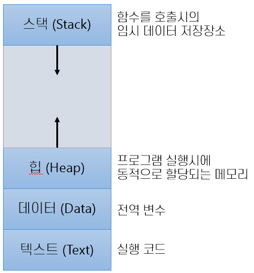

== 프로세스

---

프로세스의 메모리에는 일반적으로 아래와 같이 여러 섹션으로 구분되어 배치됩니다.

* 텍스트 섹션 +
코드를 실행하기 위해 저장된 영역으로, 코드 섹션이라고도 부릅니다. 프로그램을 실행시키기 위해 구성되는 것들이 저장되는 영역입니다. 명령문이 저장되며, 제어문, 함수, 상수 등 또한 저장됩니다.  프로그램의 실행 동안 크기가 고정됩니다.

* 데이터 섹션 +
전역 변수, static 변수 등이 저장됩니다. 일반적으로 응용 프로그램 진입(Application Entry Point 함수 실행)전에 선언되어 프로그램의 종료시까지 메모리에 남아 있습니다. 초기화 된 변수 영역(Initialized Data segment)와 초기화 되지 않은 변수 영역(Uninitialized data segment)로 나뉘며, 초기화 되지 않은 변수 영역은 BSS(Block Started by Symbol)이라고도 부릅니다.

* 힙 섹션 +
사용자에 의해 관리되는 영역으로, 동적으로 할당되는 변수와 Java, C++등의 언어에서 new 연산자로 생성되는 참조 타입의 객체들이 저장되는 영역입니다. 

* 스택 섹션 +
함수를 호출할 때 함수의 매개변수, 지역변수, 복귀 주소등을 포함하는 활성화 레코드(Activation Record)가 저장되는 영역입니다. 

프로세스는 다른 개체를 위한 실행 환경으로 동작할 수 있습니다. Java 프로그래밍 환경이 좋은 예입니다. 대부분의 상황에서 실행 가능한 Java 프로그램은 Java Virtual Machine에서 실행됩니다. JVM은 적재된 Java 코드를 해석하고 그 코드를 대신하여 원 기계어를 이용하여 실행하는 프로세스입니다. Java 명령어는 JVM을 보통의 프로세스처럼 실행시키고, JVM은 Java로 작성된 프로그램을 가상 기계에서 실행합니다.

link:./12_프로세스_상태.adoc[다음: 프로세스 상태]