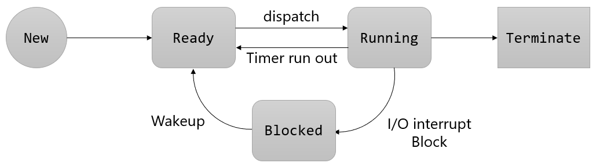

= 프로세스 상태

---

프로세스는 실행되면서 그 상태가 변화합니다. 프로세스의 상태는 부분적으로 그 프로세스의 활동에 따라 정의됩니다.
하나의 프로그램이 실행되면 그 프로그램에 대응되는 프로세스가 생성되어 Ready 리스트의 끝에 들어갑니다. Ready 리스트 상의 다른 프로세스들이 CPU를 할당 받아 Ready 리스트를 떠나면 프로세스는 리스트의 앞으로 이동하고 CPU를 사용할 수 있게 됩니다.

**프로세스 상태 변화**

* Dispatch +
Ready 리스트의 맨 앞에 있던 프로세스가 CPU를 점유하게 되는 것, 즉 준비 상태에서 실행 상태로 바뀌는 것을 디스패치라고 합니다.

* Block +
실행 상태의 프로세스가 허가된 시간을 다 쓰기 전에 입출력 동작을 필요로 하는 경우 프로세스는 CPU를 스스로 반납하고 보류 상태로 넘어 간다. 이것을 보류라고 하며 다음과 같이 표시한다.

* Wakeup +
입출력 작업 종료 등 기다리던 사건이 일어났을 때 보류 상태에서 준비 상태로 넘어갑니다.

* Timeout +
운영체제는 프로세스가 프로세서를 계속 독점해서 사용하지 못하게 하기 위해 clock interrupt를 두어서 프로세스가 일정 시간 동안만 (시분할 시스템의 time slice) 프로세서를 점유할 수 있게 합니다.

link:./13_프로세스_제어블록.adoc[다음: 프로세스 제어블록]