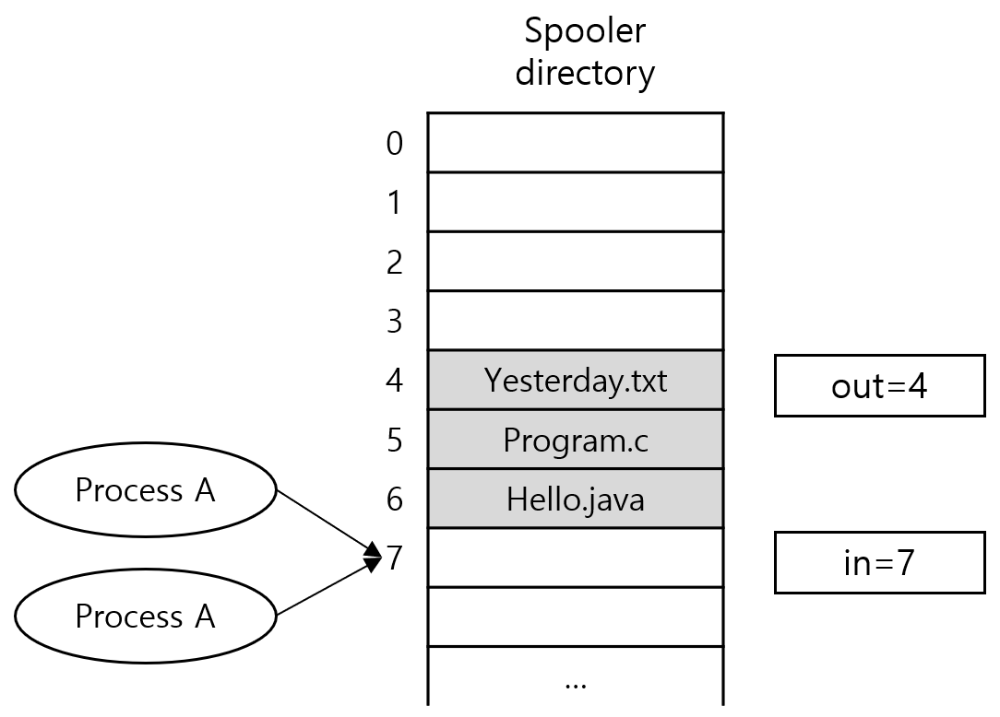

= 프로세스간 통신

* 프로세스는 다른 프로세스와 통신할 필요가 생기게 됨
* 프로세스간 통신(Inter-Process Communication - IPC)에서 논점
** 한 프로세스가 다른 프로세스에게 정보를 어떻게 전달할 것인가?
** 둘 이상의 프로세스가 임계 액티비티에서 다른 프로세스를 어떻게 방해하지 않도록 할 것인가?
** 서로 의존성이 있는 경우 어떻게 순서화 할 것인가?
* 경쟁 조건(Race Condition)
** 둘 이상의 프로세스가 공유 메모리를 읽고 기록할 때 마지막 결과는 어떤 프로세스가 수행하였는가에 의존하는 상황
* 임계 구역(Critical Section)
** 둘 이상의 프로세스가 공유 자원에 접근할 때, 공유 메모리에 접근하는 코드의 일부분
* 상호 배제(Mutual Exclusion)
** 임계 구역을 어느 시점에서 단지 한 개의 프로세스만이 사용할 수 있도록 하며, 다른 프로세스가 현재 사용중인 임계 구역에 대해 접근하려 할 때 이를 금지하는 행위

---

프로세스는 자주 다른 프로세스와 통신할 필요가 생기게 됩니다. 앞서 살펴봤던 쉘 파이프라인에서 첫 프로세스의 출력은 다음 프로세스의 입력이 됩니다. 프로세스간 통신은 인터럽트를 사용하지 않고 구조화된 방법으로 이루어져야 합니다. 이런 프로세스간 통신을 IPC(Inter-Process Communication)이라고 합니다.

프로세스간 통신에는 3가지 문제가 있습니다. 

1.	한 프로세스가 다른 프로세스에게 어떻게 정보를 전달할 것인가?
2.	둘 이상의 프로세스가 임계 액티비티에서 다른 프로세스를 어떻게 방해하지 않도록 할 것인가?
3.	프로세스가 서로 의존성이 있는 경우 어떻게 순서화 할 것인가?

이 문제는 Thread에서도 똑같이 적용됩니다. Thread는 공유 주소 공간을 가지고 있으므로 쉽게 해결되지만, 두 번째와 세 번째 문제는 동일하며, 같은 해결책이 적용됩니다.

== 경쟁 조건(Race Condition)

어떤 운영체제에서는 함께 동작하는 프로세스들은 각각 읽고 쓸 수 있는 공유 기억 장치를 갖게 됩니다. 이 장치는 커널 데이터 구조에서 사용하는 주 메모리일 수도 있고 공유 파일일 수도 있습니다. 

프린트 스풀러의 경우를 생각해봅시다. 한 프로세스가 프린트를 원하면, 스풀러 디렉토리에서 파일명을 입력합니다. 프린터 데몬이라 부르는 다른 프로세스는 주기적으로 출력할 파일이 있는지를 검사합니다. 이때 출력할 파일이 있으면 프린트하고 파일명을 디렉토리에서 삭제합니다.

스풀러 디렉토리는 상당히 많은 수의 슬롯을 가지고 있고, 이 슬롯에 파일이 하나씩 들어간다고 가정합시다. 그리고 다음 출력 파일을 가리키는 변수 out과 파일이 들어갈 수 있는 빈 슬롯을 가리키는 변수 in이 있다고 생각해봅시다. 이 변수는 프로세스에 적용 가능한 파일 상에서 유지됩니다. 아래 그림 처럼 슬롯 0~3은 비어있고 4~5는 차 있는 경우에, 거의 동시에 프로세스 A와 프로세스 B가 출력하기 위한 파일을 넣을 큐를 얻기로 합니다. 
 

프로세스 A는 in을 읽고, next_free_slot이라는 변수에 7을 저장합니다. 이때 클럭 인터럽트가 발생하여 CPU는 프로세스 A가 실행하도록 한 후 프로세스 B로 스위칭합니다. 프로세스 B 역시 in을 읽어 next_free_slot에 이를 저장합니다. 이 순간 두 프로세스는 모두 적용가능한 슬롯이 7이라고 생각합니다.

프로세스 B는 계속 수행되어 슬롯 7에 자신이 출력할 파일명을 저장하고 in을 8로 업데이트합니다. 그리고 빠져나가 다른 일을 하게 됩니다.

프로세스 A가 다시 돌아오면, 프로세스는 next_free_slot에서 7을 찾고, 파일명을 기록합니다. 즉, 프로세스 B가 기록한 파일명을 지우게 됩니다. 그리고 프로세스 A도 next_free_slot + 1을 계산하여 in에 8을 넣습니다. 스풀러 디렉토리는 내부적으로 일관되고, 프린터 데몬은 무엇이 잘못되었는지 알 수 없습니다. 따라서 프로세스 B는 결코 출력을 얻을 수 없습니다.

이와 같이 둘 이상의 프로세스가 공유 메모리를 읽고 기록할 때 마지막 결과는 어느 프로세스가 수행되었는가에 의존하는 상황을 경쟁 조건(Race Condition)이라고 합니다.

== 임계 구역(Critical Section)

경쟁 조건을 피하는 방법은 공유 메모리, 공유 파일, 모든 공유 문제에서 프로세스들이 동시에 공유 데이터를 읽고 기록하는 일을 금지시키는 것입니다. 이때 필요한 것이 상호 배제입니다. 즉, 한 프로세스가 공유 변수나 파일을 사용한다면, 어떤 다른 프로세스도 동시에 이 일을 못하도록 배제시키는 것입니다 앞의 프린터 스풀러 문제는 프로세스 A가 끝나기 전에 프로세스 B가 공유 변수를 사용하였기 때문입니다. 상호 배제를 달성하기 위하여 타당한 기본 연산을 선택하는 것이 운영체제의 주요 설계 이슈입니다. 

프로세스는 공유 메모리나 파일들에 접근을 해야만 하고 경쟁을 유발시키는 일을 하게 됩니다. 공유 메모리에 접근하는 프로그램의 코드 부분을 임계 구역(Critical Section)이라고 합니다. 어떤 두 프로세스도 동시에 임계 구역에 들 수 없도록 해 준다면 경쟁은 피할 수 있습니다.

이와 같은 요구사항이 경쟁 조건을 피할 수 있어도, 병렬 프로세스들이 정확하게 협력하고, 효율적으로 공유 데이터를 사용하기 위한 충분한 조건은 아닙니다. 좋은 해법을 얻기 위해서는 아래와 같은 세 가지 요구사항을 충족해야 합니다.

1. 상호 배제(Mutual Exclusion) +
프로세스 Pi가 자기의 임계 구역에서 실행된다면, 다른 프로세스들은 그들 자신의 임계구역에서 실행될 수 없습니다.
2. 진행(Progress) +
자신의 임계구역에서 실행되는 프로세스가 없고 그들 자신의 임계구역으로 진행하려하는 프로세스들이 있다면, 나머지 구역에서 실행 중이지 않은 프로세스들만 다음에 누가 그 임계구역으로 진입할 수 있는지를 결정하는데 참여할 수 있으며, 이 선택은 무한정 연기될 수 없다.
3. 한정된 대기(Bounded Waiting) +
프로세스가 자기의 임계 구역이 진입하려는 요청을 한 후부터 그 요청이 허용될 때까지 그들 자신의 임계구역에 진입하도록 하는 횟수에 한계가 있어야 합니다.

== 상호 배제(Mutual Exclusion, Mutex)

임계 구역을 어느 시점에서 단지 하나의 프로세만이 사용할 수 있도록 하며, 다른 프로세스가 현재 사용중인 임계 구역에 대하여 접근하려고 할 때 이를 금지하는 행위를 말합니다. 상호 배제를 위해서는 다음과 같은 4가지 조건을 만족해야 합니다.

1.	두 프로세스는 동시에 공유 자원에 진입할 수 없다.
2.	프로세스의 속도나 프로세스 수에 영향을 받지 않는다.
3.	공유 자원을 사용하는 프로세스만 다른 프로세스를 차단할 수 있다.
4.	프로세스가 공유 자원을 사용하려고 너무 오래 기다려서는 안된다.

상호배제를 위해서는 아래와 같은 3가지 기법을 사용합니다.

* 인터럽트 차단 +
가장 간단한 해법은 프로세스가 임계 구역에 들어서는 순간 각 프로세서로 하여금 인터럽트를 불가능하게 하고, 임계구역을 떠나면서 인터럽트를 가능하게 만드는 것입니다. 인터럽트가 불가능하기 때문에 어떤 클럭 인터럽트도 발생하지 않습니다. CPU는 클럭의 결과로 또는 다른 인터럽트에 의해서 프로세스에서 프로세스로 스위칭되며, 인터럽트가 꺼지게 되면 CPU는 프로세스간 스위칭이 일어나지 않습니다. 프로세스가 인터럽트 차단 상태가 되면 프로세스는 다른 프로세스로부터 방해를 받지 않고 공유 메모리를 검사하고 갱신할 수 있습니다. +
이 방법은 사용자 프로세스가 인터럽트를 제어할 수 있도록 하는, 좋은 방법이 아닙니다. 프로세스 중 하나가 인터럽트를 차단하고 복구를 수행하지 않은 채 종료되면, 단일 CPU 시스템에서는 시스템의 종말을 의미합니다. 운영체제 자체로는 유용한 기술이지만 사용자 프로세스에 대해서는 일반적인 상호배제 메커니즘으로 불가능합니다.
* 잠금 변수 +
변수를 사용하여 공유 리소스의 상태를 유지하는 방법입니다. 초기값이 0인 단일 공유 변수가 있고, 프로세스가 임계 구역에 들어가려면 먼저 잠금 변수를 검사합니다. 이 값이 0이면 프로세스는 공유 변수의 값을 1로 설정하고 임계구역에 들어갑니다. 값이 1이면 다른 프로세스가 임계구역에 있음을 의미하고, 값이 0이 될때까지 대기합니다.+
이는 앞서 살펴본 스풀러 디렉토리와 같은 결함을 가지고 있습니다. 한 프로세스가 잠금 변수를 읽고 값이 0이라는 것을 알고, 이 값을 1로 수정하기 전에 다른 프로세스가 스케줄링되어 수행되고 잠금 변수를 1로 설정할 경우, 첫 번째 프로세스가 다시 스케줄링되면 역시 변수를 1로 설정하고 두 프로세스가 동시에 임계구역에 있게 됩니다.
* 엄격한 교대 +
세 번째 접근 방법은 아래와 같습니다. +

[cols="1a, 1a"]
|===
|
[source, c]
----
while(TRUE) {
    while(true != 0);
    critical_section();
    turn = 1;
    noncritical_section();
}
----
프로세스 0
|
[source, c]
----
while(TRUE) {
    while(true != 1);
    critical_section();
    turn = 1;
    noncritical_section();
}
----
프로세스 1
|===

위 코드에서, 초기값이 0인 변수 turn은 임계구역에 들어가 공유 메모리를 검사하고 갱신하는 순서를 위한 것입니다. 처음 프로세스 0이 turn을 검사하여 0임을 알고 임계구역에 들어갑니다. 프로세스 1은 값이 0입을 알고 1로 바뀔 때까지 turn을 계속 검사하며 기다립니다. (이런 대기를 바쁜 대기라고 합니다) 이는 CPU 시간을 낭비하기 때문에 피해야 합니다. 많이 기다리지 않을 것이라는 타당한 기대값이 있을 때만 바쁜 대기를 사용합니다. 바쁜 대기에서 사용하는 잠금을 스핀록(spin lock)이라고 합니다.

프로세스 0이 임계구역을 떠날 때, turn을 1로 설정하여 프로세스 1이 임계구역에 들어갈 수 있도록 합니다. 프로세스 1이 임계구역에 들어갈 수 있도록 합니다. 프로세스 1이 임계구역을 마치고 turn을 0으로 설정한다면 두 프로세스 모두 임계구역 밖에 있게 됩니다. 이제 프로세스 0이 반복을 신속하여 수행하여 turn을 1로 하면서 임계구역을 빠져나옵니다. 이 시점에서 turn값은 1이고 두 프로세스 모두 임계구역 밖에 있습니다.

이때 갑자기 프로세스 0이 필요한 일을 하고 임계구역에 들어가려고 하면 실패합니다. turn이 1인데 프로세스 1은 임계구역 밖에 있기 때문입니다. 프로세스 1이 turn을 0으로 만들 때까지 기다려야 합니다. turn을 이용하는 개념은 한 프로세스가 다른 프로세스보다 속도가 느리면 좋은 아이디어가 아닙니다.

이 상황은 조건 3에 위배됩니다. 프로세스 0이 임계구역에 들어가지 못하고 블록 당하고 있기 때문입니다. 스풀러 디렉토리의 예에서 봐도, 프로세스 1이 다른 일을 하고 있으므로 프로세스 0은 파일을 출력하지 못합니다.

== 소프트웨어를 이용한 상호 배제 구현 기법
* 데커 알고리즘 +
두 개 프로세스간 상호 배제를 보장하는 최초의 알고리즘으로, Flag, Turn 두 변수를 활용하여 문제를 해결합니다. Flag의 True/False 여부에 따라 while문 진입을 결정하고, while문 내부에서 turn에 따라 flog를 바꾸거나 임계구역에 진입합니다.
* 피터슨 알고리즘 +
데커 알고리즘보다 간단하며, while 문 밖에서 Flag, Turn을 확인하고 상대에게 차례를 양보합니다.
* 다익스트라 알고리즘 +
프로세스 n개의 상호배제 문제를 해결한 최초의 알고리즘으로, 임계구역에 진입하기 위한 단계를 2단계로 나누어 단계마다 진입할 수 있는 프로세스를 걸러내에 최종적으로 하나의 프로세스만 임계구역에 접근하도록 구현한 알고리즘입니다.
* 베이커리 알고리즘 +
n개의 상호배제를 해결한 알고리즘으로, 프로세스에게 고유 번호를 부여하고 번호를 기준으로 우선순위가 높은 프로세스가 먼저 임계구역이 진입하도록 구현됨

link:./15_잠자기와_깨우기.adoc[다음: 잠자기와 깨우기]