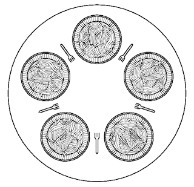

= 철학자들의 저녁식사

* 전형적인 IPC 문제로, 1965년 다익스트라가 문제를 제기함
* 다섯명의 철학자가 원형 테이블 주위에 앉아 있다.
* 접시와 접시 사이에 포크가 있고, 식사를 위해서는 두 개의 포크를 모두 잡아야 한다
* 철학자들의 삶은 식사와 생각의 반복이다.
** 철학자는 배가 고프면 왼쪽 포크, 오른쪽 포크를 한번에 하나씩 잡으려고 한다.
** 두 개의 포크를 잡은 철학자는 식사를 하고, 포크를 놓고, 다시 생각한다.
* 철학자가 굶어 죽지 않게 하는 방법은?

---

1965년에 다익스트라는 식사하는 철학자들의 동기문제를 제기하고 해결책도 제시하였습니다. 문제는 다음과 같습니다.

1.	5명의 철학자가 한 테이블 주위에 앉아 있다.
2.	철학자들은 스파게티가 들어있는 접시를 가지고 있다.
3.	스파게티를 먹는 데는 두 개의 포크가 필요하다.
4.	포크는 접시 사이에 한 개씩만 놓여있다.
5.	철학자들의 생활은 식사하고 생각하는 것의 반복이다.

한 철학자가 배가 고파지면 양손에 포크를 잡으려 할 것입니다. 만약 두 손에 포크를 잡을 수 있다면 잠시동안 식사를 한 후 포크를 내려놓고 계속 생각합니다. 이 문제의 핵심은 철학자들이 굶어 죽지 않고 하고 싶은 일을 할 수 있도록 하는 것입니다.

[source, java]
----
public void philosopher() {
    while (true) {
        this.think();
        this.takeFork(this.number);
        this.takeFork((this.number + 1) % 5);
        this.eat();
        this.releaseFork(this.number);
        this.releaseFork((this.number + 1) % 5);
    }
}
----

위의 코드는 명쾌한 해답 같아 보이지만, 5명의 철학자가 동시에 오른쪽 또는 왼쪽의 포크를 잡는다면 철학자들은 영원히 다른 한쪽의 포크를 잡기위해 기다릴 것입니다. 이런 상태를 기아(Starvation)이라고 하며, 철학자들의 저녁식사 문제는 교착상태(Deadlock)을 다루는 아주 대표적인 문제입니다.

세마포아를 이용하여 문제를 해결할 수 있습니다.

[source, java]
----
public void philosopher() {
    while (true) {
        this.think();
        try {
            semaphore.acquire();

            this.takeFork(this.number);
            this.takeFork((this.number + 1) % 5);
            this.eat();
            this.releaseFork(this.number);
            this.releaseFork((this.number + 1) % 5);

            semaphore.release();
        }
        catch (Exception e) {
            e.printStackTrace();
        }    
    }
}
----

link:./18_프로세스_스케줄링.adoc[다음: 프로세스 스케줄링]