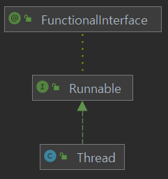

= Java에서 Thread 생성과 실행

* Java 프로그래밍 언어와 API는 Thread의 생성과 관리를 지원하는 풍부한 라이브러리를 제공
* Java에서의 Thread 구현
* Thread 클래스 상속후 run() 메소드 오버라이드
* Runnable 인터페이스를 구현하는 클래스 정의

---

[source, java]
----
public class ThreadTask extends Thread {
    @Override
    public void run() {
        System.out.println("Hello, Thread!");
    }
}

public class Task implements Runnable {
    @Override
    public void run() {
        System.out.println("Hello thread!");
    }
}
----

Thread는 Java 프로그램 실행의 근본적인 모델이며, Java 프로그래밍 언어와 API는 Thread의 생성과 관리를 지원하는 풍부한 특성을 제공합니다. 모든 Java 프로그램은 적어도 하나의 단일 제어 Thread를 포함합니다. main() 메소드로만 이루어진 Java 프로그램도 JVM내의 단일 Thread로 수행됩니다. Java Thread는 JVM을 제공하는 어떠한 시스템 내에서도 사용될 수 있습니다. 

Java에서 Thread를 구현하는 방법에는 두 가지가 있습니다. 한 가지 방법은 Thread 클래스에서 파생된 새 클래스를 만들고 run() 메소드를 재정의하는 것입니다. 두 번째 방법은 Runnable 인터페이스를 구현하는 클래스를 정의하는 것입니다. Runnable 인터페이스는 public void run() 단일 메소드를 가진 Functional Interface로, Runnable을 구현하는 클래스의 run() 메소드는 별도의 Thread에서 실행됩니다.

 

새 Thread 객체에 대해 start() 메소드를 호출하면 두 가지 작업이 수행됩니다.

1.	메모리가 할당되고, JVM 내에 새로운 Thread가 초기화됩니다.
2.	run() 메소드를 호출하면 Thread가 JVM에 의해 수행될 자격을 갖게 합니다. 이때 run 메소드를 직접 호출하지 않아야 합니다. start 메소드를 호출하면 run 메소드가 호출됩니다.

== Thread 클래스를 상속한 Thread 구현

[source, java]
----
class ThreadTask extends Thread {
    @Override
    public void run() {
        System.out.println("Hello, Thread!");
    }
}

class Test {
    public static void main(String[] args) {
        ThreadTask worker = new ThreadTask();
        worker.start();
    }
}
Runnable 인터페이스를 상속한 Thread 구현
public class Task implements Runnable {
    @Override
    public void run() {
        System.out.println("I am a thread");
    }
}

class Test {
    public static void main(String[] args) {
        Task task = new Task();
        Thread worker = new Thread(task);
        worker.start();
    }
}
----

== 람다 식 사용

[source, java]
----
Runnable task = () -> {
    System.out.println("Hello, Thread!");
};
Thread worker1 = new Thread(task);
worker1.start();
----

link:./26_Java_Multi_Thread와_우선순위.adoc[다음: Java Multi Thread와 우선순위]