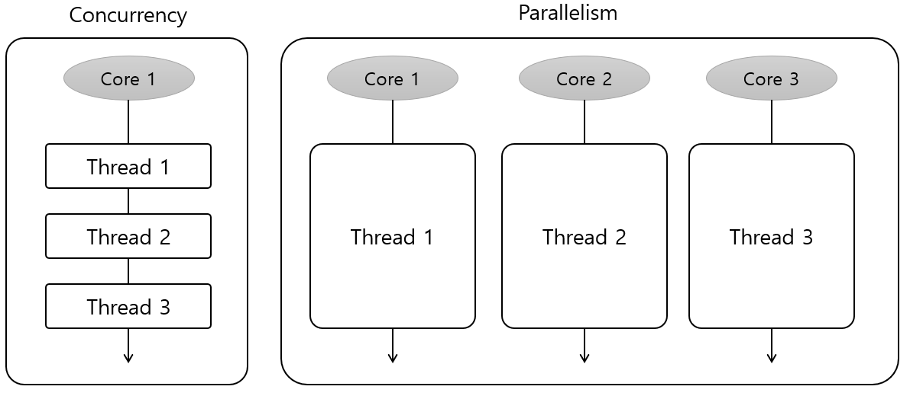

= Java 멀티 Thread와 우선 순위

* Java는 멀티 Thread를 지원
* 프로그램 내에서 두 개 이상의 동작을 동시에 실행
** CPU 활동을 극대화
** 두 Thread가 동작을 동시에 실행
* 하나의 프로세스를 다수의 실행단위로 구분하여 자원을 공유
** 	자원의 생성과 관리의 중복성 최소화
** 수행 능력 향상
* Thread 우선 순위
** Java Thread는 우선순위 기반 Round Robin 방식으로 스케줄링됨
** setPriority() 메소드를 이용해 우선순위 지정

---

멀티 Thread는 동시성(Concurrenty) 또는 병렬성(Parallelism)으로 실행됩니다. 동시성은 다중 작업을 위해 하나의 코어에서 여러 개의 Thread가 번갈아가며 실행되는 것이고, 병렬성은 다중 작업을 위해 여러 개의 코어에서 각각의 Thread를 동시에 실행하는 성질을 말합니다.
 

Java의 Thread 스케줄링은 우선순위 기반 라운드 로빈 방식으로 스케줄링됩니다. 우선순위 방식은 Thread 객체에 우선 순위 번호를 부여하는 방식으로 제어합니다. 우선 순위방식은 1부터 10까지의 범위로 설정할 수 있으며, 우선순위를 부여하지 않으면 기본적으로 5의 우선순위를 부여 받습니다. 우선순위의 변경을 위해서 setPriority 메소드를 이용할 수 있습니다. 
setPriority 메소드에 Thread 클래스의 Thread 우선순위 상수를 이용할 수도 있습니다.

[cols="1,3" options=header]
|===
|상수	|값
|MAX_PRIORITY	|10
|NORM_PRIORITY	|5
|MIN_PRIORITY	|1
|===

link:./27_Thread와_동시성_제어_.adoc[다음: Thread 동시성 제어]