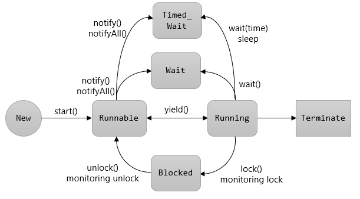

= Thread 상태 변화

 

---

Thread 객체가 생성되면 아래와 같은 5가지의 생명 주기를 갖게 됩니다.

사용자는 실행중인 Thread를 일시정지 또는 중단할 수 있습니다. 동영상 플레이어는 동영상을 재생하는 Thread와 동영상 재생 도중에 다른 작업(소리를 크게 한다거나 하는 등의)을 하기위한 Thread 등 멀티 Thread로 동작할 것입니다. 사용자는 동영상을 재생하는 도중 재생을 일시 정지하거나 중단할 수 있습니다. Java는 Thread의 상태 변화를 위한 여러 메소드를 제공합니다.

* New +
Thread가 실행 준비를 완료한 상태로, start() 메소드를 호출하기 전 상태
* Runnable +
start()가 호출되어 실행될 수 있는 상태
* Wait +
다른 Thread가 통지할 때 까지 기다리는 상태
* Timed_wait +
정해진 시간동안 기다리는 상태
* Blocked +
사용하고자 하는 객체의 잠금(lock)이 풀릴 때까지 대기하는 상태
* Terminated +
실행이 종료된 상태

Java에서 Thread의 상태를 변경하는 메소드는 아래와 같습니다.

[cols="1,3a" options=header]
|===
|메소드 |설명
|Interrupt()	|일시 정지 상태의 Thread에서 InterruptedException 예외를 발생시켜 예외 처리 코드에서 실행 대기 상태로 가거나 종료 상태로 가도록 함
|notify() + notiflyAll()	|Block 상태에서 wait() 메소드에 의해 Wait 상태에 있는 Thread를 Runnable 상태로 만듦
|sleep(long millis) +sleep(long millis, int nanos)	| 주어진 시간동안 Thread를 Timed_wait 상태로 만듦. 주어진 시간이 지나면 자동으로 Runnable 상태로 바뀜
|join()
join(long millis)
join(long millis,, int nanos)	|Join() 메소드를 호출한 Thread는 wait 상태가 됨. join 메소드를 멤버로 가지는 Thread가 종료되거나, 파라미터로 주어진 시간이 지나면 Runnable 상태로 전이
|wait()
wait(long millis)
wait(long millis, int nanos)	|Block에서 Thread를 Wait 상태로 만듦. 파라미터로 주어진 시간이 시간이 지나면 Runnable 상태가 됨. 시간이 주어지지 않은 경우 notify(), notifyAll() 메소드에 의해 Runnable 상태로 전이
|Yield()	|실행중에 우선순위가 동일하거나 높은 순위의 Thread를 산출하고 Wait 상태로 전이
|===

== Thread.sleep

지정된 시간 동안 쓰레드를 일시 정지 합니다. 지정된 시간이 지나고 나면 다시 실행상태가 됩니다.

[source, java]
----
public static native void sleep(long millis) 
public static void sleep(long millis, int nanos)
----

1초마다 쓰레드가 일시 정지되면서 1 to 10까지 반복하는 예제입니다. 1000ms는 1초를 의미합니다.

[source, java]
----

public static void main(String[] args) throws InterruptedException {
    for(int i=1; i<=10; i++) {
        System.out.println("count:" + i);
        Thread.sleep(1000);
    }
}
----

== Thread.join

지정된 시간 동안 쓰레드가 실행되도록 설정합니다. 지정된 시간이 지나거나 작업이 종료되면 join()을 호출한 쓰레드로 다시 돌아와 실행을 계속합니다.

[source, java]
----
public final void join() 
public final synchronized void join(long millis)
public final synchronized void join(long millis, int nanos)

public static void main(String[] args) throws InterruptedException {
    Thread thread = new Thread(new MyThread());
    thread.start();
    thread.join();
    System.out.println("Thread Terminated");
}

static class MyThread implements Runnable{
    @Override
    public void run() {
        for(int i=1; i<=5; i++){
            try {
                Thread.sleep(1000);
                System.out.println("count:" + i);
            } catch (InterruptedException e) {
                e.printStackTrace();
            }
        }
    }
}
----

thread.join 간단한 예제입니다. Thread.join() 메서드를 호출 하면 내부적으로 join(0)을 호출합니다. 0의미는 MyThread가 1 to 5까지의 반복이 종료될때까지 기다린다는 의미입니다. 즉 1 to 5까지 count가 출력되고 마지막에 Thread종료가 출력됩니다. 

출력결과

----
count:1
count:2
count:3
count:4
count:5
Thread Terminated
----

thread.join(2000) 설정하면 다음과 같이 출력됩니다.

----
count:1
Thread Terminated
count:2
count:3
count:4
count:5
----

2초 대기 후 ‘Thread종료’가 출력되는 것을 확인할 수 있습니다.

== Interrupt

실행 중인 쓰레드의 작업이 끝나기 전에 취소시켜야 할 때 interrupt() method를 호출합니다. Interrupt()는 대상Thread에 멈추라고 요청합니다.  

[source, java]
----
public void interrupt()
----

MyThread는 1 to 5까지 출력합니다. 중간에 interrupt가 발생하면 
if(Thread.interrupted()) 절에서 interrupt 발생 여부 ( true / false)를 체크합니다.

[source, java]
----
public static void main(String[] args) throws InterruptedException {
    Thread thread = new Thread(new MyThread());
    thread.start();
    thread.interrupt();
    thread.join();
    System.out.println("Thread 종료");
}

static class MyThread implements Runnable {
    @Override
    public void run() {
        for(int i=1; i<=5; i++){
            if(Thread.interrupted()){
                System.out.println("Interrupt 발생!");
                break;
            }
            try {
                Thread.sleep(1000);
                System.out.println("count:" + i);
            } catch (InterruptedException e) {
                e.printStackTrace();
            }
        }
    }
}
----

