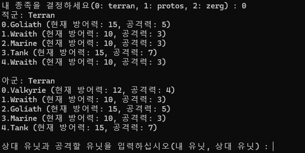
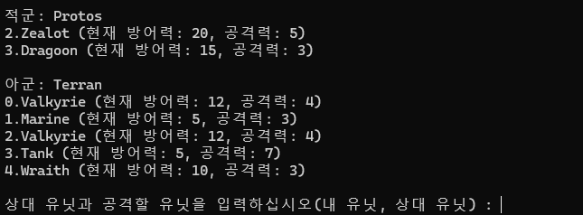
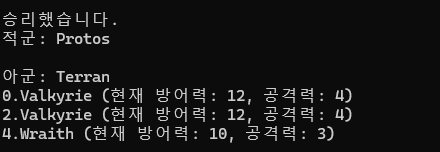

= 콘솔 기반 턴 방식의 공격 게임

콘솔에서 동작하는 게임을 만듭니다. 게임은 컴퓨터와 사용자가 대결하는 형식의 게임이며, 아래와 같은 규칙을 가집니다.

== 게임 규칙

1. 게임에는 Terran, Protos, Zerg 등 3개의 종족이 존재합니다 
2. 각 종족들은 각각의 유닛들을 가지며 유닛은 날수 있는 유닛과 날수 없는 유닛으로 나뉩니다. 
* 날 수 있는 유닛은 날 수 있는 유닛과 날 수 없는 유닛 모두를 공격할 수 있습니다. 
* 날 수 없는 유닛은 날 수 있는 유닛을 공격할 수 없습니다. 
* 미사일, 레이저 포 또는 침을 가진 유닛은 날 수 있는 유닛을 공격할 수 있습니다. 
* 각 유닛은 공격력과 방어력을 가집니다. 
* 한 유닛은 한 유닛을 공격할 수 있고, 공격 받은 유닛은 공격한 유닛이 가진 공격력만큼 방어력이 감소됩니다. 
* 방어력이 0이된 유닛은 소멸됩니다.

== 종족 

1. Terran 종족: 2개의 날수 있는 유닛과 3개의 날 수 없는 유닛을 가집니다. 
* Marine: 날 수 없는 유닛이며, 3의 공격력과 10의 방어력을 가집니다. 
* Tank: 날 수 없는 유닛이며, 7의 공격력과 15의 방어력을 가집니다. 
* Goliath: 날 수 없는 유닛이며, 5의 공격력과 15의 방어력을 가집니다. 미사일을 발사 할 수 있습니다. 
* Wraith: 날 수 있는 유닛이며, 3의 공격력과 10의 방어력을 가집니다. 
* Valkyrie: 날 수 있는 유닛이며, 4의 공격력과 12의 방어력을 가집니다.
2. Protos 종족: 2개의 날수 있는 유닛과 3개의 날 수 없는 유닛을 가집니다. 
* Zealot: 날 수 없는 유닛이며, 5의 공격력과 20의 방어력을 가집니다. 
* Dragoon: 날 수 없는 유닛이며, 3의 공격력과 15의 방어력을 가집니다. 레이저를 발사할 수 있습니다. 
* HighTempler: 날 수 없는 유닛이며, 10의 공격력과 2의 방어력을 가집니다. 
* Scout: 날 수 있는 유닛이며, 5의 공격력과 10의 방어력을 가집니다. 
* Corsair: 날 수 있는 유잇이며, 4의 공격력과 12의 방어력을 가집니다. 
3. Zerg 종족: 2개의 날 수 있는 유닛과 2개의 날 수 없는 유닛을 가집니다. 
* Zergling: 날 수 없는 유닛이며, 2의 공격력과 2의 방어력을 가집니다. 
* Hydralisk: 날 수 없는 유닛이며,3 의 공격력과 7 의 방어력을 가집니다. 침을 발사할 수 있습니다. 
* Ultralisk: 날 수 없는 유닛이며, 5의 공격력과 15의 방어력을 가집니다. 
* Mutalisk: 날 수 있는 유닛이며, 2의 공격력과 8의 방어력을 가집니다. 
* Guardian: 날 수 있는 유닛이며, 3의 공격력과 6의 방어력을 가집니다.

== 게임 실행

1. 게임이 실행되면 사용자는 3가지 종족 중 하나를 선택할 수 있습니다. 
A. Terran 을 선택하면 5개의 유닛이 무작위로 생성됩니다. 
B. Protos 를 선택하면 4개의 유닛이 무작위로 생성됩니다. 
C. Zerg를 선택하면 8개의 유닛이 무작위로 생성됩니다. 
2. 컴퓨터의 종족은 무작위로 선택됩니다. 
3. 게임이 시작되면, 적군과 아군의 유닛이 표시됩니다.
+

+
4. 턴이 시작되면, 공격을 실행할 유닛과 공격받을 적군 유닛을 선택하고 공격하면 적의 방어력이 감소됩니다. 
5. 적군의 방어력이 0이하가 되면 적군의 유닛은 파괴됩니다. 
+

+
6. 컴퓨터는 무작위로 공격을 수행합니다. 
7. 적군의 모든 유닛을 파괴하면 승리합니다. 아군의 모든 유닛이 파괴되면 패배합니다. 
+

+

== 제출 방법

* main 메소드가 포함된 클래스를 public으로 선언하고 학번_Starcraft 로 작성한다.
* 프로그램 동작에 필요한 모든 소스파일을 학번_Starcraft.zip 으로 압축한다.
* 학번_Starcraft.zip 파일을 제출한다.