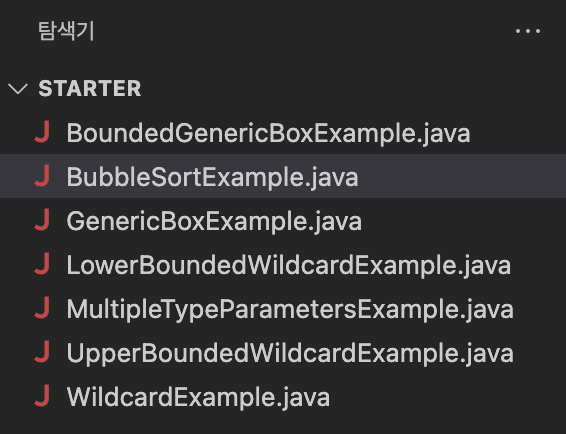

= Lab 11-1: 기본적인 Generics 사용

이 연습에서는 Java의 기본적인 Generics 사용법에 대해 연습합니다. 

== 연습 1: Generic 클래스 작성

이 연습애서는 가장 단순한 방법으로서의 Generic 클래스 작성을 연습합니다. 아래 절차에 따릅니다.

=== 연습 환경 설정

여기에서는 연습을 위한 파일을 다운로드하고 Visual Studio Code에서 로드합니다. 아래 절차에 따릅니다.

1. 웹 브라우저를 실행하여 아래 웹 페이지로 이동합니다.
+
https://github.com/gikpreet/class-programming_with_java/blob/master/Module%2011%20Generics/LabFile/Lab11-1.zip
+
2. 오른쪽 위에서 RAW 파일 다운로드 링크를 클릭하여 Lab11-1.zip 파일을 다운로드합니다.
3. 다운로드한 Lab11-1.zip 파일의 압축을 해제합니다.
4. 압축을 해제한 폴더에서, Starter 폴더를 Visual Studio Code에서 엽니다.
+

=== 코드 확인

여기에서는 Generic 클래스로 작성하기 전의 Box 클래스를 확인합니다. 아래 절차에 따릅니다.

1. Visual Studio Code 탐색기에서 Box.java 파일을 열고 Box 클래스의 코드를 확인합니다. 코드는 아래와 같습니다.
+
[source, java]
----
public class Box {
    private String name;
    private int value;

    public Box(String name) {
        this.name = name;
    }

    public String getName() {
        return this.name;
    }

    public void setValue(int value) {
        this.value = value;
    }

    public int getValue() {
        return this.value;
    }
}
----
+
2. BoxTest 클래스를 열고 코드를 확인합니다. 
a. BoxTest 클래스에는 application entry point가 선언되고 작성되어 있습니다.
b. Box 클래스의 인스턴스를 생성하고 setValue() 메소드를 호출하여 Box 객체의 value 변수에 값을 할당한 후, 출력합니다. 코드는 아래와 같습니다.
+
[source, java]
----
class BoxTest {
    public static void main(String[] args) {
        Box box = new Box("Celine");
        box.setValue(1);

        int result = (int)box.getValue();
        System.out.printf("%s has %s", box.getName(), result);
    }
}
----
+
3. Visual Studio Code 에서 터미널을 열고, 아래 명령을 실행하여 Box.java 파일을 컴파일 합니다.
+
----
$ javac Box.java
----
+
4. 터미널에서 아래 명령을 실행하여 컴파일된 프로그램을 실행합니다.
+
----
$ java BoxTest
Celine has 1
----

=== 코드 수정 후 실행

여기에서는 BoxTest 클래스의 main 메소드를 수정하여 Box 클래스의 value 변수에는 int 타입의 값만이 할당 될 수 있음을 확인합니다. 아래 절차에 따릅니다.

1. BoxTest 클래스의 main 메소드에서, setValue 메소드 호출하면서 전달되는 파라미터를 문자열(String) 타입으로 변경합니다. 수정된 코드는 아래와 유사할 것입니다.
+
[source, java]
----
class BoxTest {
    public static void main(String[] args) {
        Box box = new Box("Celine");
        box.setValue("a laptop");

        System.out.printf("%s has %d", box.getName(), box.getValue());
    }
}
----
+
2. 아래 명령을 수행하여 파일을 컴파일하고, 오류를 확인합니다.
+
----
$ javac Box.java
Box.java:25: error: imcompatible types: String cannot be converted to int
    box.setValue("a bag");
----

=== Box 클래스의 value를 Object 타입으로 수정

여기에서는 Box 클래스의 value에 다양한 타입을 할당할 수 있도록 타입을 Object로 변경합니다. 아래 절차에 따릅니다.

1. Box 클래스의 value 변수의 타입을 Object로 변경합니다.
2. Box 클래스의 setValue 메소드의 파라미터 타입을 Object로 변경합니다.
3. Box 클래스의 getValue 메소드의 return 타입을 Object로 변경합니다.
4. 변경된 클래스는 아래와 같을 것입니다.
+
[source, java]
----
public class Box {
    private String name;
    private Object value;

    public Box(String name) {
        this.name = name;
    }

    public String getName() {
        return this.name;
    }

    public void setValue(Object value) {
        this.value = value;
    }

    public Object getValue() {
        return this.value;
    }
}
----

=== 컴파일 및 실행

이 연습에서는 Object 변수에 값을 할당하고 사용할 때 발생할 수 있는 런타임 오류를 확인합니다. 아래 절차에 따릅니다.

1. BoxTest 클래스의 main 메소드에서 box.serValue 메소드로 전달되는 파라미터를 1로 변경합니다.
+
[source, java]
----
public static void main(String[] args) {
    Box box = new Box("Celine");
    box.setValue(1);

    int result = (int)box.getValue();
    System.out.printf("%s has %s", box.getName(), result);
}
----
+
2. 아래 명령을 실행하여 Box.java 파일을 컴파일 합니다.
+
----
$ javac Box.java
----
+
3. 아래 명령을 실행하여 프로그램을 실행합니다.
+
----
$ java BoxTest
Celine has 1
----
+
4. BoxTest 클래스의 main 메소드에서 box.serValue 메소드로 전달되는 파라미터를 1에서 "a bag"으로 변경합니다.
+
[source, java]
----
public static void main(String[] args) {
    Box box = new Box("Celine");
    box.setValue("a bag");

    int result = (int)box.getValue();
    System.out.printf("%s has %s", box.getName(), result);
}
----
+
5. 아래 명령을 실행하여 box.java 파일을 컴파일합니다.
+
----
$ javac Box.java
----
+
6. 오류 없이 컴파일 되는 것을 확인합니다.
7. 아래 명령을 실행하여 프로그램을 실행하고 런타임 오류를 확인합니다.
+
----
$ java BoxTest
Exception in thread "main" java.lang.ClassCastException: class java.lang.String cannot be cast to class java.lang.Integer (java.lang.String and java.lang.Integer are in module java.base of loader 'bootstrap')
        at BoxTest.main(Box.java:27)
----

=== Box 클래스를 Generic 클래스로 수정

이 연습에서는 Box 클래스를 Generic 클래스로 수정합니다. 아래 절차에 따릅니다.

1. Box.java 파일의 Box 클래스를 타입 파라미터를 가질 수 있도록 수정하고, T를 타입으로 지정합니다. 수정된 클래스 선언은 아래와 같습니다.
+
[source, java]
----
public class Box<T> {
    ...
}
----
+
2. value 변수의 타입을 T로 수정합니다.
3. setValue 메소드의 파라미터 타입을 T로 수정합니다.
4. getValue 메소드의 return 타입을 T로 수정합니다.
5. 수정된 Box 클래스는 아래와 같을 것입니다.
+
[source, java]
----
public class Box<T> {
    private String name;
    private T value;

    public Box(String name) {
        this.name = name;
    }

    public String getName() {
        return this.name;
    }

    public void setValue(T value) {
        this.value = value;
    }

    public T getValue() {
        return this.value;
    }
}
----

== Generic 클래스를 생성하도록 수정

여기에서는 BoxTest 클래스의 main 메소드에서 Generic 클래스를 생성하도록 수정합니다. 아래 절차에 따릅니다.

1. BoxTest 클래스의 main 함수에서, Box 클래스를 생성할 때 Integer 타입의 타입 파라미터를 가지도록 수정합니다.
+
[source, java]
----
Box<Integer> box = new Box<Integer>("Celine");
----
+
2. BoxTest 클래스의 main 메소드에서 box.serValue 메소드로 전달되는 파라미터를 "a bag"에서 1로 변경합니다.
3. box.getValue 메소드의 return 값을 정수형으로 타입 변환하는 코드를 삭제합니다.
4. 수정 후의 전체 코드는 아래와 같을 것입니다.
+
[source, java]
----
public class Box<T> {
    private String name;
    private T value;

    public Box(String name) {
        this.name = name;
    }

    public String getName() {
        return this.name;
    }

    public void setValue(T value) {
        this.value = value;
    }

    public T getValue() {
        return this.value;
    }
}

class BoxTest {
    public static void main(String[] args) {
        Box<Integer> box = new Box<Integer>("Celine");
        box.setValue(1);

        int result = box.getValue();
        System.out.printf("%s has %s", box.getName(), result);
    }
}
----
+
5. 아래 명령을 수행하여 Box.java 파일을 컴파일합니다.
+
----
$ javac Box.java
----
+
6. 아래 명령을 수행하여 프로그램을 실행합니다.
+
----
$ java BoxTest
Celine has 1
----

=== 타입에 맞지 않는 데이터 사용

이 연습에서는 타입 파라미터가 Integer로 설정된 Generic 클래스에 String 타입의 파라미터를 사용하면 컴파일 타임에 오류가 검출되는 것을 확인합니다. 아래 절차에 따릅니다.

1. BoxTest 클래스의 main 메소드에서 box.serValue 메소드로 전달되는 파라미터를 1에서 "a bag"으로 변경합니다.
2. 아래 명령을 실행하여 box.java 파일을 컴파일하고, 오류를 확인합니다. +
Generic 타입은 타입 변환과 관련된 오류를 컴파일 타임에 검출할 수 있도록 합니다.
+
----
$ javac Box.java
Box.java:25: error: incompatible types: String cannot be converted to Integer
        box.setValue("a bag");
----
+
3. BoxTest 클래스의 main 메소드에서 result 객체의 타입 파라미터를 String으로 변경합니다. 생성자에는 타입 파라미터를 명시하지 않습니다.
4. result 변수의 타입을 String으로 변경합니다.
+
[source, java]
----
public static void main(String[] args) {
    Box<String> box = new Box<>("Celine");
    box.setValue("a bag");

    String result = box.getValue();
    System.out.printf("%s has %s", box.getName(), result);
}
----
+
5. 아래 명령을 수행하여 Box.java 파일을 컴파일합니다.
+
----
$ javac Box.java
----
+
6. 아래 명령을 수행하여 프로그램을 실행합니다.
+
----
$ java BoxTest
Celine has a bag
----

== 연습 2 타입 제한

Generis 타입에서 extends 키워드를 사용하면 타입 파라미터에 특정 클래스나 인터페이스를 상속받은 타입만 허용할 수 있습니다. 여기에서는 타입 파라미터에 extends 키워드를 사용하여 특정 클래스나 인터페이스의 서브 타입만 사용되도록 Generic 클래스를 작성합니다. 아래 절차에 따릅니다.

=== 코드 확인

여기에서는 타입 제한이 있는 Generic 클래스로 작성하기 전의 BoundedBox 클래스를 확인합니다. 아래 절차에 따릅니다.

1. Visual Studio Code 탐색기에서 BoundedBox.java 파일을 열고 BoundedBox 클래스의 코드를 확인합니다. 코드는 아래와 같습니다.
+
[source, java]
----
public class BoundedBox<T> {
    String name;
    T value;

    BoundedBox(String name) {
        this.name = name;
    }

    public String getName() {
        return  this.name;
    }

    public void setValue(T value) {
        this.value = value;
    }

    public T getValue() {
        return  this.value;
    }
}
----
+
2. BoundBoxTest 클래스를 열고 코드를 확인합니다. 
a. BoundBoxTest 클래스에는 application entry point가 선언되고 작성되어 있습니다.
b. main 메소드에서 각각 Integer 타입과 String 타입을 타입 파라미터로 하는 box1, box2 타입 객체가 선언되어 있습니다.
c. Integer 타입을 타입 파라미터로 사용하는 box1 객체의 value 변수에 1을 할당하는 코드가 작성되어 있습니다.
d. String 타입을 타입 파라미터로 사용하는 box2 객체의 value 변수에 "Celine"을 할당하는 코드가 작성되어 있습니다.
3. 코드는 아래와 같습니다.
+
[source, java]
----
class BoundBoxTest {
    public static void main(String[] args) {
        BoundedBox<Integer> box1 = new BoundedBox<Integer>("box1");
        BoundedBox<String> box2 = new BoundedBox<String>("box2");

        box1.setValue(1);
        box2.setValue("celine");

        System.out.println("Box1 has " + box1.getValue());
        System.out.println("Box2 has " + box2.getValue());
    }
}
----
+
4. 터미널에서 아래 명령을 실행하여 BoundedBox.java 파일을 컴파일합니다.
+
----
$ javac BoundedBox.java
----
+
5. 아래 명령을 실행하여 컴파일된 프로그램을 실행합니다.
+
----
$ java BoundedBoxTest
Box1 has 1
Box2 has celine
----

== BoundBox 클래스에 타입 제한 설정

이 연습에서는 BoundedBox 클래스의 타입 파라미터를 Number의 서브 타입만 허용하도록 코드를 수정합니다. java.lang 패키지에서 제공되는 추상 클래스로, 알려진 서브 클래스는 다음과 같습니다:

`AtomicInteger`, `AtomicLong`, `BigDecimal`, `BigInteger`, `Byte`, `Double`, `DoubleAccumulator`, `DoubleAdder`, `Float`, `Integer`, `Long`, `LongAccumulator`, `LongAdder`, `Short`

아래 절차에 따릅니다.

1. BoundedBox 클래스의 타입 파라미터에 extends 키워드를 사용해서 Number 클래스의 서브 타입으로 타입을 제한합니다.
+
[source, java]
----
public class BoundedBox<T extends Number> {
    ...
}
----
+
2. 터미널에서 아래 명령을 실행하여 BoundedBox.java 파일을 컴파일합니다.
+
----
$ javac BoundedBox.java
----
+
3. 컴파일 오류를 확인합니다.
+
----
BoundedBox.java:25: error: type argument String is not within bounds of type-variable T
        BoundedBox<String> box2 = new BoundedBox<String>("box2");
                   ^
  where T is a type-variable:
    T extends Number declared in class BoundedBox
BoundedBox.java:25: error: type argument String is not within bounds of type-variable T
        BoundedBox<String> box2 = new BoundedBox<String>("box2");
                                                 ^
  where T is a type-variable:
    T extends Number declared in class BoundedBox
2 errors
----
+
4. box2 객체의 타입 파라미터를 Double로 수정하고, setValue 메소드의 파라미터를 2.0d 로 변경합니다.
5. box1 객체와 box2 객체의 getValue 메소드를 호출하는 코드에서 intValue 메소드를 호출하고 결과를 정수형 변수에 할당하는 코드를 작성합니다.
6. return 받은 값을 출력하도록 마지막 두 줄의 코드를 수정합니다.
7. 수정된 코드는 아래와 유사할 것입니다.
+
[source, java]
----
class BoundBoxTest {
    public static void main(String[] args) {
        BoundedBox<Integer> box1 = new BoundedBox<Integer>("box1");
        BoundedBox<Double> box2 = new BoundedBox<Double>("box2");

        box1.setValue(1);
        box2.setValue(2.0d);

        int valueFromBox1 = box1.getValue().intValue();
        int valueFromBox2 = box2.getValue().intValue();

        System.out.println("Box1 has " + valueFromBox1);
        System.out.println("Box2 has " + valueFromBox2);
    }
}
----
+
8. 터미널에서 아래 명령을 실행하여 BoundedBox.java 파일을 컴파일합니다.
+
----
$ javac BoundedBox.java
----
+
9. 아래 명령을 실행하여 컴파일된 프로그램을 실행합니다.
+
----
$ java BoundedBoxTest
Box1 has 1
Box2 has 2
----

== 연습 3 다중 타입 파라미터

Generic 타입은 하나 이상의 타입 파라미터를 사용하여 클래스를 구성할 수 있습니다. 이 연습에서는 여러개의 타입 파라미터를 사용하는 Generic 클래스를 작성합니다.

=== 코드 확인

여기에서는 다중 타입 Generic 클래스로 작성하기 전의 MultpeTypeBox 클래스를 확인합니다. 아래 절차에 따릅니다.

1. Visual Studio Code 탐색기에서 MultpeTypeBox.java 파일을 열고 MultpeTypeBox 클래스의 코드를 확인합니다. 코드는 아래와 같습니다.
+
[source, java]
----
public class MultpeTypeBox<T> {
    String name;
    T value;

    public MultpeTypeBox(String name) {
        this.name = name;
    }

    public String getName() {
        return this.name;
    }

    public void setValue(T value) {
        this.value = value;
    }

    public T getValue() {
        return  this.value;
    }
}
----
+
2. MultpeTypeBoxTest 클래스를 열고 코드를 확인합니다. 
a. Integer 타입 파리미터를 사용하는 MultpeTypeBox 타입의 box1 객체를 생성합니다.
b. box1 객체의 생성자 파라미터로 box1을 할당합니다.
c. box1 객체의 value 변수에 1을 할당하고 출력합니다.
3. 코드는 아래와 같습니다.
+
[source, java]
----
class MultpeTypeBoxTest {
    public static void main(String[] args) {
        MultpeTypeBox<Integer> box1 = new MultpeTypeBox<>("box1");

        box1.setValue(1);
        System.out.println(box1.getName() + " has " + box1.getValue());
    }
}
----

=== 다중 타입 Generic 클래스로 수정

이 연습에서는 MultpeTypeBox 클래스를 두 개의 타입 파라미터를 가지는 다중 타입 클래스로 수정합니다. 아래 절차에 따릅니다.

1. MultpeTypeBox 클래스의 타입 파라미터를 T, U 두 개로 수정합니다.
2. MultpeTypeBox 클래스의 name 변수의 타입을 U로 변경합니다.
3. MultpeTypeBox 클래스 생성자 파라미터를 U 타입으로 변경합니다.
4. getName 메소드의 return 타입을 U 타입으로 변경합니다.
5. 수정된 코드는 아래와 유사할 것입니다.
+
[source, java]
----
public class MultpeTypeBox<T,U> {
    U name;
    T value;

    public MultpeTypeBox(U name) {
        this.name = name;
    }

    public U getName() {
        return this.name;
    }

    public void setValue(T value) {
        this.value = value;
    }

    public T getValue() {
        return  this.value;
    }
}
----
+
6. MultpeTypeBoxTest 클래스의 main 메소드에서, box1 객체의 타입 파라미터를 Integer, String으로 변경합니다.
+
[source, java]
----
public static void main(String[] args) {
    MultpeTypeBox<Integer, String> box1 = new MultpeTypeBox<>("box1");

    box1.setValue(1);
    System.out.println(box1.getName() + " has " + box1.getValue());
}
----
+
7. 아래 명령을 실행하여 MultpeTypeBox.java 파일을 컴파일합니다.
+
----
$ javac MultpeTypeBox.java
----
+
8. 아래 명령을 실행하여 컴파일된 프로그램을 실행합니다.
+
----
$ Java MultpeTypeBoxTest
box1 has 1
----

=== 타입에 맞지 않는 데이터 사용

여기에서는 객체 생성 시 주어진 타입 파라미터에 맞지 않는 파라미터 타입의 사용을 테스트합니다.

1. MultpeTypeBoxTest 클래스의 main 메소드에서, box1 객체 생성자로 1.0을 전달하도록 코드를 수정합니다.
2. 수정한 코드는 아래와 같을 것입니다.
+
[source, java]
----
public static void main(String[] args) {
    MultpeTypeBox<Integer, String> box1 = new MultpeTypeBox<>(1.0);

    box1.setValue(1);
    System.out.println(box1.getName() + " has " + box1.getValue());
}
----
+
3. 아래 명령을 실행하여 MultpeTypeBox.java 파일을 컴파일합니다.
+
----
$ javac MultpeTypeBox.java
----
+
4. 오류를 확인합니다.
+
----
MultpeTypeBox.java:24: error: incompatible types: cannot infer type arguments for MultpeTypeBox<>
        MultpeTypeBox<Integer, String> box1 = new MultpeTypeBox<>(1.0);
                                                               ^
    reason: inference variable U has incompatible bounds
      equality constraints: String
      lower bounds: Double
  where U is a type-variable:
    U extends Object declared in class MultpeTypeBox
1 error
----

== 연습 4 Generic Method

메소드에 타입 파라미터를 추가하여 다양한 데이터 타입을 처리할 수 있는 Generic 메소드를 작성할 수 있습니다. 이 연습에서는 다양한 종류의 데이터를 포함하는 배열을 정렬할 수 있는 Generic 메소드를 작성합니다.

=== 코드 확인

여기에서는 Generic 메소드로 작성하기 전의 bubbleSort 메소드를 확인합니다. 아래 절차에 따릅니다.

1. Visual Studio Code 탐색기에서 GenericMethod.java 파일을 열고 GenericMethod 클래스의 코드를 확인합니다. 코드는 아래와 같습니다.
+
[source, java]
----
public class GenericMethod {
    public static void bubbleSort(Integer[] items) {
        for(int i = items.length - 1; i > 0; i--) {
            for(int j = 0 ; j < i ; j++) {
                if (items[j] > items[j + 1]) {
                    Integer item = items[j];
                    items[j] = items[j + 1];
                    items[j + 1] = item;
                }
            }
        }
    }
}
----
+
2. 2. GenericMethodTest 클래스를 열고 코드를 확인합니다. 
a. Integer 타입 배열 integerList가 선언되어 있습니다.
b. String 타입 배열 stringList 선언되어 있습니다.
c. GenericMethod.bubbleSort(integerList) 메소드를 호출하여 integerList 배열을 정렬합니다.
3. 코드는 아래와 같습니다.
+
[source, java]
----
class GenericMethodTest {
    public static void main(String[] args) {
        Integer[] integerList =  {1, 10, 7, 2, 5, 4, 9, 8, 3, 6};
        String[] stringList =  {"Celine", "Jason", "Robert", "Adrian", "William"};

        GenericMethod.bubbleSort(integerList);

        for(int i: integerList) {
            System.out.print(i + " ");
        }
    }
}
----
+
4. 아래 명령을 실행하여 GenericMethod.java 파일을 컴파일합니다.
+
----
$ javac GenericMethod.java
----
+
5. 아래 명령을 실행하여 컴파일된 프로그램을 실행합니다.
+
----
$ java GenericMethodTest
1 2 3 4 5 6 7 8 9 10
----

=== 파라미터와 맞지 않는 데이터 타입 배열 정렬

여기에서는 String 타입 데이터가 포함된 데이터를 bubbleSort 메소드의 파라미터로 넘겨 정렬을 시도합니다. 아래 절차에 따릅니다.

1. GenericMethodTest 클래스의 main 메소드에서, GenericMethod.bubbleSort 메소드의 파라미터로 stringList 배열을 지정합니다.
2. 아래 명령을 실행하여 GenericMethod.java 파일을 컴파일합니다.
+
----
$ javac GenericMethod.java
----
+
3. 오류를 확인합니다.
+
----
javac GenericMethod.java
GenericMethod.java:20: error: incompatible types: String[] cannot be converted to Integer[]
        GenericMethod.bubbleSort(stringList);
----

=== GenericMethod 클래스의 bubbleSort 메소드를 Generic 메소드로 수정

여기에서는 GenericMethod 클래스의 bubbleSort 메소드를 Generic 메소드로 수정합니다. 아래 절차에 따릅니다.

1. GenericMethod 클래스의 bubbleSort 메소드를 T 타입을 타입 파라미터로 하는 Generic 메소드로 수정합니다. T 타입 파라미터는 Comparable 인터페이스의 서브 타입으로 제한합니다.
+
[source, java]
----
public <T extends Comparable<T>> void bubbleSort(T[] items) {
    ...
}
----
+
2. bubbleSort 메소드의 if 절에서, 값의 비교를 compartTo 메소드를 사용하도록 변경합니다.
+
[source, java]
----
if (items[j].compareTo(items[j + 1]) > 0) {
    ...
}
----
+
3. 수정된 bubbleSort 메소드의 코드는 아래와 유사할 것입니다.
+
[source, java]
----
public static <T extends Comparable<T>> void bubbleSort(T[] items) {
    for(int i = items.length - 1; i > 0; i--) {
        for(int j = 0 ; j < i ; j++)  {
            if (items[j].compareTo(items[j + 1]) > 0) {
                T item = items[j];
                items[j] = items[j + 1];
                items[j + 1] = item;
            }
        }
    }
}
----
+
4. GenericMethodTest 클래스의 main 메소드에서, foreach 문을 stringList 배열을 대상으로 하도록 수정합니다.
+
[source, java]
----
public static void main(String[] args) {
    Integer[] integerList =  {1, 10, 7, 2, 5, 4, 9, 8, 3, 6};
    String[] stringList =  {"Celine", "Jason", "Robert", "Adrian", "William"};

    GenericMethod.bubbleSort(stringList);

    for(String i: integerList) {
        System.out.print(i + " ");
    }
}
----
+
5. 아래 명령을 실행하여 GenericMethod.java 파일을 컴파일합니다.
+
----
$ javac GenericMethod.java
----
+
6. 아래 명령을 실행하여 컴파일된 프로그램을 실행합니다.
+
----
$ java GenericMethodTest
Adrian Celine Jason Robert William
----