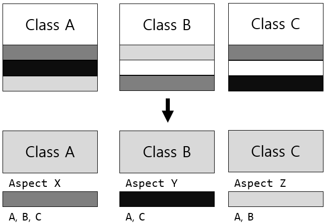

= AOP와 Annotation

* Aspect Oriented Programming (관점 지향 프로그래밍)
** 객체지향 프로그래밍 기법으로 독립적으로 분리하기 어려운 부가 기능을 모듈화하는 방식
** 어떤 로직을 기준으로 핵심적인 관점, 부가적인 관점으로 나누어보고 그 관점을 기준으로 각각 모듈화 하겠다는 것을 의미
** 흩어진 관심사를 Aspect로 모듈화하고 핵심적인 비즈니스 로직에서 분리하여 재 사용

---

== 일반적인 어노테이션 사용

JavaDoc을 사용하여 프로그램을 설명하는 HTML 문서를 만들기 위해 주석을 사용합니다. JavaDoc에서는 설명이 필요한 변수, 메소드, 클래스등의 요소에 /** 로 시작하는 여러 줄 주석을 표시하고, 주석에 어노테이션을 추가하여 응용 프로그램을 설명하는 HTML 문서를 생성하여 공유할 수 있습니다.

[source, java]
----
/**
 * @author NHN Academy
 * @version 1.0 2022-03-01
 */
public class Hello {
    /**
     * @param args 프로그램이 실행될 때 주어지는 인자값이 포함된 배열입니다
     */
    public static void main(String args[]) {
        System.out.println("Hello, Worlds!");
    }
}
----

JavaDoc에서 사용하는 주석안에는 @로 시작하는 어노테이션이 있습니다. 이 어노테이션은 작성자, 버전, 파라미터 인자등의 정보를 제공하고 JavaDoc은 어노테이션에 표시된 정보를 사용하여 문서를 생성합니다.

어노테이션은 주석처럼 프로그래밍 언어에 영향을 미치지 않으면서도 다른 프로그램에 유용한 정보를 제공할 수 있습니다.

== Aspect-Oriented Programming과 어노테이션

AOP라고 줄여서 부르는 관점 지향 프로그래밍은 객체지향 프로그래밍 기법으로 독립적으로 분리하기 어려운 부가 기능을 모듈화하는 방식입니다. 관점 지향이란 어떤 로직을 기준으로 핵심적인 관점, 부가적인 관점으로 나누어보고 그 관점을 기준으로 각각 모듈화 하겠다는 것을 의미합니다.

AOP에서 각 관점을 기준으로 로직을 모듈화 한다는 것은 코드들을 부분적으로 나누어서 모듈화 하겠다는 것을 의미합니다. 이때 소스 코드상에서 다른 부분에 계속 반복해서 쓰는 코드들을 발견할 수 있는데 이것들 흩어진 관심사(Crosscutting Concerns)라고 합니다.

이런 흩어진 관심사를 Aspect로 모듈화하고 핵심적인 비즈니스 로직에서 분리하여 재 사용하겠다는 것이 AOP, 관점 지향 프로그래밍입니다.

Java에서는 이 흩어진 관심사(Crosscutting Concerns)을 하나로 묶어서 모듈화할 수 있습니다. 이렇게 모듈화된 관심사는 관심사가 필요한 대상(클래스, 메소드 등)의 Target에 적용할 수 있습니다. Java에서는 AspectJ, Spring AOP등이 유명합니다.

== AOP 주요 개념

* Aspect +
흩어진 관심사(Crosscutting concerns)를 묶어서 모듈화 한 것으로 Advice와 Point cut이 들어갑니다. Java에서 어노테이션으로 구체화합니다.
* Target +
Aspect가 가지고 있는 Advice가 적용되는 대상입니다. Java에서는 패키지, 클래스, 인터페이스, 메소드, 지역 변수, 타입 파라미터 등이 됩니다.
* Advice +
어떤 일을 해야할 지에 대한 것으로, 해야 할 일에 대한 정보를 가지고 있습니다.
* Join Point +
Advice가 적용될 위치, 끼어들 수 있는 지점, 생성자 호출 직전, 필드에 접근하기 전등의 메소드 실행 시점을 말합니다.
* Point cut +
Join Point의 상세한 스펙을 정의합니다. 어디에 적용해야 하는지에 대한 구체적인 정보를 가지고 있습니다.

Java에서는 Aspect를 어노테이션으로 만들어 클래스와 메소드 등의 Target에 적용할 수 있습니다. 어노테이션은 아래와 같은 방식으로 적용할 수 있습니다.

[source, java]
----
@Component
@Aspect
public class PerfAspect {
    @Around("@annotation(PerfLogging)")
    public Object logPerf(ProceedingJoinPoint pjp) throws Throwable {
        long begin = System.currentTimeMillis();
        Object retVal = pjp.proceed();
        System.out.println(System.currentTimeMillis() - begin);
        return retVal;
    }
}
----