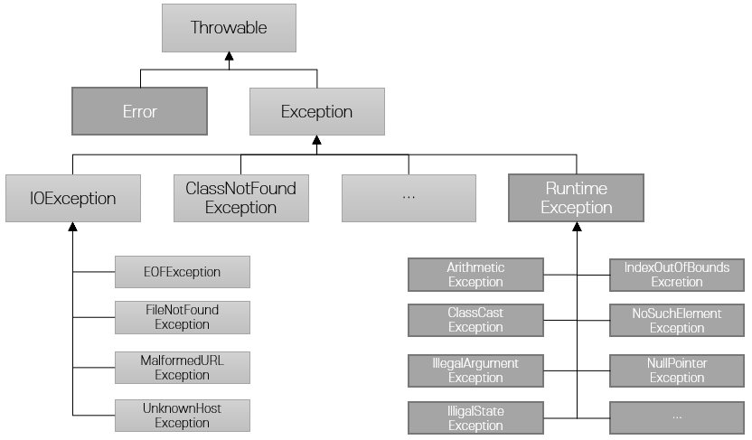

= 예외 객체

* Checked 예외(checked exception)
** 체크 예외가 발생할 수 있는 메소드를 사용할 경우 복구가 가능한 예외로, 반드시 예외 처리를 해야 함
* Unchecked 예외(unchecked exception)
** 명시적으로 예외 처리를 강제하지 않음
* Error
** 메모리 부족 등 시스템에 심각한 상황이 발생했을 경우

---

Java는 프로그램 동작 중에 발생할 수 있는 오류를 Checked 예외(checked exception), Unchecked 예외(Unchecked exception), Error로 구분합니다.

* Error +
시스템에 비정상적인 상황이 발생했을 때 발생합니다. 메모리 부족(OutofMemoryError) 또는 스택오버플로우(StackOverflowError)등이 대표적입니다. 이런 오류는 발생하면 처리하기가 어렵습니다.
* 예외(Exception) +
프로그램 실행 중에 예측할 수 있는 오류 상황이 발생했을 때, 프로그램 실행에서 기대하지 않은 값이 입력되었거나, 프로그램 실행중에 참조된 값이 잘못된 경우로 인해 프로그램의 정상적인 흐름이 실행되지 않는 사항을 의미합니다. Java는 예외를 checked 예외와 Unchecked 예외로 구분합니다.
** `check` 예외는 RuntimeException의 하위 클래스가 아닌 Exception 클래스의 하위 클래스로 구분할 수 있습니다. check 예외는 반드시 try/catch 블록으로 예외 처리를 해야 합니다. 아래와 같은 예외들이 check 예외에 해당합니다. +
`FileNotFountException` - 존재하지 않는 파일에 접근하고자 하는 경우 +
`ClassNotFoundException` – 존재하지 않거나 도달할 수 없는 클래스로 인스턴스를 생성하고자 하는 경우
** uncheck 예외는 RuntimeException의 하위 클래스로 구분할 수 있습니다. Unchecked 예외는 예외 처리를 강조하지 않습니다. 아래와 같은 예외들이 `unchecked` 예외에 해당합니다.+
`ArrayIndexOutOfBoundsException`` – 범위를 벗어난 배열의 요소에 접근하고자 하는 경우 +
`NullPointerException` – null인 객체를 참조하고자 하는 경우

link:./21_why_exceptions.adoc[이전: 예외를 왜 사용해야 하는가?] +
link:./23_try_catch_block.adoc[다음: try/catch 블록]
