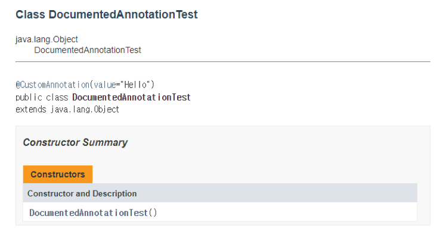

= @Documented

Annotation 정보가 javadoc으로 생성한 문서에 포함되도록 함

[source, java]
----
@Documented
@interface CustomAnnotation {
    String value();
}
----

---

@Documented 어노테이션은 어노테이션에 대한 정보가 javadoc으로 작성한 문서에 포함되도록 합니다.

[source, java]
----
@Documented
@interface CustomAnnotation {
    String value();
}
----

@Documented 메타 어노테이션이 적용된 CustomAnnotation은 javadoc을 사용한 문서 생성시 생성된 문서에 정보가 포함됩니다.

[source, java]
----
@CustomAnnotation("Hello")
public class DocumentedAnnotationTest {
    public static void main(String[] args) {
        System.out.println("DocumentedAnnotationTest");
    }
}
----

---

link:./18_retention.adoc[이전: @Retention] +
link:./20_target.adoc[다음: @Target]