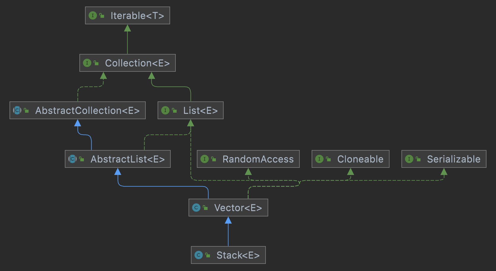

= Stack

* FILO (First In Last Out) 구조를 가진 전통적인 자료구조
* Java에서 Stack은 Vector에서 파생됨

[source, java]
----
Stack<String> stack = new Stack<>();

stack.push("white");
stack.push("red");
stack.pop();
stack.peek().
for(String s: stack) {
    System.out.print(s + " ");
}
----

---

Stack은 FILO(First In Last Out) 구조를 가진 전통적인 자료 구조이며, Java의 Collection Framework에서는 Vector에서 파행된 형태로 구현되었습니다.

*주요 메소드*
[cols="1,3" options="header"]
|===
|Method|설명
|public E push(E item) |Stack의 아래에서부터 데이터를 저장합니다.
|public synchronized E pop() |Stack의 맨 위의 값을 삭제합니다.
|public synchronized E peek()|Stack의 맨 위의 값을 가져옴니다.
|public synchronized int search(Object o) |Stack에서 해당 객체가 몇 번째에 있는지 반환합니다.
|public boolean empty() |Stack이 비어있는지 확인합니다. 비어있다면 true를 반환합니다.
|===

*생성 및 데이터 삽입*
[source, java]
----
Stack stack = new Stack();
stack.push("white");
stack.push("red");
----

*데이터 조회 (꺼냄)*

[source, java]
----
stack.pop();
----

*최 상위 데이터 조회 (삭제 없음)*

[source, java]
----
stack.peek();
----

*데이터 순회*

[source, java]
----
for(String s: stack) {
    System.out.print(s + " ");
}

Iterator iterator = stack.iterator();
while(iterator.hasNext()) {
    System.out.print(iterator.next() + " ");
}
----

---

link:./18_vector.adoc[이전: Vector] +
link:./20_chapter4_set.adoc[다음: Chapter 4: Set]

