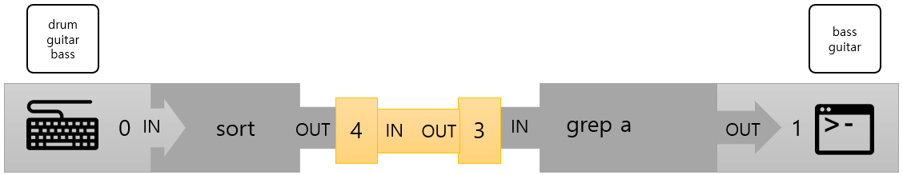

= 파이프

* 유닉스 계열 운영체제에서 프로세스와 주변 장치 사이에 미리 연결된 통로
** 두 프로세스가 생산자-소비자 모델에 따라 통신할 수 있게 하는 원형 버퍼
** 한 프로세스가 쓰고, 다른 프로세스가 읽는 선입선출 형태의 Queue

---

“Write programs that do one thing and do it well. Write programs to work together. Write programs to handle text streams, because that is a universal interface” - Doug Mcllroy

파이프는 데이터가 한 프로세스에서 다른 프로세스로 전달되도록 합니다. 파이프는 프로세스의 명령들이 스트림에 의해 서로 연결되도록 합니다. 파이프로 연결된 명령들은 함께 동작하여 최종 목적을 이룰 수 있게 합니다. 이런 프로세스들의 연결(chain)을 파이프라인(Pipeline)이라고 합니다. 한 파이프라인안에 있는 명령들은 파이프에 의해 연결되고, 파이프의 한 쪽 끝에서 다른 쪽 끝으로 데이터가 흐르면서 두 프로세스 사이에 데이터가 공유됩니다. 파이프라인 안이 있는 각 명령들은 각자 독립적인 프로세스 안에서 실행되며, 각자 독립적인 메모리 공간에서 실행됩니다. pipe() 시스템 콜이 독립적인 프로세스 사이의 통신을 제공합니다.

구현에 있어서는 파이프는 buffered stream이며, 스트립은 2개의 파일 디스크립터와 연결되어 있습니다. 첫 번째는 데이터를 읽기 위한 것이고, 두 번째는 쓰기 위한 것입니다. 파이프라인의 명령 실행을 처리하는 코드를 살펴보면 2개의 정수값을 저장하는 배열이 생성되고, pipe() 호출은 그 배열에 사용 가능한 2개의 파일 디스크립터 값을 채웁니다.

실제의 물리적인 파이프는 유닉스 파이프의 추상적인 개념을 설명하는데 매우 좋은 비유입니다. 한 프로세스에서 시작되는 데이터 스트림을 독립적인 공간에 들어있는 물이라고 생각할 수 있습니다. 그 물이 다음 프로세스의 공간으로 흐를 수 있는 유일한 방법은 각 공간을 파이프로 연결하는 것입니다. 이런 방식으로 물은 첫 번째 공간에서 파이프로 흘러 들어가고, 물이 파이프에 가득차면 파이프에서 다음 공간으로 물을 흘려보냅니다. 

----
$ sort | grep a
drum 
guitar
bass
bass
guitar
----

위 명령을 시각화 하면 아래와 같습니다.
 

위 파이프라인에서, sort 명령은 사용자가 STDIN을 통한 입력을 기다립니다. 그 다음 입력 받은 문자열은 정렬되고, 결과가 STDOUT을 통해 파이프로 전달됩니다. 이는 STDOUT으로 출력된 데이터를 터미널 디스플레이가 아닌 파이프의 왼쪽 끝(파일 디스크립터 4)로 입력하도록 합니다. 파이프는 파일 디스크립터 3으로 연결되고 grep 프로세스에 전달되고, grep 프로세스는 전달받은 문자열에서 a 문자를 포함하는 문자열을 필터하여 터미널 디스플레이에 출력합니다.

파이프라인에서 명령어 사이의 파이프는 | (Vertical bar)기호로 아래와 같은 형태로 표시합니다.

----
$ dpkg -l | grep ssh
----

link:./08_IO_리다이렉션.adoc[다음: I/O 리다이렉션]