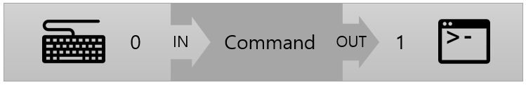
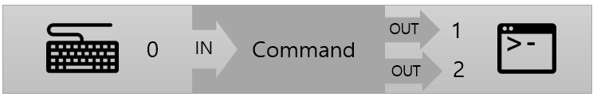
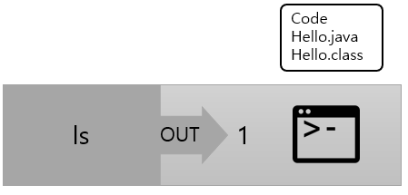
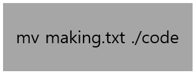
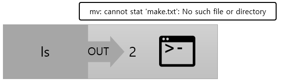
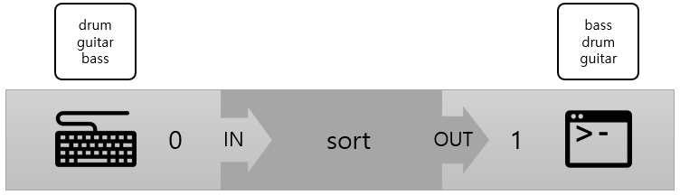

= 표준 스트림

* 유닉스 계열 운영체제에서 프로세스와 주변 장치 사이에 미리 연결된 통로
* 물리적으로 연결된 시스템 콘솔의 키보드와 모니터 연결을 추상화
** 유닉스 시스템은 장치의 추상화로 프로그램이 어떤 장치와 연결되는지 알 필요가 없음
** 데이터 스트림을 통해 데이터의 크기나 구조를 알 필요 없이 데이터를 쓸 수 있음
** 운영체제에서 입출력 장치를 연결하기 위해 작업 제어 언어나 프로그램이 필요하지 않음
* 표준 스트림이 응용 프로그램에서 사용될 때 스트림은 연쇄적으로 연결될 수 있음
* 어떤 프로그램의 출력은 다른 프로그램의 입력으로 쓰일 수 있음

---

유닉스에서는 기본적으로 입력을 터미널 키보드와 연결시키고 출력을 터미널 디스플레이와 연결시킵니다. 유닉스는 키보드와 모니터를 포함하여 시스템의 모든 것을 파일로 모델링합니다. 유닉스 시스템에서 디스플레이에 데이터를 쓰는 것은 스크린 위에 데이터를 담당하는 어떤 파일에 데이터를 쓰는 것입니다. 마찬가지로, 키보드에서 데이터를 읽어오는 것은 키보드를 나타내는 어떤 파일에서 데이터를 읽어오는 것입니다.

데이터는 바이트를 스트림을 통해 이동합니다. 유닉스 시스템은 3가지의 표준 입력(Standard Input - STDIN), 표준 출력(Standard output - STDOUT), 표준 에러(Standard Error - STDERR)를 가지고 있고, 이 스트림들은 각자 특정한 파일 디스크립터를 가지고 있습니다. 각 파일 디스크립터는 정수 값으로, 하나의 파일과 연결되어 있고 프로세스들은 파일 디스크립터를 이용해 데이터를 처리합니다.

유닉스 시스템의 기본 스트림은 각각 0, 1, 2의 파일 디스크립터 숫자를 가지고 있고 파일 디스크립터는 파일 디스크립터 테이블에 저장됩니다. 각 프로세스는 파일 디스크립터 테이블을 가지고 있으며, 프로세스가 생성될 때 기본적으로 0, 1, 2 중 하나가 해당하는 스트림들에게 각각 매핑됩니다.

각 스트림은 자신에게 매핑된 파일 디스크립터에게 보낸 데이터가 어디로 가는지 또는 그 파일 디스크립디스부터 받은 데이터가 어디로부터 오는지 알지 못합니다. 스트림은 자신의 파일 디스크립터를 통해 데이터를 처리할 뿐 실제 데이터를 직접 처리하지 않습니다. 프로세스는 파일 디스트림터들만 처리하면되고, 실제 그 파일은 커널이 안전하게 관리합니다.

프로세스는 0, 1, 2 이외에도 다른 파일 디스크립터를 사용하게 되는데, 새로운 파일 디스크립터가 할당될 때는 가장 낮은 숫자의 사용되지 않은 파일 디스크립터가 사용됩니다. 

== 데이터 흐름

터미널에서 명령을 실행 시킬때는 입력과 출력이 적절하게 처리되어야 합니다. 각 명령은 어떤 데이터를 입력으로 받아야 할지 그리고 어떤 데이터를 출력으로 내보내야 할 지 알아야 합니다. 

 
위 그림은 입력과 출력 스트림의 기본 설정을 나타냅니다. 키보드(STDIN)는 명령을 수행하는 프로그램에게 데이터를 전달하고 프로그램은 터미널(STDOUT)에 데이터를 출력합니다. 데이터의 흐름은 오른쪽에서 왼쪽이며, 입력과 출력 파일에는 파일 디스크립터 번호가 있습니다.

만약 아래와 같은 명령을 실행할 때를 가정해 봅시다.

----
$ ls aDirectory
ls: cannot access 'aDirectory': No such file or directory
----

위 명령에서 두 번째 줄을 출력하기 위한 스트림은 STDERR입니다. 만약 aDirectory가 존재했으면 STDOUT으로 출력할 것입니다. 따라서, 데이터의 흐름은 아래와 같이 변경됩니다.
 

위 그림에서 각 출력 스트림과 연결된 파일 디스크립터 변호를 볼 수 있습니다. 

== 명령을 이용한 데이터 흐름

명령어의 옵션 인자들은 커맨드 라인으로부터 읽히는데 비해 실제 입력은 파일 디스크립터와 연결된 파일로부터 읽힙니다. 따라서, 명령어에 대한 입력은 STDIN을 통해 전달된 데이터로 정의할 수 있습니다. 그 입력은 키보드를 통해 입력되었는지, IO를 통해 리다이렉트 되었는지, 명령에게 파일 인자로 전달되었는지는 상관없습니다. 

아래 명령은 현재 디렉토리에 있는 모든 파일과 디렉토리의 목록을 보여줍니다.

----
$ ls
code Hello.java Hello.class
---- 

이 명령은 아래와 같이 시각화 될 수 있습니다.

 
만약 어떤 명령이 STDIN으로부터 입력을 받지 않는다면, 그 명령으로 전달되는 데이터는 그 명령을 실행하는 프로그램에 의해 무시됩니다. 만약 `&lt; making.txt ls` 를 입력하면 현재 디렉토리의 모든 파일과 디렉토리를 출력하고 STDIN으로 리다이렉트된 입력 데이터는 무시됩니다.

mv 명령은 입력은 없지만 출력은 있습니다. mv 명령이 성공적으로 수행되었을 경우에는 출력이 없습니다. 아래와 같이 시각화 할 수 있습니다.

 
mv 명령에 오류가 있을 경우에는 다음과 같이 오류가 발생하여 STDERR을 통해 출력됩니다.

----
$ mv make.txt ./code
mv: cannot stat 'make.txt': No such file or directory
----
 

입력과 출력이 모두 있는 경우로, sort 명령을 생각할 수 있습니다. sort 명령은 실행 인자와 입력 리다이렉션이 둘 다 없을 경우 사용자가 문자열 목록을 입력할 때까지 대기합니다. 사용자가 표준 입력 종료(Ctrl + D)를 입력하면 정렬된 문자열 목록을 보여줍니다.

----
$ sort
drum
guitar
bass
bass
drum
guitar
----

이를 시각화 하면 다음과 같습니다.
 

sort 명령은 사용자에게 직접 문자열을 입력받지 않고 파일 이름을 인자로 파일 안의 문자열을 사용할 수 있으며, 리다이렉션을 통해서도 입력을 전달받을 수 있습니다.

link:./07_파이프.adoc[다음: 파이프]