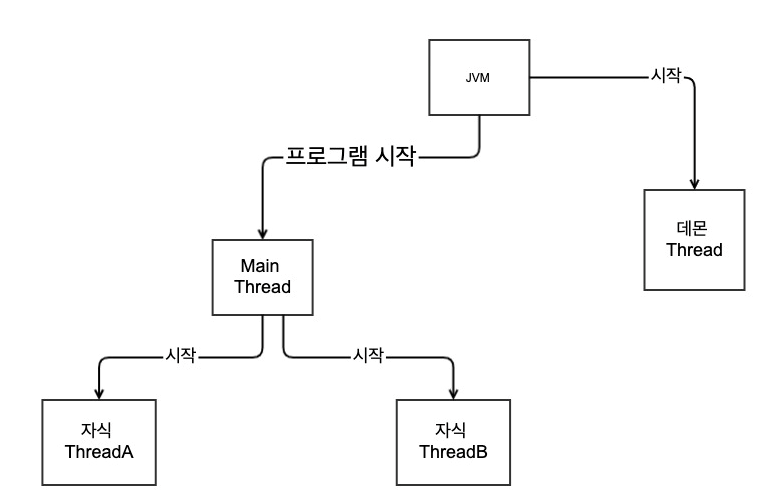

= Main Thread

* 모든 Java 응용 프로그램은 메인 Thread가 main() 메소드를 실행하면서 시작됨
* 단일 레지스터와 스택으로 구성
* Context Switching 작업을 요구하지 않음
* 동시성 제어에 대한 처리를 신경쓰지 않아도 됨
* Java 프로그래밍 언어와 API는 Thread의 생성과 관리를 지원하는 풍부한 라이브러리를 제공
* Java에서의 Thread 구현
* Thread 클래스 상속후 run() 메소드 오버라이드
* Runnable 인터페이스를 구현하는 클래스 정의

---

모든 Java 응용 프로그램은 Main Thread가 응용 프로그램의 진입점인 main() 메소드를 실행하면서 시작됩니다. Main Thread는 main 메소드의 코드를 순차적으로 끝까지 실행하거나 return을 만나면 종료합니다.
이는 단일 Thread(Single Thread)가 실행되는 응용 프로그램 모형이며, 단일 Thread가 응용 프로그램에서는 Main Thread가 종료하면 프로세스가 종료됩니다.

[source, java]
----
public class MainThread {
    public static void main(String[] args) {
        System.out.println("Hello, World!");
    }
}
----

== 주 Thread(main Thread)
Java 프로그램을 실행하면 하나의 Thread가가 즉시 실행됩니다. 즉 시작과 동시에 Thread가 실행됩니다. 이 스레를 주 Thread(Main Thread)라고 합니다.

주 Thread는 프로그램이 시작될 때 자동으로 생성됩니다. `currentThread()` 메소드를 호출하면 해당 Thread가의 참조를 얻을 수 있고, Thread가를 제어할 수 있습니다.

[source, java]
----
public class Example {
    public static void main(String[] args) {
        Thread mainThread = Thread.currentThread();
        System.out.println("thread-name:" + mainThread.getName());
        System.out.println("thread-priority:" + mainThread.getPriority());
    }
}
----

link:./25_Java에서_Thread_생성과_실행.adoc[다음: Java에서 Thread 생성과 실행]